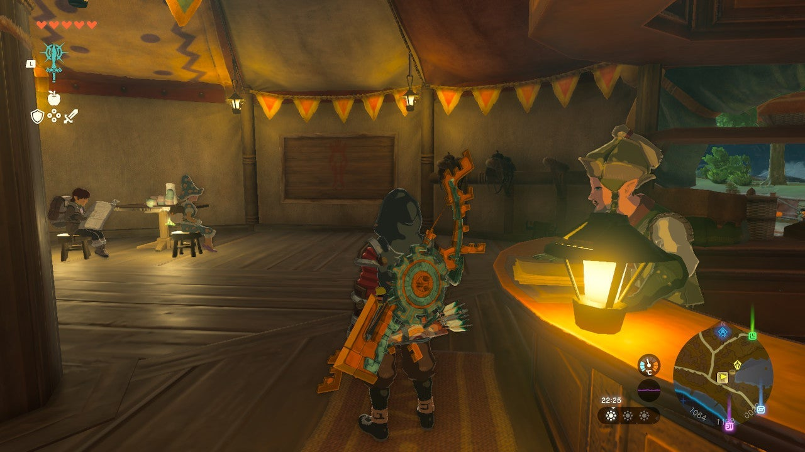
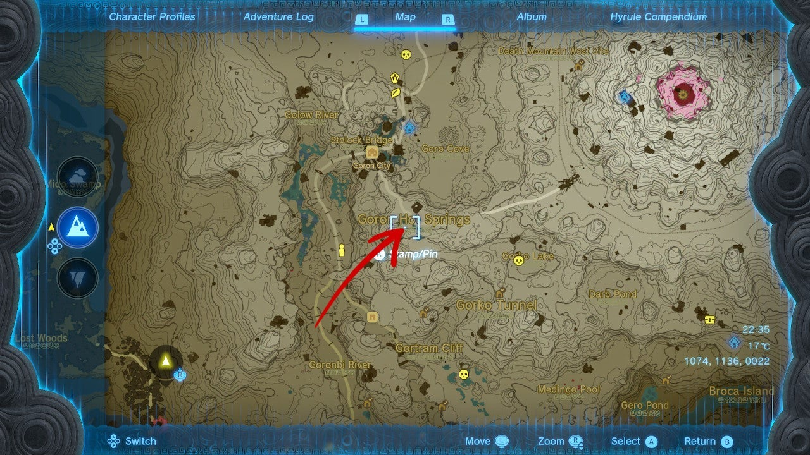
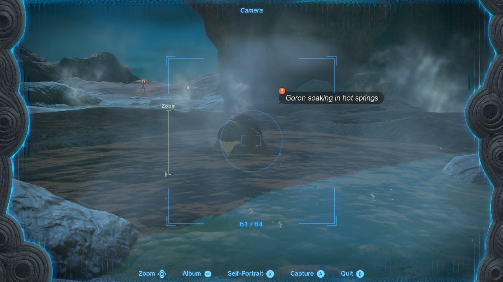

Woodland Stable has a beautiful wooden picture frame, but unfortunately, it's empty. In the Tears of the Kingdom side quest called **A Picture for Woodland Stable** , we'll remedy that. Here's how to take the right picture and complete this Eldin quest. 

## A Picture for Woodland Stable Walkthrough

To start A Picture for Woodland Stable, enter the stable in the southwestern part of the Eldin region, and interact with the **empty picture frame** (see picture below). The stable owner, Kish, will tell you about his desire to display a painting, but he needs a **picture of a Goron bathing in a hot spring** for reference. 

To make that happen, visit the **Goron Hot Springs** south of Goron City. They're quite easy to find if you start from the city and follow the road towards the southeast. 

Once there, you'll see an elderly Goron bathing in the middle of the springs. Use your **Camera** ability to snap a picture, and make sure you save it to your album. 

Return to Woodland Stable and interact with the picture frame again. This will complete A Picture for Woodland Stable and award you with **one Pony Point** plus one **Hasty Vegetable Curry**. 

A Picture for Woodland Stable

See the complete List of Side Quests and Side Adventures

### Up Next: Walkthrough

Previous

About IGN's Zelda TotK Guide Writers

Next

Walkthrough

### Top Guide Sections

  * Walkthrough
  * Zelda: Tears of The Kingdom Switch 2 Edition Guide
  * Zelda Notes Voice Memories
  * List of Side Quests and Side Adventures

### Was this guide helpful?

Leave feedback

Go to comments