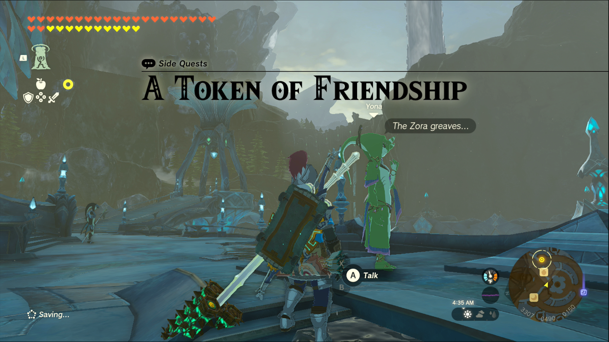
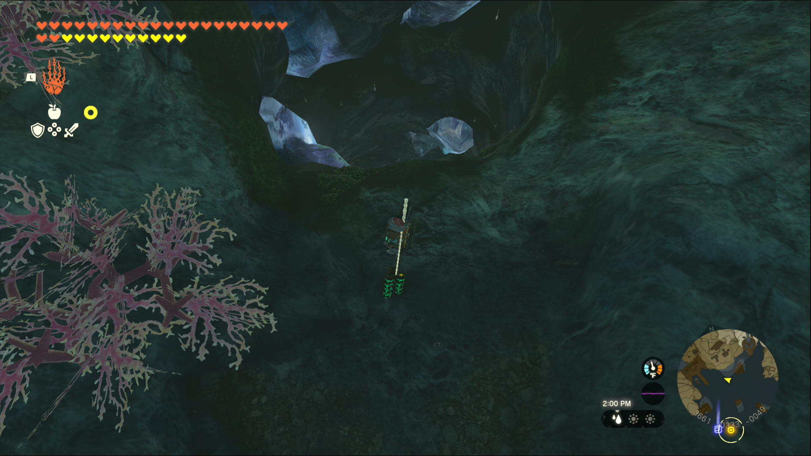
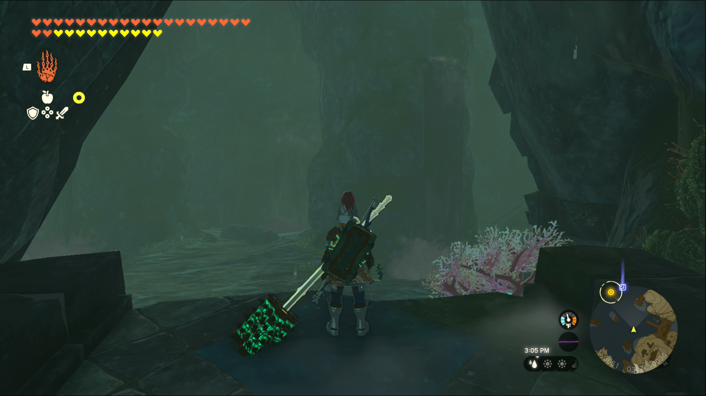
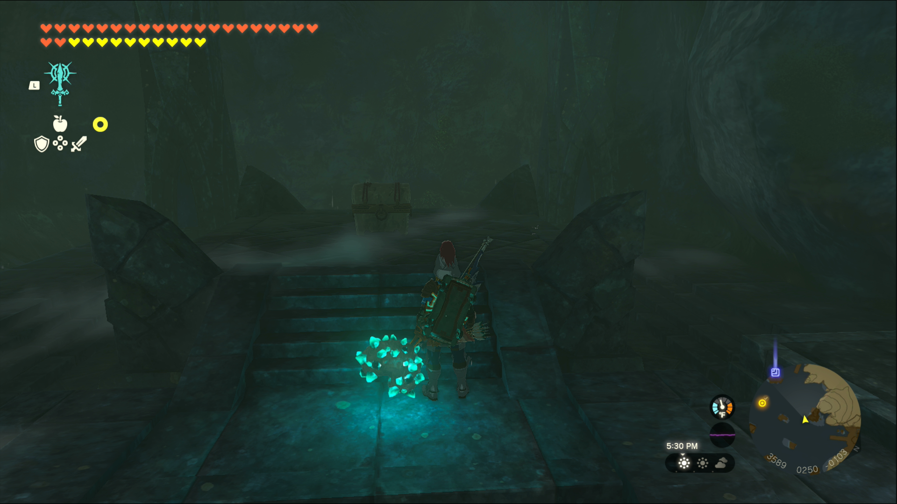

A Token of Friendship is one of the Side Quests you’ll discover in the Lanayru Great Spring region. Side Quests are quests in The Legend of Zelda: Tears of the Kingdom that are relatively short or simple chores that can earn you small rewards or services. 

## A Token of Friendship

To start the Side Quest “A Token of Friendship” you first need to complete the Main Quest “Sidon of the Zora.” Then head to the throne room, at the center of Zora’s Domain, and speak to Yona, who can be seen standing in front of the goddess statue. 

She’s heard mention of greaves to go with your Zora armor and wants to help you find it. Yona mentions that it should be somewhere in the Ancient Zora Waterworks, so head over to search for it. You can access it by entering the giant whirlpool in the East Reservoir Lake. 

Once inside, you may notice that the cave is largely drained of water. The zora nearby, Gruve, confirms that all the water is gone. Luckily, this means you can explore the cave freely, including some previously inaccessible areas. One such area can be found beneath the large, lit up pipe on the far wall. 

Traverse the rubble and head just to the right of the pipe to discover a tunnel descending further. Jump down and turn around to enter another large chamber. 

Head to the waterfall at the back of the room, where you’ll trigger a fight with a **Talus**. You can fight it or run, but either way head to the waterfall afterwards, and swim behind it. 

Open the chest inside to find the Zora Greaves, bringing the quest to a close. 

A Token of Friendship

See the complete List of Side Quests and Side Adventures

### Up Next: Walkthrough

Previous

About IGN's Zelda TotK Guide Writers

Next

Walkthrough

### Top Guide Sections

  * Walkthrough
  * Zelda: Tears of The Kingdom Switch 2 Edition Guide
  * Zelda Notes Voice Memories
  * List of Side Quests and Side Adventures

### Was this guide helpful?

Leave feedback

### In This Guide

The Legend of Zelda: Tears of the KingdomNintendo EPD

Initial Release: May 12, 2023

Learn more

Go to comments