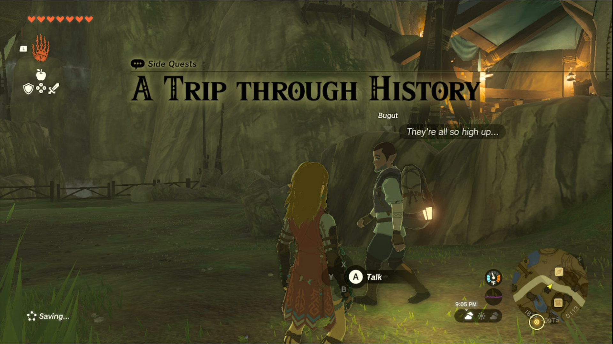
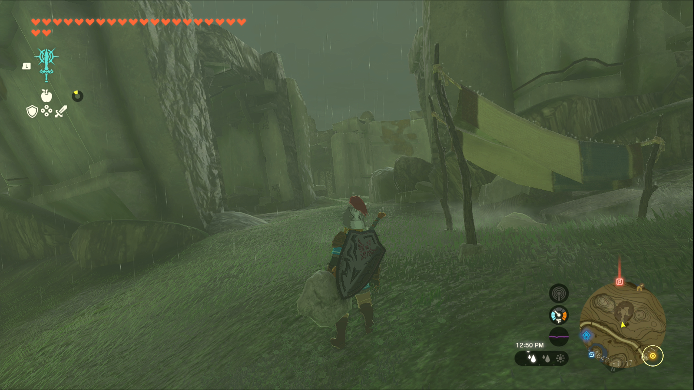
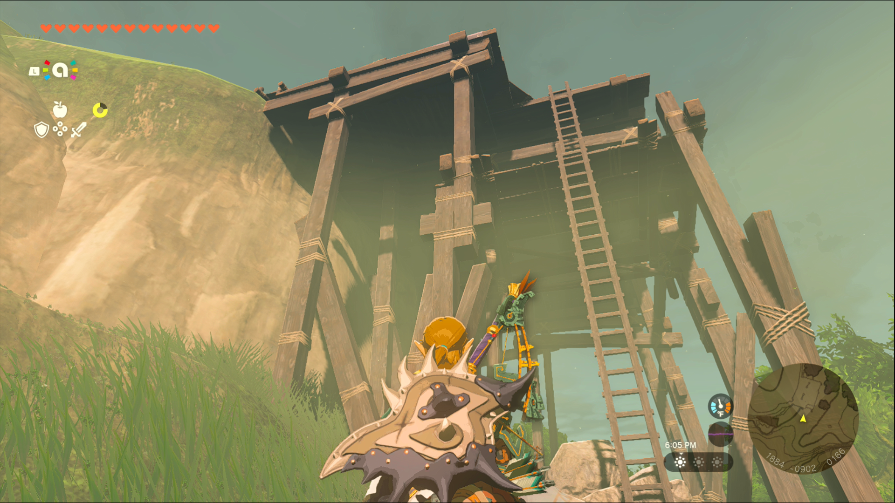
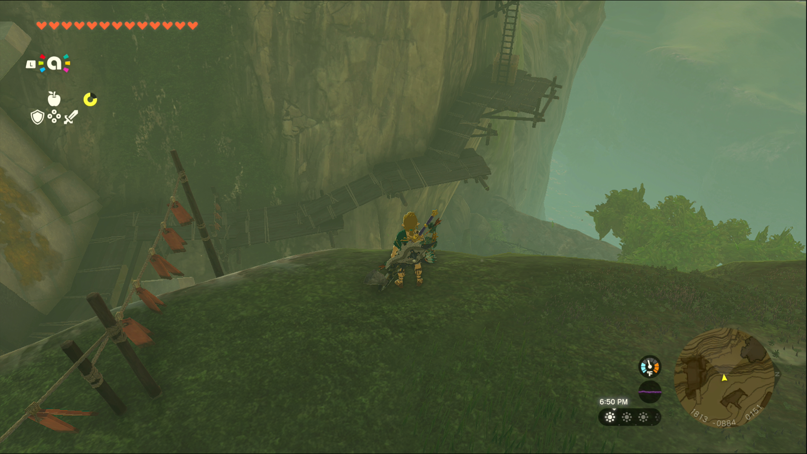
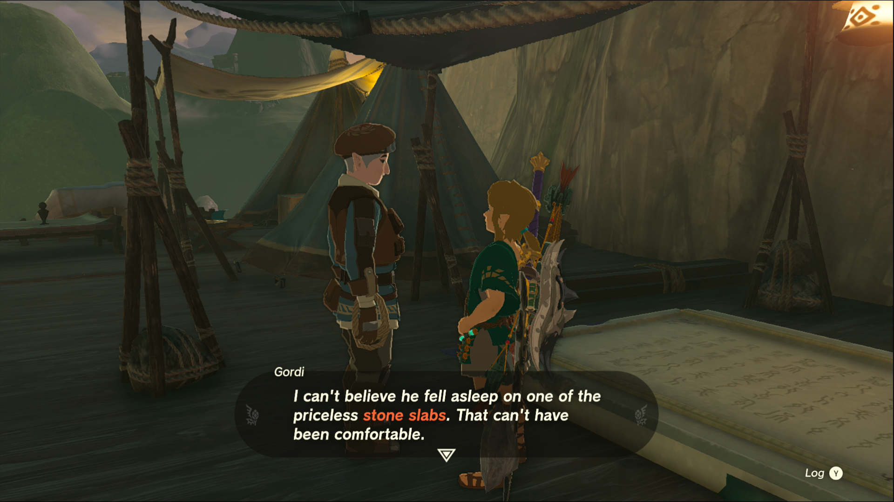

A Trip through History is one of the Side Quests you’ll discover in Kakariko Village. Side Quests are quests in The Legend of Zelda: Tears of the Kingdom that are relatively short or simple chores that can earn you small rewards or services. 

## A Trip through History Guide

To start the Side Quest "A Trip through History" you need to speak to Bugut, who can be found wandering around Kakariko Village. Bugut tasks you with reading 4 Zonai slabs located at the ruins and letting him know what’s written on them. 

### Helpful Note

You should accept the side quests “Codgers’ Quarrel” from Trissa, and “Out of the Inn” from Dai, before embarking on this quest. These quests all have to do with the Ring Ruins in one way or another so it’s most efficient to accept them all at once. Trissa operates High Spirits Produce near the southwest entrance to the village, while Dai is watching over the Shuteye Inn across the road. 

Each section of the ring ruins around Kakariko has a slab in it, so you’ll have to do some light exploration to get them all. We’ll list them in no particular order here. You can return to Bugut to tell him about the notes after each Zonai slab, but you can also wait until you’ve collected all 4 notes to turn them in. 

The southwestmost ruin is up a large hill from Makasura Shrine, from which you’ll need to head south across the road into the village. If you’ve accepted the Side Quest “Codgers’ Quarrel,” you’ll see a pair of men arguing outside the ruin, but either way you can head inside to clear out the bokoblins. Just past where they were camping is a hallway with the stone slab on the right. Read the notes on the table in front of it then move on. 

The ruins southeast of the village can be accessed easily from the Device Dispenser. This machine is located on a cliff south of the village, but there are sloping paths leading up to it from the southeast corner of Kakariko. From the Device Dispenser, head east along the scaffolding into the ruins. This one is very small in comparison, consisting almost entirely of the hallway with the slab. Once again, read the notes on the table and you can cross this one off your list. 

Next up is the ruin to the northeast of the village. This one is fairly easy to access, you need to take the sloping path out of the northeast side of the village, toward East Hill. On the way you’ll see a tall ladder leading up some scaffolding. Climb it and follow the makeshift ramp up to the ruins and head inside. This ruin is composed almost entirely of the slab room, so following the ramps will lead you right to it. Once you’ve read the notes, it’s time to check the last ruin. 

From the previous ruin, head directly west, down the hill, and onto the scaffolding across the road. 

Climb the ladders and follow the wooden ramps up to the ruins, where you’ll eventually come across a man sleeping on a slab. Next to him is a journal with notes on the fourth slab. Once you’ve read these notes you can head back to Bugut, but you should take the time to wake the innkeeper for the Side Quest “Out of the Inn.” 

Whatever you decide, speak to Bugut when you’re back in the village to share everything you learned with him. If you can’t find him, selecting “A Trip through History” will mark him on your map. Once you’ve shared all your information with him, he’ll give you 3 Thunderwing Butterflies, an elixir ingredient that can provide temporary resistance to electricity. 

A Trip Through History

See the complete List of Side Quests and Side Adventures

### Up Next: Walkthrough

Previous

About IGN's Zelda TotK Guide Writers

Next

Walkthrough

### Top Guide Sections

  * Walkthrough
  * Zelda: Tears of The Kingdom Switch 2 Edition Guide
  * Zelda Notes Voice Memories
  * List of Side Quests and Side Adventures

### Was this guide helpful?

Leave feedback

### In This Guide

The Legend of Zelda: Tears of the KingdomNintendo EPD

Initial Release: May 12, 2023

Learn more

Go to comments