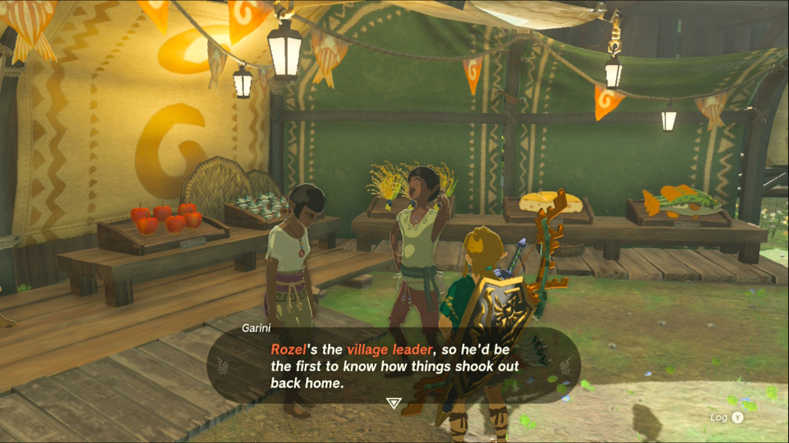
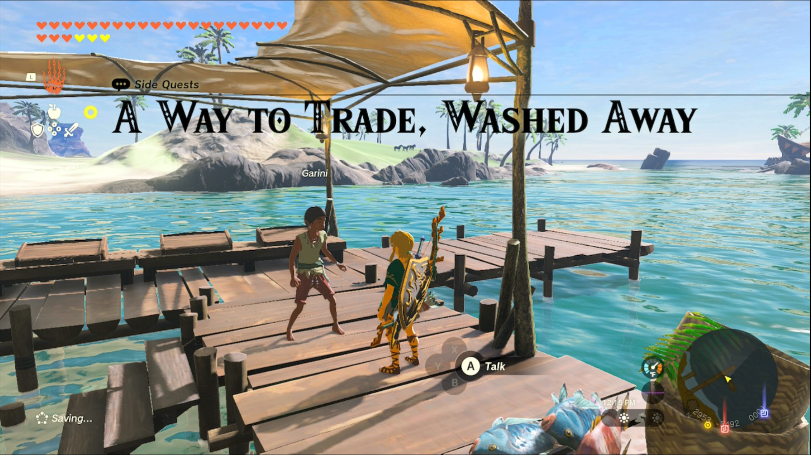
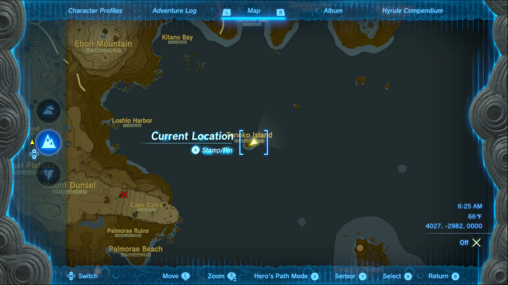
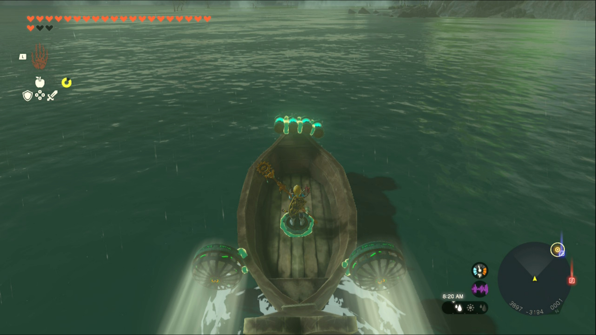
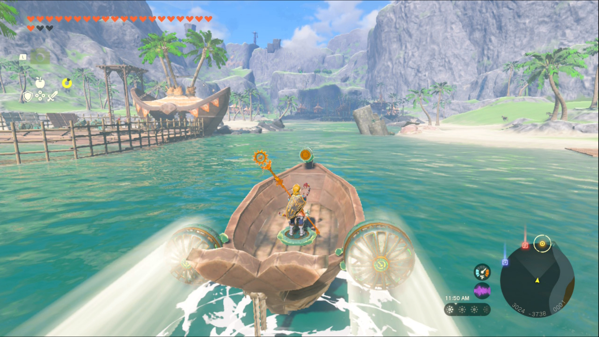

A Way to Trade, Washed Away is a Side Quest you’ll find in Lurelin Village. Side Quests are quests in The Legend of Zelda: Tears of the Kingdom that are relatively short or simple chores that can earn you small rewards or services. 

## A Way to Trade, Washed Away

To start the Side Quest “A Way to Trade, Washed Away” you need to complete “Ruffian-Infested Village” and “Lurelin Village Restoration Project.” 

Then head to Lookout Landing and speak to Garini at the general store; he’ll return home to Lurelin Village right away. Return to Lurelin and speak to Garini on the dock. 

He wants to trade but he can’t, because his boats floated away while the village was occupied. He thinks they probably washed up on Tenoko Island, a small island in the Necluda Sea. 

Head to the island, by glider or raft, and add some devices to one of the boats so you can navigate it back to Lurelin Village. You’ll need to head south around Soka Point, but besides that your trip should be uneventful. 

As soon as you get close enough to the dock, you’ll automatically be transported into a conversation with Garini. 

He’s going to open up his shop now thanks to you, and since you helped him out you can shop for free! You can check on his shop every few days to fill up on some supplies. You also get a Star Fragment for your troubles. 

A Way to Trade, Washed Away

See the complete List of Side Quests and Side Adventures

### Up Next: Walkthrough

Previous

About IGN's Zelda TotK Guide Writers

Next

Walkthrough

### Top Guide Sections

  * Walkthrough
  * Zelda: Tears of The Kingdom Switch 2 Edition Guide
  * Zelda Notes Voice Memories
  * List of Side Quests and Side Adventures

### Was this guide helpful?

Leave feedback

### In This Guide

The Legend of Zelda: Tears of the KingdomNintendo EPD

Initial Release: May 12, 2023

Learn more

Go to comments