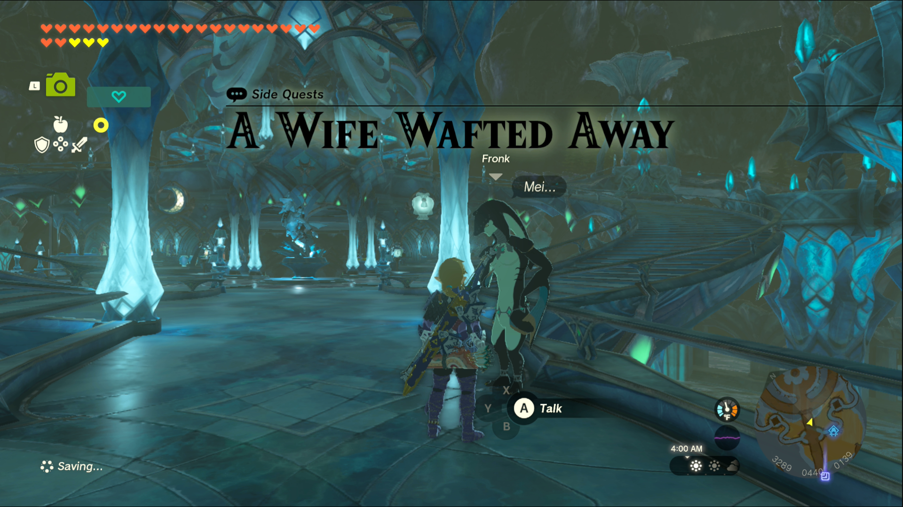
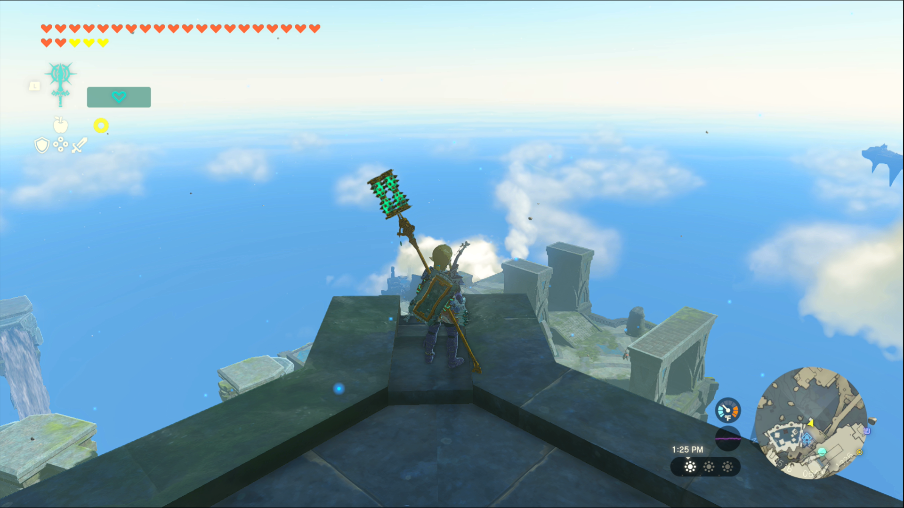
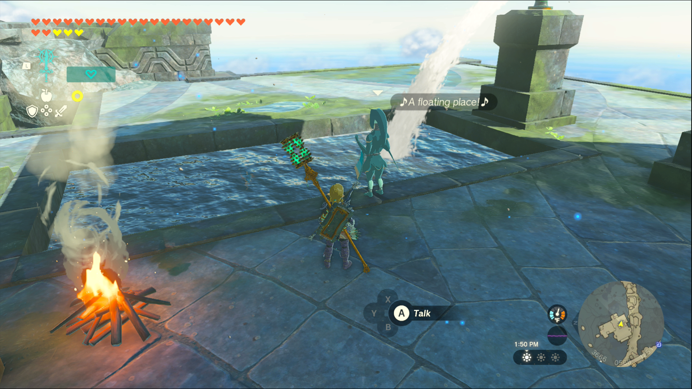
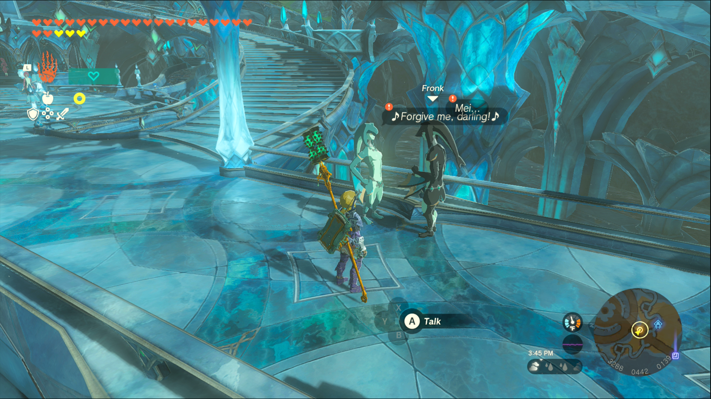

A Wife Wafted Away is one of the Side Quests you’ll discover in the Lanayru Great Spring region. Side Quests are quests in The Legend of Zelda: Tears of the Kingdom that are relatively short or simple chores that can earn you small rewards or services. 

## A Wife Wafted Away

To start the Side Quest “A Wife Wafted Awayl” you first need to complete the Main Quest “Sidon of the Zora.” Then go to the bridge into Zora’s Domain, specifically the section just above Mogawak Shrine, and speak to the Zora Fronk. He’s worried about his wife Mei, and would like you to find her, with the only clue being that she crossed the bridge east of Zora’s Domain singing about a floating island. 

If you cross the bridge to the east, you’ll find a series of waterfalls leading to the top of Ploymus Mountain, and from there you can glide to the waterfall in East Reservoir Lake. Since Zora can climb waterfalls with ease, it’s reasonable to assume that Mei climbed the waterfall to Wellspring Island. Looking at the map of the islands above Zora’s Domain, it’s also the only group of islands close enough to be the correct location. 

You can swim up the waterfall or teleport to Igoshon Shrine on Wellspring Island. From there, look to the east to spot a plume of smoke coming from a campfire. It can be tricky to spot due to the clouds at this altitude, but they move vertically and faster than any other clouds in the area. Glide over to spot a Zora singing about a floating island. 

Speaking to her confirms that this is Fronk’s wife, Mei, to inform her that he’s worried about her disappearance. She’ll head back immediately, so you should follow suit and speak with Fronk back at Zora’s Domain. 

For reuniting the couple, Mei will give you a dish made of the Hearty Bass she’d been catching on Wellspring Island. This restores all of your hearts and grants a whopping 10 extra temporary hearts! 

A Wife Wafted Away

See the complete List of Side Quests and Side Adventures

### Up Next: Walkthrough

Previous

About IGN's Zelda TotK Guide Writers

Next

Walkthrough

### Top Guide Sections

  * Walkthrough
  * Zelda: Tears of The Kingdom Switch 2 Edition Guide
  * Zelda Notes Voice Memories
  * List of Side Quests and Side Adventures

### Was this guide helpful?

Leave feedback

Go to comments