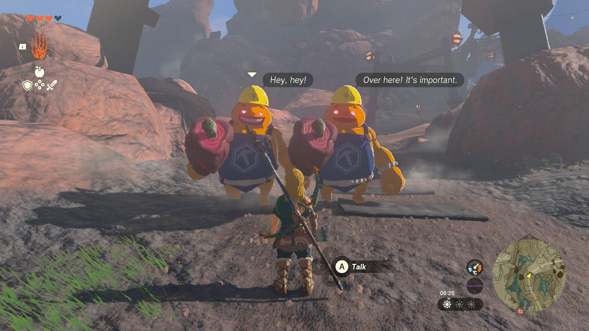
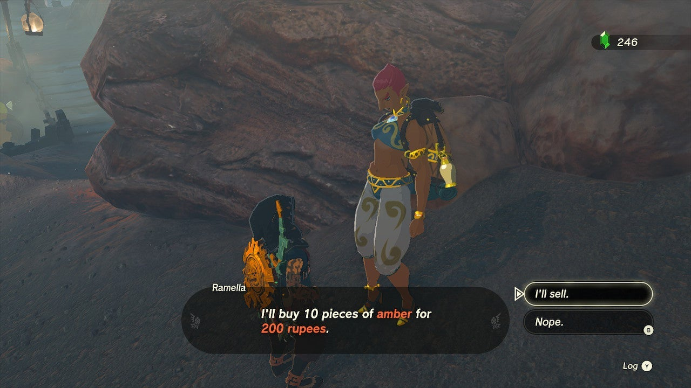

The Amber Dealer side quest in Tears of the Kingdom, which takes place in the Eldin region, is all about valuable amber ore. Collect ore, unlock an ore merchant, and beware of the rupee-hungry Gorons near Goron City! 

Here's how to complete the Legend of Zelda **Amber Dealer** quest. 

## Amber Dealer Walkthrough

On the road to **Goron City** , when approaching from the west, you’ll meet two shady Gorons (see picture below). They’ll offer to buy all of your ore for three rupees, which you need to accept. Don’t worry, you won’t actually lose any ore - but you will **start the Amber Dealer side quest**. 

  
After saving you from the scammers, an NPC named **Ramella** will offer to **buy ten pieces of amber** for a high price. You can sell your amber immediately if you have enough - if not, you might want to smash some ore deposits or fight some pebblits to obtain more. 

Once Ramella has her amber pieces, she’ll give you **200 rupees**. This will complete the Amber Dealer side quest. Ramella will remain available as an ore merchant with varying requests for specific ore types, starting with topaz. 

Amber Dealer

See the complete List of Side Quests and Side Adventures

### Up Next: Walkthrough

Previous

About IGN's Zelda TotK Guide Writers

Next

Walkthrough

### Top Guide Sections

  * Walkthrough
  * Zelda: Tears of The Kingdom Switch 2 Edition Guide
  * Zelda Notes Voice Memories
  * List of Side Quests and Side Adventures

### Was this guide helpful?

Leave feedback

Go to comments