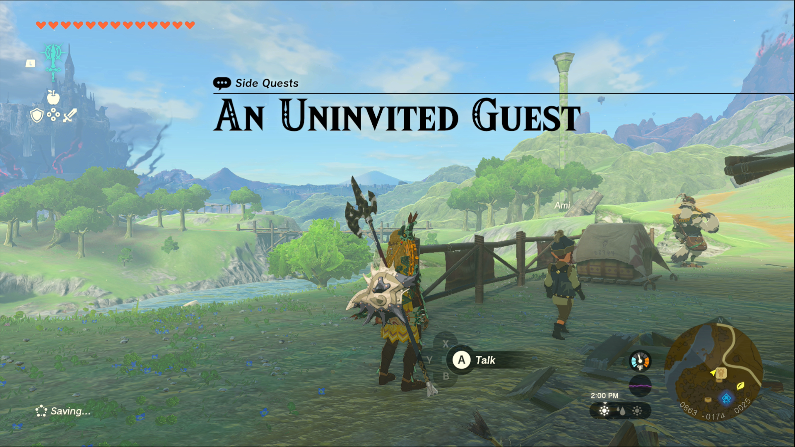
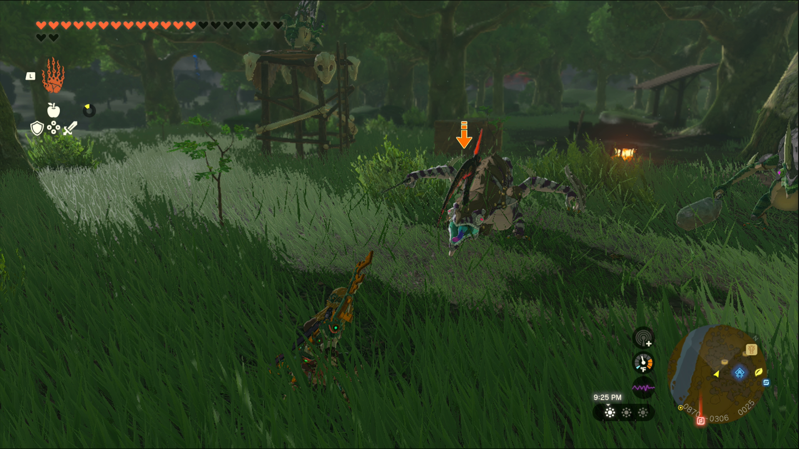

An Uninvited Guest is one of the Side Quests you’ll discover in the Lanayru Wetlands. Side Quests are quests in The Legend of Zelda: Tears of the Kingdom that are relatively short or simple chores that can earn you small rewards or services. 

## An Uninvited Guest

To start the Side Quest “An Uninvited Guest” you need to visit the Wetlands Stable, located between Necluda Wetlands and Hyrule Field. Speak to the Ami, the young child outside, to learn about their concerns regarding the monsters just south of the Stable, in the woods. 

You’ll need to enter the woods to defeat them; it’s a relatively small camp, consisting of just a trio of monsters, but always remain cautious against any enemy. 

If you’ve already explored the area, you may have already dealt with them, in which case Ami will immediately reward you with 2 Pony Points and the quest will be completed! 

An Uninvited Guest

See the complete List of Side Quests and Side Adventures

### Up Next: Walkthrough

Previous

About IGN's Zelda TotK Guide Writers

Next

Walkthrough

### Top Guide Sections

  * Walkthrough
  * Zelda: Tears of The Kingdom Switch 2 Edition Guide
  * Zelda Notes Voice Memories
  * List of Side Quests and Side Adventures

### Was this guide helpful?

Leave feedback

### In This Guide

The Legend of Zelda: Tears of the KingdomNintendo EPD

Initial Release: May 12, 2023

Learn more

Go to comments