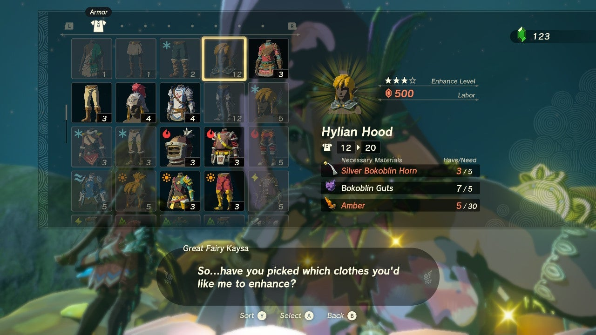

The Ancient Hero's Aspect is a single piece of Armor in The Legend of Zelda: Tears of the Kingdom that takes up all three armor slots. It's a special piece of armor you can only get by finding and completing every Shrine in TotK. 

Ancient Hero’s Aspect

Piece Effect  
Set / Upgrade Effect

N/A  
/ Master Sword Beam Up

Ancient Hero's Aspect

**Official Description:**_"This item is said to contain the spirit of a hero who once saved Hyrule. That hero's aura will envelop the wearer."_

##  How to Get the Ancient Hero's Aspect

After completing all 152 shrines in Tears of the Kingdom you will receive a message that says "make your way to the Temple of Time" and "you shall find a suitable reward for your efforts". 

Head to the Temple of Time on The Great Sky Island and return to the area above the rotating gears with the Goddess Statue where you first upgraded your health. Behind the statue you'll find a chest containing the Ancient Hero's Aspect. 

## Ancient Hero's Aspect Upgrade Materials

After you find and unlock the Great Fairy Fountains in Hyrule, you can bring them ingredients and a donation of rupees to increase the armor value. The rupees and materials needed to upgrade the Ancient Hero's Aspect Armor, according to Eurogamer, are listed below. 

Ancient Hero's Aspect Materials

Level  
Materials  
Defense Level

Base  
N/A  
12

★  
30 Rupees9xSilver Bokoblin Horn9xHinox Gutsx15Zonaite  
21

★★  
150 Rupees9xSilver Moblin Horn9xFrox Guts10xLarge Zonaite  
36

★★★  
600 Rupees9xSilver Lizalfos Horn9xMolduga Guts15xLarge Zonaite  
54

★★★★  
1500 Rupees9xSilver Lynel Saber Horn9xSilver Lynel Mace Horn9xGleeok Guts  
84

### Up Next: Walkthrough

Previous

About IGN's Zelda TotK Guide Writers

Next

Walkthrough

### Top Guide Sections

  * Walkthrough
  * Zelda: Tears of The Kingdom Switch 2 Edition Guide
  * Zelda Notes Voice Memories
  * List of Side Quests and Side Adventures

### Was this guide helpful?

Leave feedback

### In This Guide

The Legend of Zelda: Tears of the KingdomNintendo EPD

Initial Release: May 12, 2023

Learn more

Go to comments