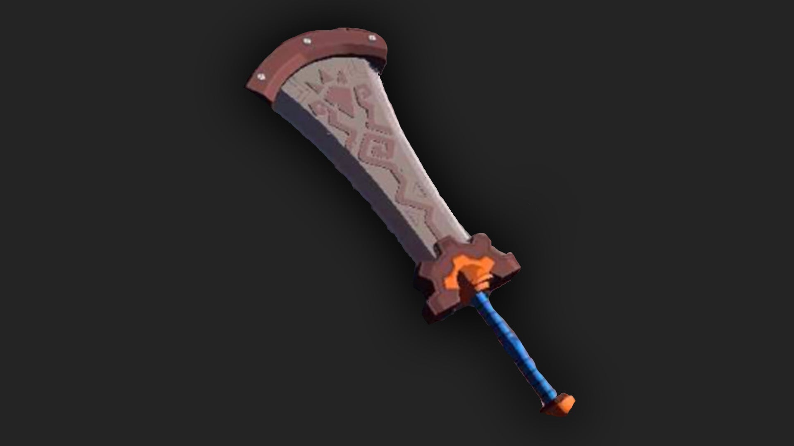

The Boulder Breaker is a two-handed weapon in The Legend of Zelda: Tears of the Kingdom. This massive weapon used to belong to the Goron Champion Daruk, but now it can be yours as long as you put in the work during the "Soul of the Gorons" side quest. 

## Boulder Breaker Stats

This two-handed weapon was once wielded by the Goron Champion Daruk. Daruk made swinging it around look easy, but a Hylian would need an immense amount of strength.

  * **Hyrule Compendium number:** 387
  * **Base Damage:** 38
  * **Passive Ability:** Demolisher

387 Boulder Breaker

You'll get this weapon after completing the side quest "Soul of the Gorons." 

Learn more about The Legend of Zelda: Tears of the Kingdom with our helpful guide: 

  * Complete Walkthrough
  * Tips, Tricks, and Things to Know
  * Things to Do First in TotK

Or Jump back to our Weapons Hub

### Up Next: Walkthrough

Previous

About IGN's Zelda TotK Guide Writers

Next

Walkthrough

### Top Guide Sections

  * Walkthrough
  * Zelda: Tears of The Kingdom Switch 2 Edition Guide
  * Zelda Notes Voice Memories
  * List of Side Quests and Side Adventures

### Was this guide helpful?

Leave feedback

### In This Guide

The Legend of Zelda: Tears of the KingdomNintendo EPD

Initial Release: May 12, 2023

Learn more

Go to comments