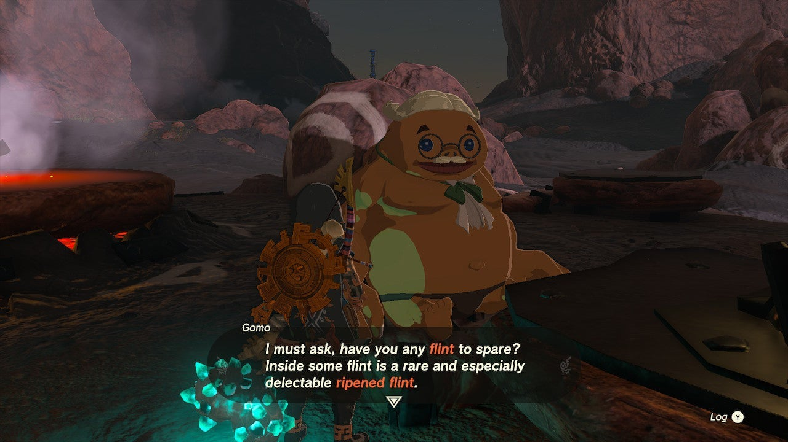

There's a very flint-hungry Goron waiting for your help at the Bedrock Bistro... If you're looking for some extra rupees and you have a nice stack of flint, you don't want to miss the **Cash in on Ripened Flint** side quest. 

If you want to know where to find this hungry Goron and how to complete the quest, here's a **full walkthrough** for Cash in on Ripened Flint. 

## Cash in on Ripened Flint Walkthrough

This side quest takes place at the **Bedrock Bistro** in the Eldin region, northeast of Woodland Stable. Beware that this Tears of the Kingdom side quest only becomes available after you've completed the previous side quest in the same location: Meat for Meat. 

Speak to the Goron named **Gomo** , who's sitting at a table in front of the Bedrock Bistro. He will offer to pay **1,000 rupees** if you bring him Ripened Flint, but there's a catch: he will consume a batch of normal flint first, and only pay you if it happens to contain a piece of Ripened Flint. This is based on chance, so you may have to spend a lot of flint before you get the 1,000 rupee reward. 

Luckily, there's a workaround: **save your game** before giving Gomo the flint, then hand over a batch of 20 or 50 flint (choose 50 if you want to avoid having to reload your game several times). Simply reload your saved game until you get lucky. Congrats on the 1,000 rupees! 

Cash In on Ripened Flint

See the complete List of Side Quests and Side Adventures

### Up Next: Walkthrough

Previous

About IGN's Zelda TotK Guide Writers

Next

Walkthrough

### Top Guide Sections

  * Walkthrough
  * Zelda: Tears of The Kingdom Switch 2 Edition Guide
  * Zelda Notes Voice Memories
  * List of Side Quests and Side Adventures

### Was this guide helpful?

Leave feedback

### In This Guide

The Legend of Zelda: Tears of the KingdomNintendo EPD

Initial Release: May 12, 2023

Learn more

Go to comments