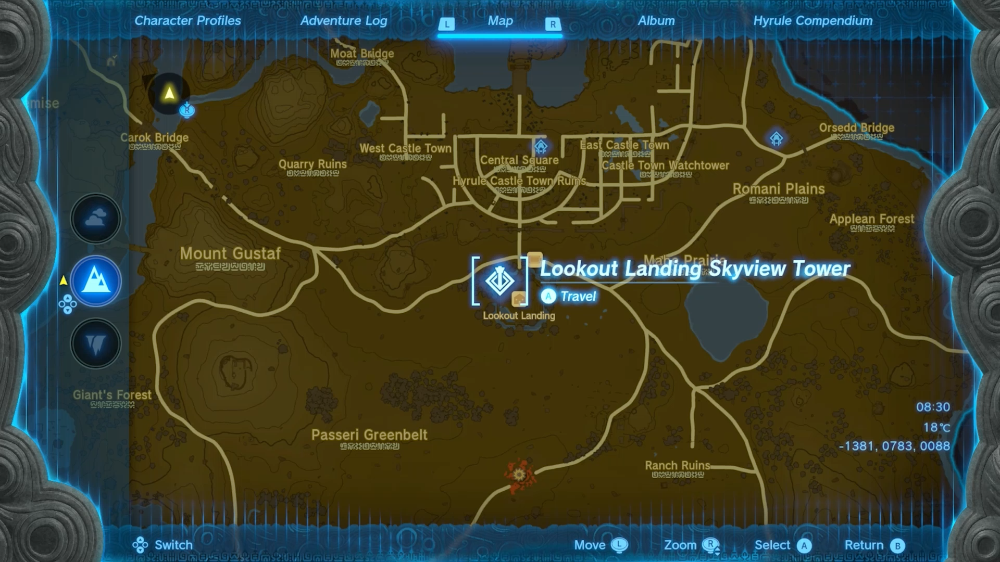
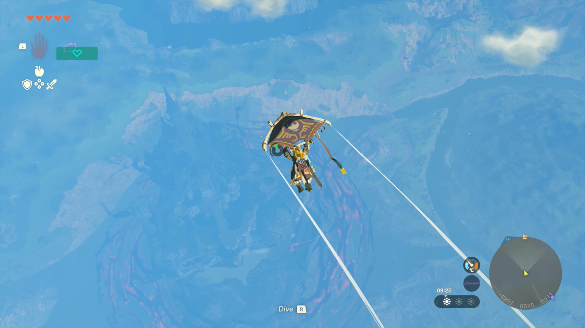
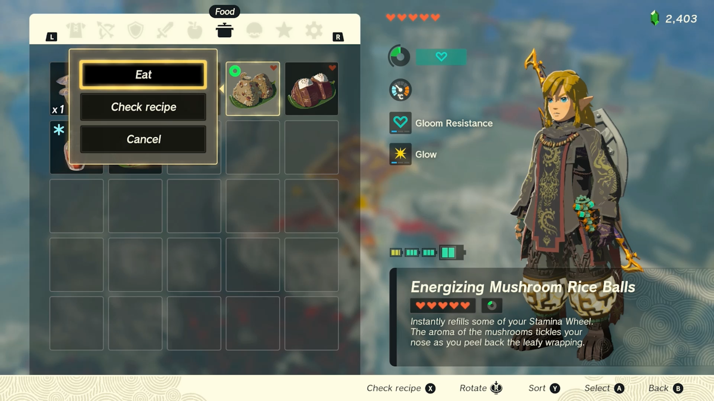
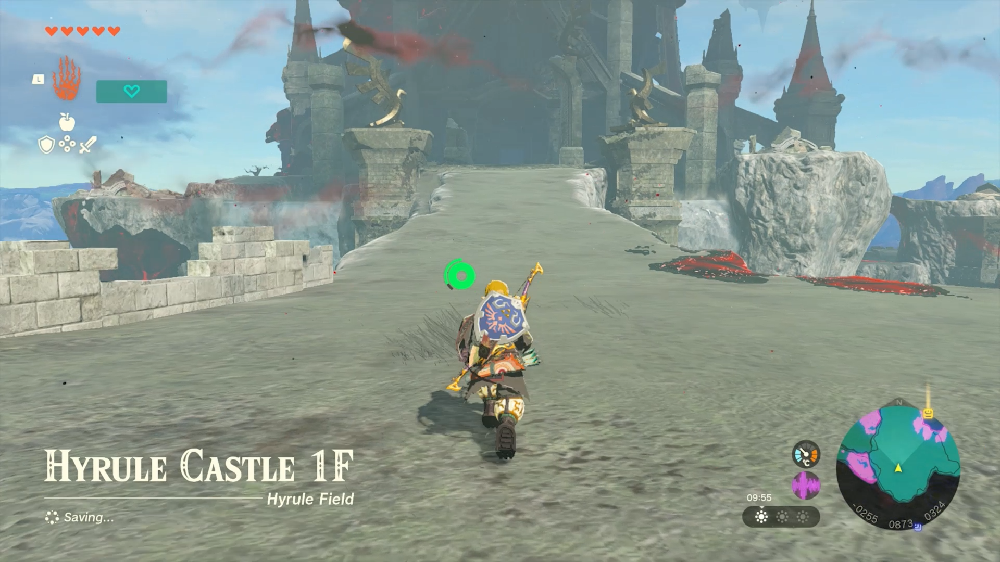
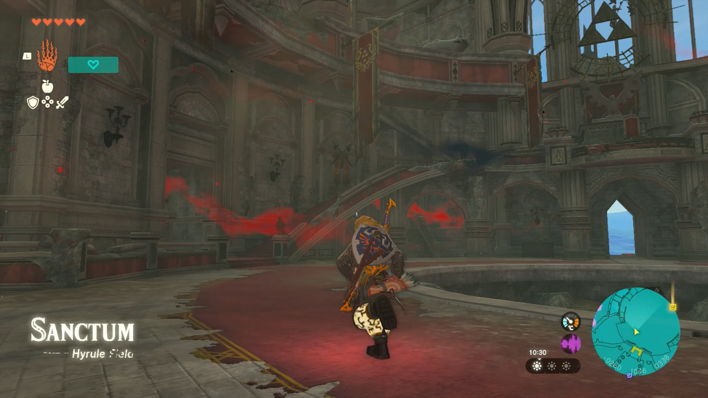
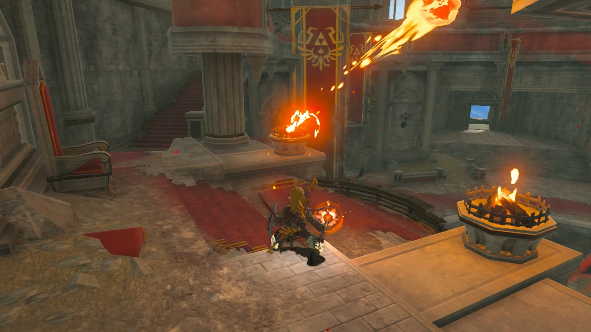
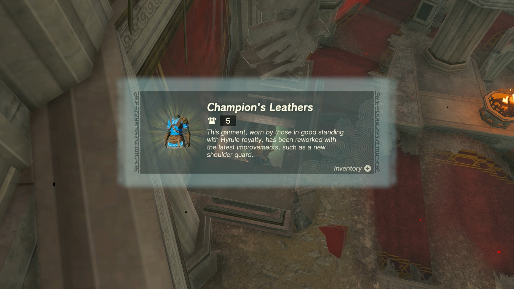

The Champion's Leathers is a new piece of Armor in The Legend of Zelda: Tears of the Kingdom. It is a redesigned take on the Blue Champion's Tunic, and offers improved defenses. However, unlike the Champion's Tunic, it does not reveal enemy hit points. 

Champion's Leathers

Piece Effect

(Hidden - Master Sword Beams w/o full health)

Champion's Leathers

This garment, worn by those in good standing with Hyrule royalty, has been reworked with the latest improvements, such as a new shoulder guard. It is fairly interchangeable with the Hylian Outfit, which includes: 

  * Hylian Hood \- Head Gear
  * Hylian Tunic \- Chest Gear
  * Hylian Trousers \- Leg Gear

While it cannot be dyed, the Champion's Leathers can be upgraded by visiting the Great Fairy Fountains. 

## How to Get the Champion's Leathers in TotK

Before we get started, you're going to want to make sure that you've either upgraded your Stamina Wheel a couple of times or have a few stamina-replenishing meals in your inventory since this requires a fair bit of gliding. 

To get the Champion's Leathers, you'll need access to the Paraglider. Thankfully, if you haven't managed to get this Key Item just yet, our How to Get the Paraglider guide has you covered.

Once you're ready, head on over to Lookout Landing, and use the Lookout Landing Skyview Tower to shoot yourself up into the air! 

As soon as you can, open the paraglider, and start heading north, right towards Hyrule Castle's front entrance, as that's where you'll want to land. 

This is where you'll want to be mindful of how much stamina you've got left; if the answer's not a lot, inhale the odd rice ball or two and get yourself topped up. 

Once you've safely landed, continue heading north until you've made it into the Sanctum. 

Take a left up some stairs, and you'll find a couple of unlit braziers right next to a statue of a bird. 

Use a torch, fire fruit, or whatever else catches on fire to light both of them up, and a short cutscene will play, revealing a chest beneath the nearby statue that has now moved. This chest will contain the blue Champion's Leathers. 

**Champion's Leathers Description** : _This garment, worn by those in good standing with Hyrule royalty, has been reworked with the latest improvements, such as a new shoulder guard._

##  Champion's Leathers Armor Upgrades

Level  
Materials  
Defense Level

Base  
-  
5

★  
10 Rupees(3) Silent Princess(2) Light Dragon's Scale  
8

★★  
50 Rupees(3) Silent Princess(10) Sundelion(2) Light Dragon's Talon  
14

★★★  
200 Rupees(5) Silent Princess(15) Sundelion(2) Shard of Light Dragon's Fang  
22

★★★★  
500 Rupees(10) Silent Princess(20) Sundelion(2) Light Dragon's Horn  
32

Looking for even more Tears of the Kingdom Guides? Why not check out... 

  * Things Tears of the Kingdom Doesn't Tell You
  * All Skyview Towers Locations
  * Walkthrough Guide
  * All Shrine Locations and Solutions

### Up Next: Diamond Circlet

Previous

Cece Hat

Next

Diamond Circlet

### Top Guide Sections

  * Walkthrough
  * Zelda: Tears of The Kingdom Switch 2 Edition Guide
  * Zelda Notes Voice Memories
  * List of Side Quests and Side Adventures

### Was this guide helpful?

Leave feedback

Go to comments