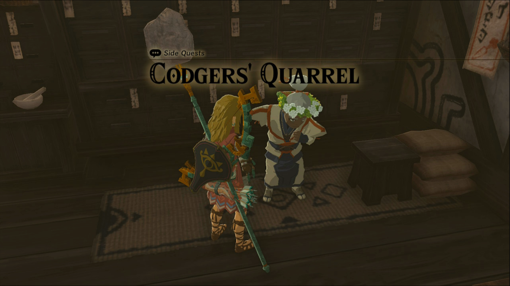
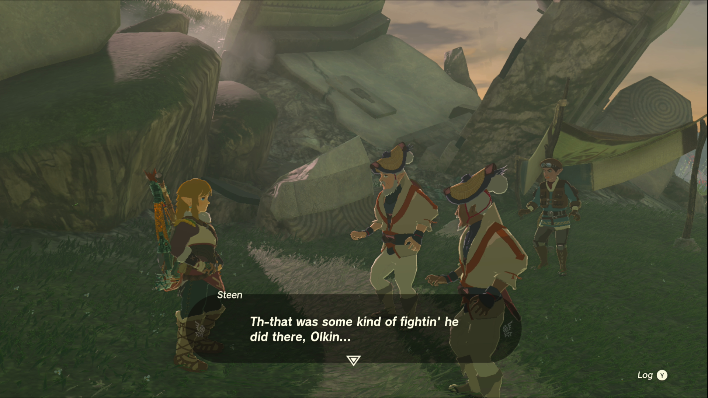

Codgers’ Quarrel is one of the Side Quests you’ll discover in Kakariko Village. Side Quests are quests in The Legend of Zelda: Tears of the Kingdom that are relatively short or simple chores that can earn you small rewards or services. 

## Codgers’ Quarrel Guide

To start the Side Quest “Codgers’ Quarrel” you need to visit **High Spirits Produce** in **Kakariko Village**. Speak to the woman at the counter, Trissa, and she’ll apologize for the meager offerings, saying that the people that usually supply the shop are busy at the ring ruins. To help her bring them back, you’ll need to head to the Ring Ruins **southwest of the village**. Teleport to Makasura Shrine if you’ve activated it to make the trip a little shorter. 

### Helpful Note

You should accept the side quests “**A Trip through History**” from Bugut, and “**Out of the Inn**” from Dai, before embarking on this quest. These quests all have to do with the Ring Ruins in one way or another so it’s most efficient to accept them all at once. Bugut can be found wandering through Kakariko Village, while Dai is watching over the Shuteye Inn near the southwest entrance to the village. 

When you reach the Ring Ruins, you’ll see the pair arguing over the best way to handle the monsters. Naturally, things would move along more smoothly if someone else just dealt with the monsters in the ruins, so head on in and defeat the bokoblins. There are a few in the clearing, but there may also be an archer standing on the ruins above. 

Once they’re all defeated, head back to the arguing pair (after reading the notes on the stone slab further within for the side quest **A Trip through History**) to see how the pair has learned from your example. They head back to town, mentioning that they need to get back to resupplying the grocer, which is your cue to head back to the store and speak to Trissa. 

She will thank you and offer an **Endura Carrot** as a reward for your help, in addition to having more supplies to sell you. However, now she’s missing eggs and you’ll need to complete her new side quest, **Follow the Cuccos****,** to fully stock the store. 

Codgers' Quarrel

See the complete List of Side Quests and Side Adventures

### Up Next: Walkthrough

Previous

About IGN's Zelda TotK Guide Writers

Next

Walkthrough

### Top Guide Sections

  * Walkthrough
  * Zelda: Tears of The Kingdom Switch 2 Edition Guide
  * Zelda Notes Voice Memories
  * List of Side Quests and Side Adventures

### Was this guide helpful?

Leave feedback

### In This Guide

The Legend of Zelda: Tears of the KingdomNintendo EPD

Initial Release: May 12, 2023

Learn more

Go to comments