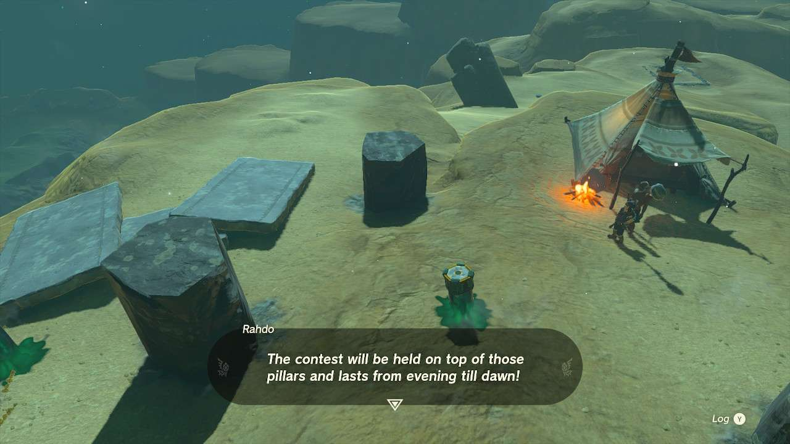
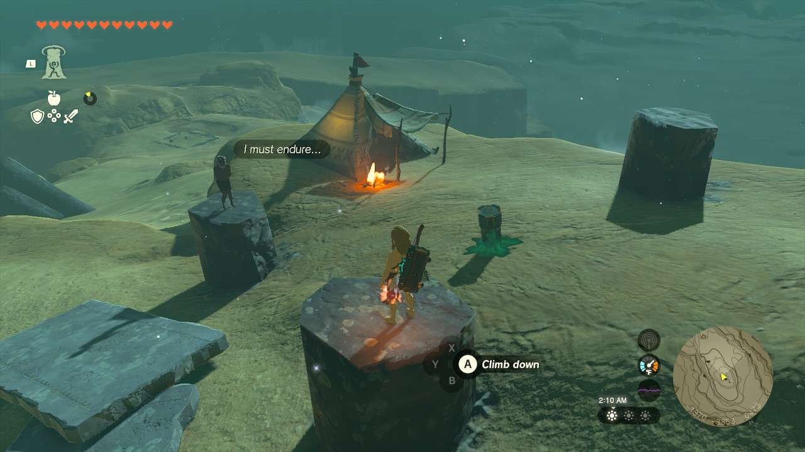

**Cold-Endurance Contest!** is one of the many Side Quests to complete in The Legend of Zelda: Tears of the Kingdom. In this guide, we will teach you everything you need to know to complete Cold-Endurance Contest!, including where to find it and what you will get as a reward. 

  * **Side Quest Location** : Mount Granajh, Gerudo Canyon
  * **Prerequisites** : n/a
  * **Rewards** : 100 Rupees

You can speak to **Rahdo** at the peak of **Mount Granajh** , where he’ll issue a challenge: both of you put up 50 Rupees to see who can make it through the night in the extreme desert cold. **The catch is you can’t wear any clothing or have your feet touch the floor from the pillar you start on**. However, everything else is fair game. 

There are a variety of ways to make it through this without freezing; you can make food or elixirs and consume them throughout the night just fine, though you’ll need a lot of them. The challenge starts at around 8:30 PM and will go until 4 AM the next day, so that would be a lot of brewing. Perhaps the easiest way is to have a weapon or shield that’s Fused with a Ruby and just equip it - he doesn't take your weapons. Not far away to the west from Mount Granajh is the South Lomei Labyrinth, which has a Meteo Wizzrobe nearby you can take a Ruby Rod from. 

Another solution, though you may have to budget your space on the pillar, is to create a fire. **There are three bundles of wood right beside Rahdo’s tent you can pick up and if you’ve got some Flint** , you can just make the fire then and there. There are also several slabs and Zonai devices surrounding the area for you to work some imagination with if you wish. 

When the morning rolls around, Rahdo will concede and hand you the reward, but then also hint he has a second challenge for you. 

Cold-Endurance Contest!

See the complete List of Side Quests and Side Adventures

### Up Next: Walkthrough

Previous

About IGN's Zelda TotK Guide Writers

Next

Walkthrough

### Top Guide Sections

  * Walkthrough
  * Zelda: Tears of The Kingdom Switch 2 Edition Guide
  * Zelda Notes Voice Memories
  * List of Side Quests and Side Adventures

### Was this guide helpful?

Leave feedback

### In This Guide

The Legend of Zelda: Tears of the KingdomNintendo EPD

Initial Release: May 12, 2023

Learn more

Go to comments