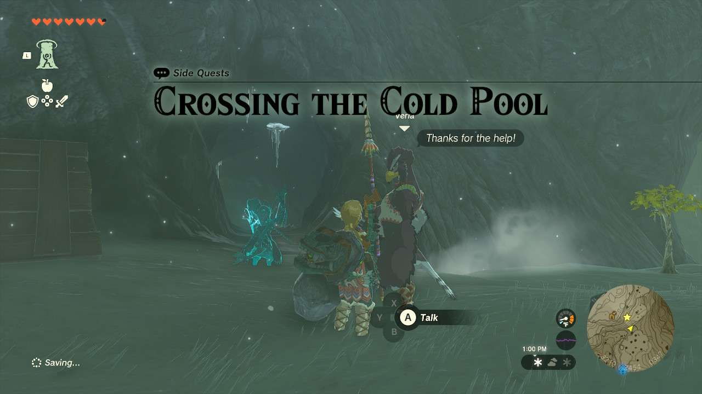
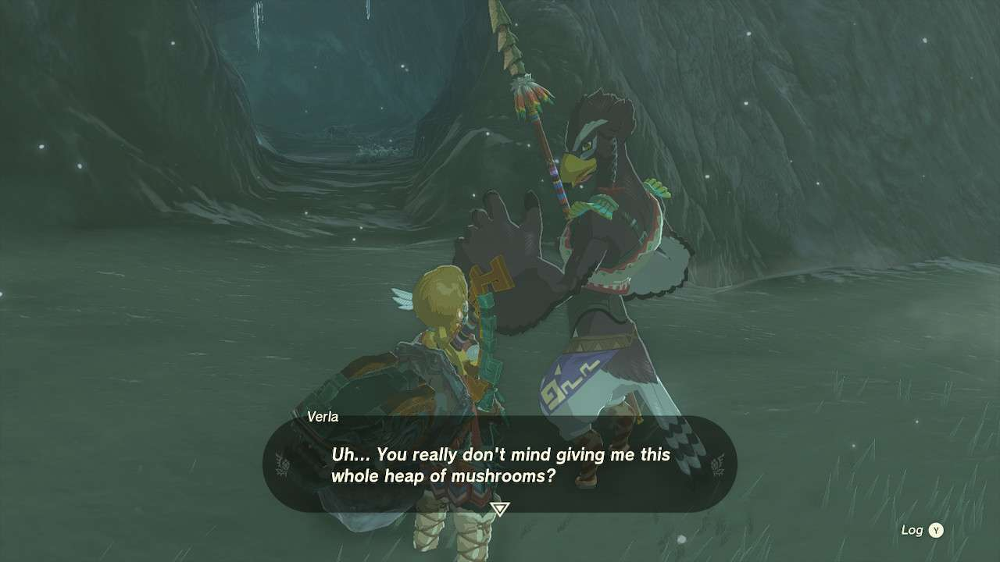
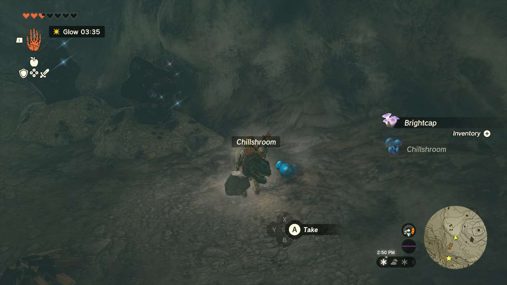

**Crossing the Cold Pool** is one of the many Side Quests to complete in The Legend of Zelda: Tears of the Kingdom. In this guide, we will teach you everything you need to know to complete Crossing the Cold Pool, including where to find it and what you will get as a reward. 

  * **Side Quest Location** : Talonto Peak Cave (-3221, 2454, 0347)
  * **Prerequisites** : n/a (Possibly need to finish the Rito Village portion of Regional Phenomena)
  * **Rewards** : 50 Rupees

As you’re adventuring in the Hebra Mountains, you may come across **Verla** in front of a cave opening, just up the ladder from **Hebra Trailhead Lodge**. Speak with them to begin the quest. 

Verla just needs 10**chillshrooms** and this small cave is actually full of them. If you don’t have that many from just venturing up and around the mountains, you can enter the cave and collect a great deal of chillshrooms. Right behind you are building materials, which you can combine together to make a bridge long enough to, well, cross the cold pool and collect all the chillshrooms. 

Speak with Verla again once you have the 10 chillshrooms and they’ll gift you 50 Rupees. 

Crossing the Cold Pool

See the complete List of Side Quests and Side Adventures

### Up Next: Walkthrough

Previous

About IGN's Zelda TotK Guide Writers

Next

Walkthrough

### Top Guide Sections

  * Walkthrough
  * Zelda: Tears of The Kingdom Switch 2 Edition Guide
  * Zelda Notes Voice Memories
  * List of Side Quests and Side Adventures

### Was this guide helpful?

Leave feedback

### In This Guide

The Legend of Zelda: Tears of the KingdomNintendo EPD

Initial Release: May 12, 2023

Learn more

Go to comments