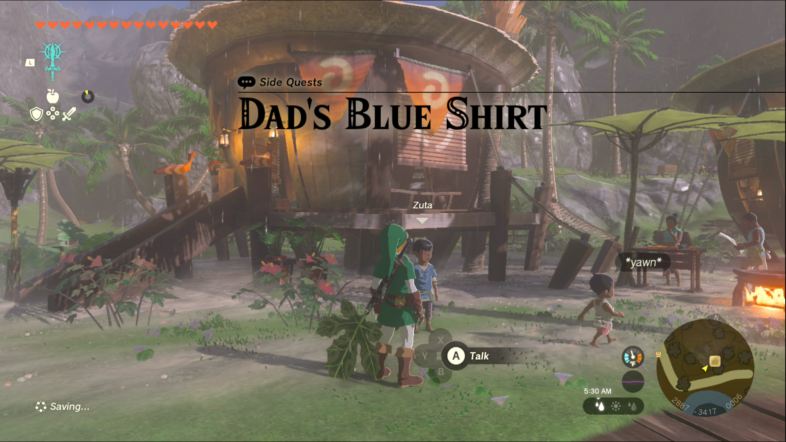
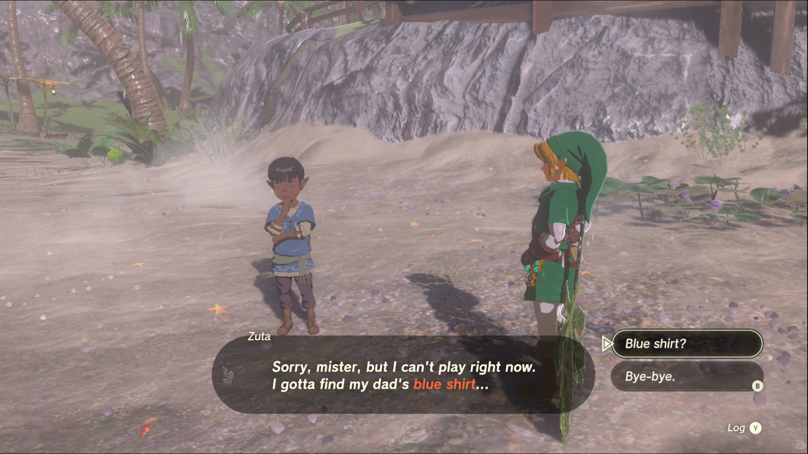
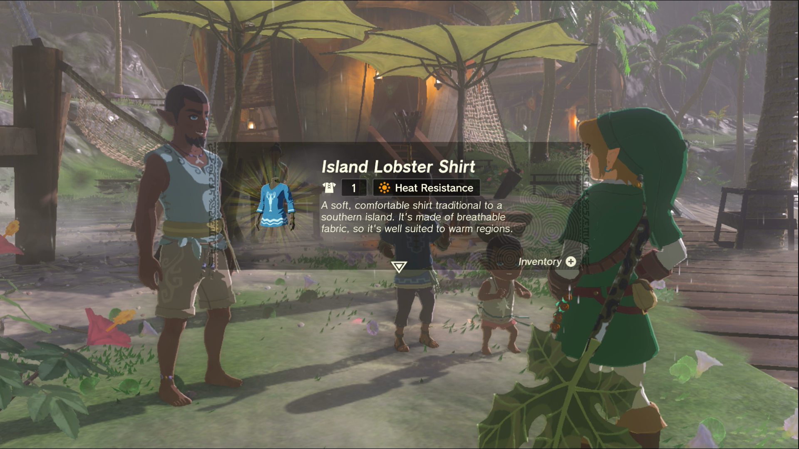

Dad’s Blue Shirt is a Side Quest you’ll find in Lurelin Village. Side Quests are quests in The Legend of Zelda: Tears of the Kingdom that are relatively short or simple chores that can earn you small rewards or services. 

## Dad’s Blue Shirt

To start the Side Quest “Dad’s Blue Shirt” you need to complete “Ruffian-Infested Village” and “Lurelin Village Restoration Project.” Then you can find a young boy, Zuta, on the beach in Lurelin Village. It seems his father has been lamenting his blue shirt, which was stored in an iron chest and was lost in the invasion. Zuta is sure it can’t be far, since it’s made of heavy iron, but he can’t find it anywhere. 

Zuta is right on the money, the chest is in the bay of the village, and if you activate your Ultrahand you may be able to see it out in the water. Getting to it is another issue though, and you’ll have to either create a raft to let you get close enough to pluck it out of the water, or do what we did, and fashion a long device made of logs. We used our longest log to attach the chest from the safety of the shore, then brought the whole thing closer to give us access to the chest. It contains the **Island Lobster Shirt** , which may be familiar to fans of the franchise. 

In any case, speak to Zuta once you have the shirt in hand and he’ll call his father over to retrieve it. After a short misunderstanding, you’ll be allowed to keep the shirt and the quest will be completed. 

Dad's Blue Shirt

See the complete List of Side Quests and Side Adventures

### Up Next: Walkthrough

Previous

About IGN's Zelda TotK Guide Writers

Next

Walkthrough

### Top Guide Sections

  * Walkthrough
  * Zelda: Tears of The Kingdom Switch 2 Edition Guide
  * Zelda Notes Voice Memories
  * List of Side Quests and Side Adventures

### Was this guide helpful?

Leave feedback

### In This Guide

The Legend of Zelda: Tears of the KingdomNintendo EPD

Initial Release: May 12, 2023

Learn more

Go to comments