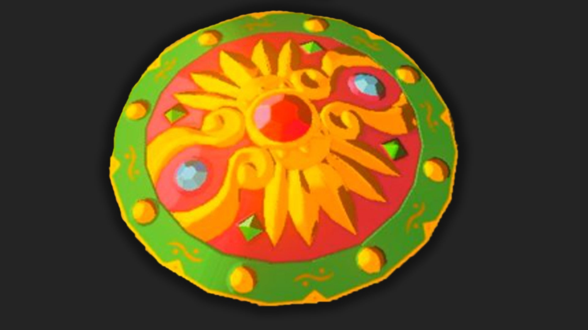

Daybreaker is a Shield in The Legend of Zelda: Tears of the Kingdom. Once upon a time, this shield used to belong to the Gerudo Champion Urbosa. It has a base protection of 48, and it can be yours by completing a side quest in the Gerudo Desert. 

## Daybreaker Stats

 _"This shield was cherished by the Gerudo Champion Urbosa. The gold used to make it was handpicked to ensure a design that is both lightweight and very durable."_

  * **Hyrule Compendium number:** 487
  * **Base Protection:** 48

487 Daybreaker

You can find this shield by completing the side quest "The Missing Owner." 

Learn more about The Legend of Zelda: Tears of the Kingdom with our helpful guide: 

  * Complete Walkthrough
  * Tips, Tricks, and Things to Know
  * Things to Do First in TotK

Or Jump back to our Weapons Hub

### Up Next: Walkthrough

Previous

About IGN's Zelda TotK Guide Writers

Next

Walkthrough

### Top Guide Sections

  * Walkthrough
  * Zelda: Tears of The Kingdom Switch 2 Edition Guide
  * Zelda Notes Voice Memories
  * List of Side Quests and Side Adventures

### Was this guide helpful?

Leave feedback

### In This Guide

The Legend of Zelda: Tears of the KingdomNintendo EPD

Initial Release: May 12, 2023

Learn more

Go to comments