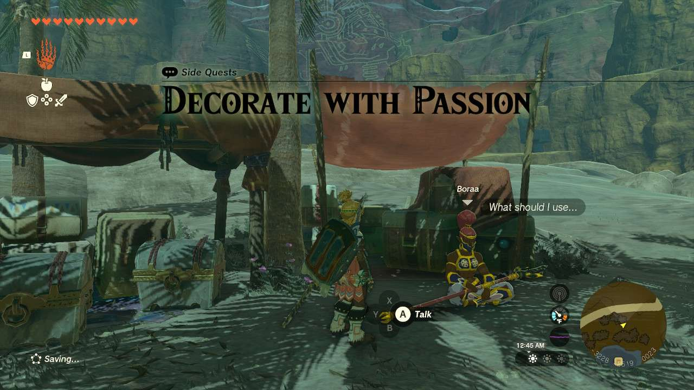
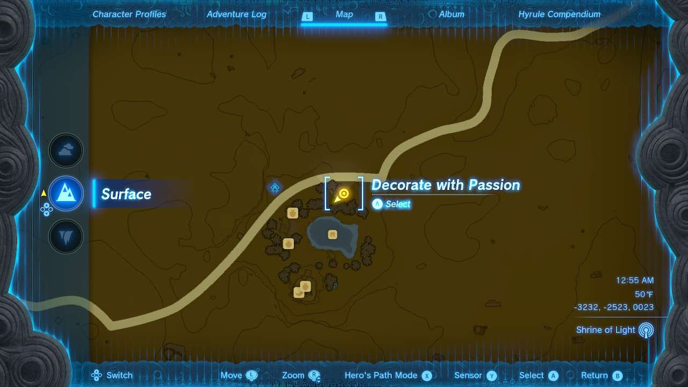
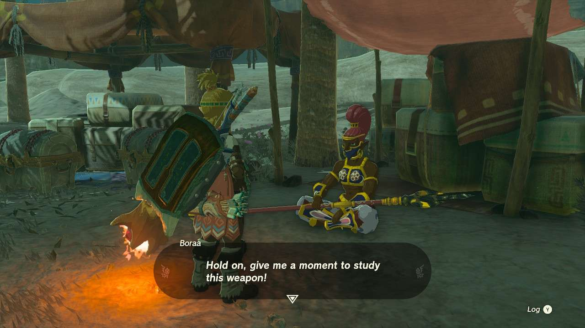

**Decorate with Passion** is one of the many Side Quests to complete in The Legend of Zelda: Tears of the Kingdom. In this guide, we will teach you everything you need to know to complete Decorate with Passion, including where to find it and what you will get as a reward. 

  * **Side Quest Location** : Gerudo Desert, Kara Kara Bazaar
  * **Prerequisites** : n/a
  * **Rewards** : Electric Keese Eye

Towards the farthest back area of the Kara Kara Bazaar, you’ll find a soldier sitting next to two chests that you can’t open. This is **Boraa** , who you need to speak to to start this quest. She’s looking for a weapon that burns with passion. 

The solution is fairly simple - either fuse a weapon you already have with a Ruby to make it have fire properties, or find one. **Monster parts are not allowed for this quest**. Fire Wizzrobes carry them if you can take one down. Otherwise, simply craft the weapon necessary. Additionally, you don’t have to worry about losing it because you don’t lose the item, you just need to show it to Boraa. If you need to track down a Ruby, head to caves with ore deposits. 

Decorate with Passion

See the complete List of Side Quests and Side Adventures

### Up Next: Walkthrough

Previous

About IGN's Zelda TotK Guide Writers

Next

Walkthrough

### Top Guide Sections

  * Walkthrough
  * Zelda: Tears of The Kingdom Switch 2 Edition Guide
  * Zelda Notes Voice Memories
  * List of Side Quests and Side Adventures

### Was this guide helpful?

Leave feedback

Go to comments