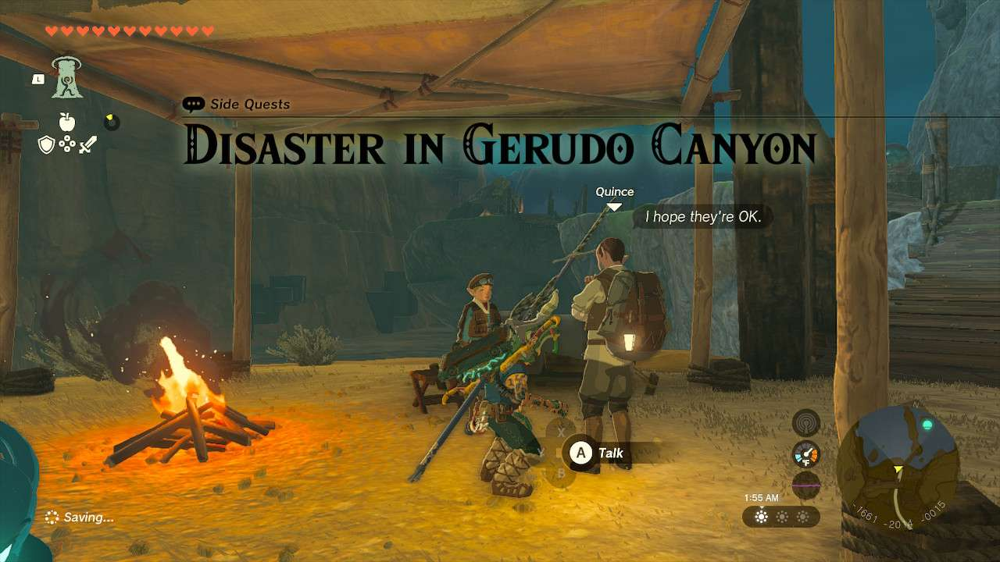
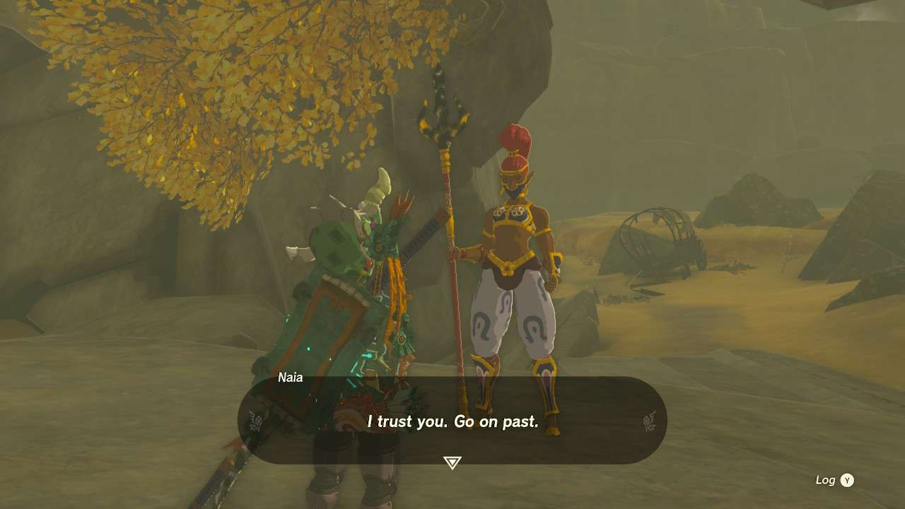
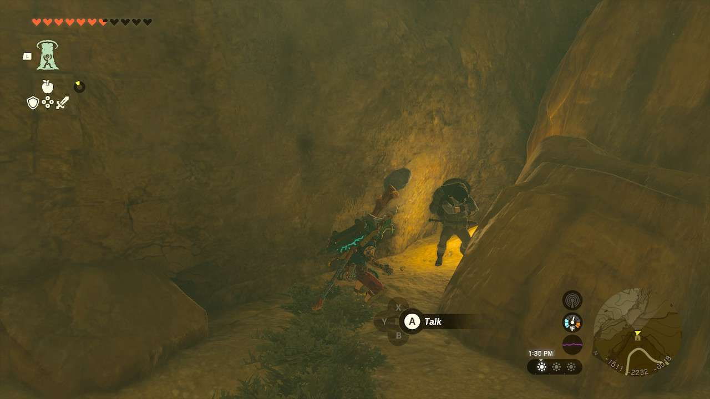
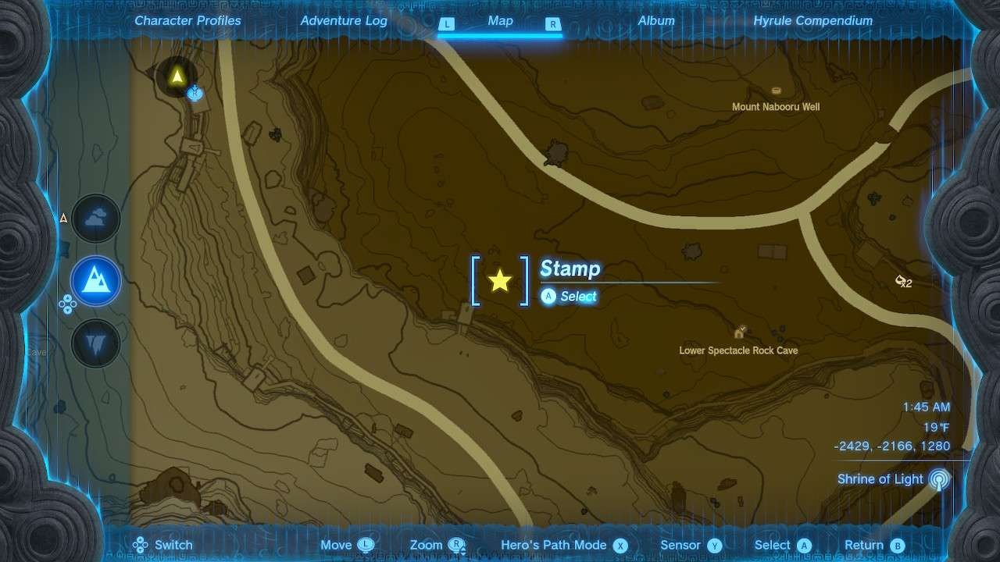
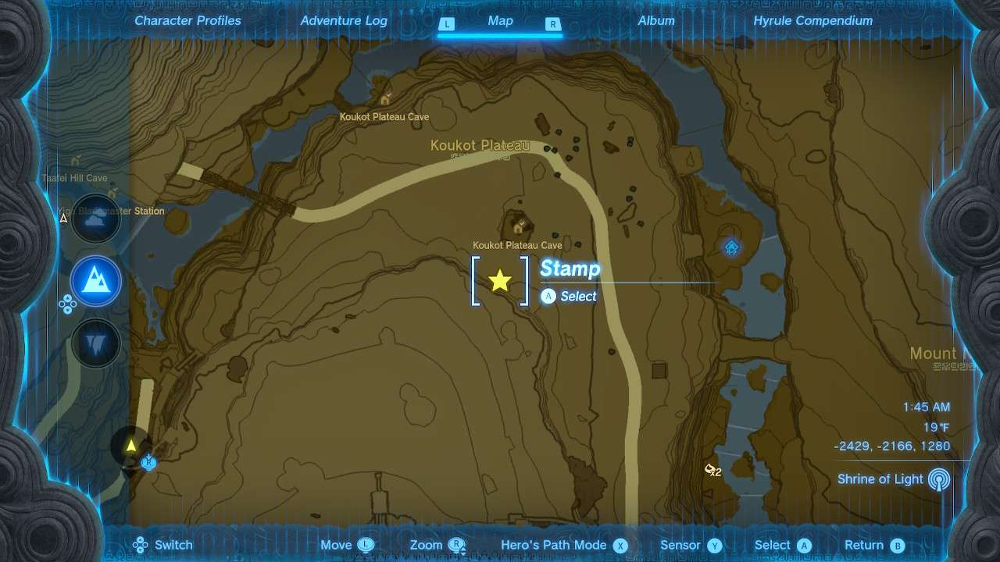

**Disaster at Gerudo Canyon** is one of the many Side Quests to complete in The Legend of Zelda: Tears of the Kingdom. In this guide, we will teach you everything you need to know to complete Disaster at Gerudo Canyon, including where to find it and what you will get as a reward. 

  * **Side Quest Location** : Gerudo Canyon Pass, Gerudo Desert
  * **Prerequisites** : n/a
  * **Rewards** : Bomb Flower x10

This quest can be started proper at the base camp of the **Gerudo Canyon Pass** , just south of the Mini Stable and the Device Dispenser around there. A fellow named **Quince** had 3 people in his patrol get lost on their travels and needs to find them, help them with whatever stopped them, and make sure everyone’s okay. They are all within the **Gerudo Canyon Pass** area between **Mount Nabooru** and **Gerudo Canyon** itself. _This quest can be jump-started by finding the lost travelers out in the wild outside of the mission._ They can also all be found by traveling along the road through the pass. 

Before you can go rescue anyone, however, a Gerudo named **Naia** stands as gatekeeper and asks you four questions to see if you’re prepared for the extreme weather and terrain of the desert. The four answers are: 

  * Stay near a fire!
  * A nice, shady spot!
  * Chillshroom!
  * Into a cave!

Once satisfied, she’ll let you pass. She can also be completely circumvented if you come from the other side of the Pass. _Naia isn't necessarily attached exclusively to this quest, as she asks those questions the first time you meet her no matter what and this is likely your first time speaking to her_. 

The first and closest of the lost folks is **Botrick** in **Starly Plateau Cave** (-1529, -2225, -0018). He’s trapped by some Lizfols you need to quickly defeat. Once the four of them are out of the way, he’ll make his way back to camp. 

The next one is located further down the road, west of **Lower Spectacle Rock Cave**. You should see white smoke, where you’ll find **Giro** in need of a Splash Fruit. Give them the Splash Fruit and they’ll return to the group. If you need one, there’s actually a plant somewhere nearby in the area. 

The final traveler, **Garill** , in the **Koukot Plateau** area. You may need to do some climbing around here to get to them. They’re not far from the huge shaft entrance to **Koukot Plateau Cave**. They’ll also have white smoke around a campfire, and be in need of a Spicy Pepper. Hand it over and they’ll rejoin the group. 

When all three members have returned, you can also return to Quince, where the thankful explorer will gift you with a bunch of Bomb Flowers. 

Disaster in Gerudo Canyon

See the complete List of Side Quests and Side Adventures

### Up Next: Walkthrough

Previous

About IGN's Zelda TotK Guide Writers

Next

Walkthrough

### Top Guide Sections

  * Walkthrough
  * Zelda: Tears of The Kingdom Switch 2 Edition Guide
  * Zelda Notes Voice Memories
  * List of Side Quests and Side Adventures

### Was this guide helpful?

Leave feedback

### In This Guide

The Legend of Zelda: Tears of the KingdomNintendo EPD

Initial Release: May 12, 2023

Learn more

Go to comments