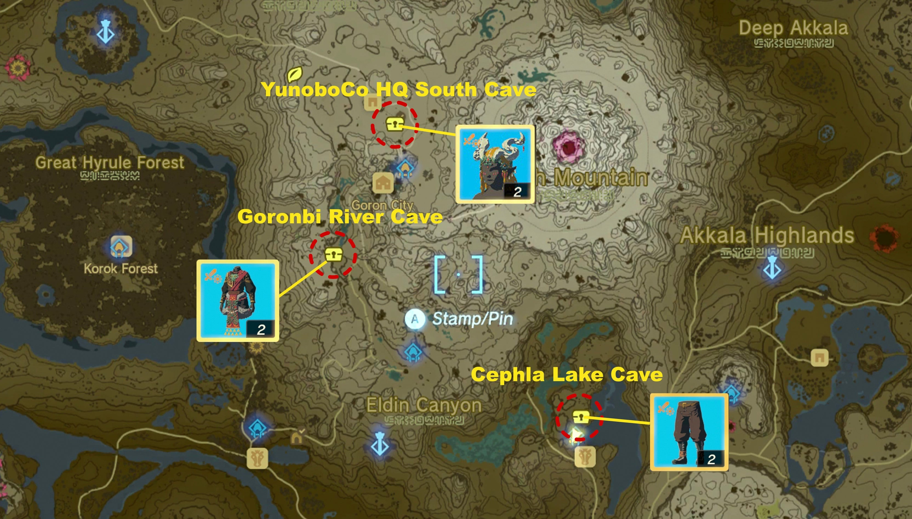
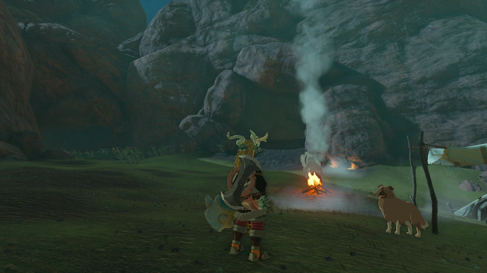
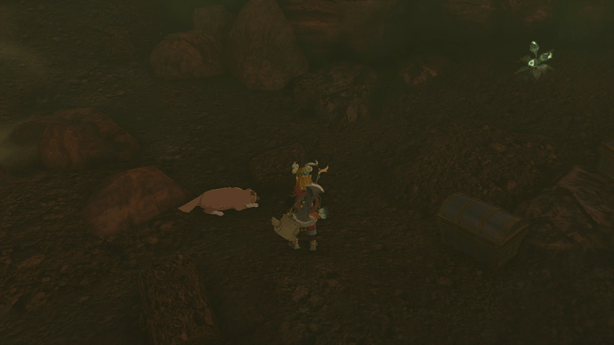
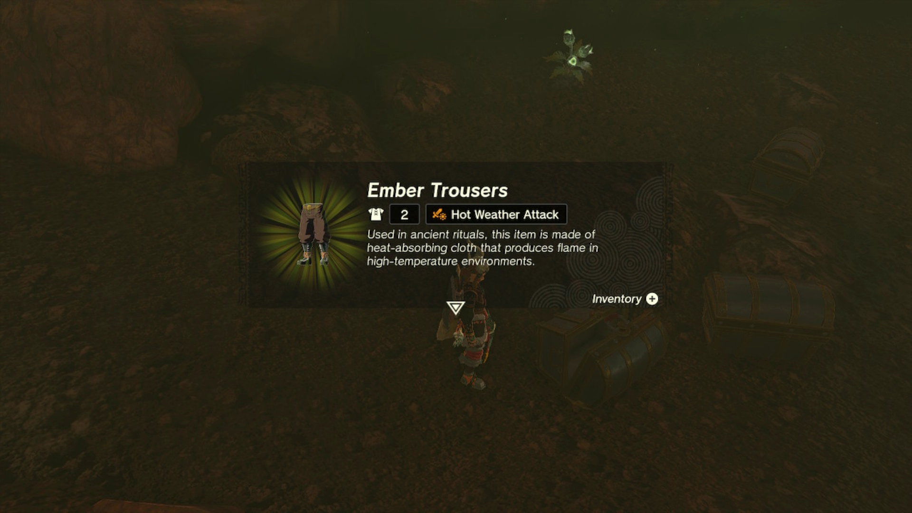
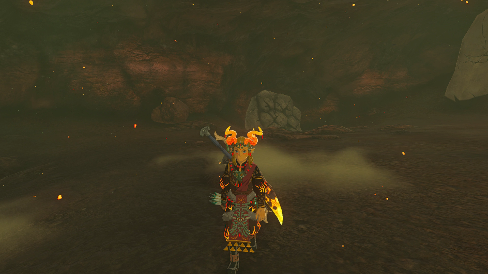

The Ember Trousers is a piece of Armor in the Legend of Zelda: Tears of the Kingdom that offers armor and an attack buff in heat. It can be found in the Eldin region inside the Goronbi River Cave. It is also part of the Ember Armor Set, which includes the following pieces: 

  * Ember Headdress \- Head Gear
  * Ember Shirt \- Body Gear

Ember Trousers

2 Defense. Hot Weather Attack Buff. 600 Sell Value.

Used in ancient rituals, this item is made of heat-absorbing cloth that produces flame in high-temperature environments.

Ember Trousers

## How to Get the Ember Trousers in TotK

You can find the Ember Trousers in Cephla Lake Cave in the Eldin Region, just north of Foothill Stable and Kisinona Shrine. You'll see a small camp set up in front of the mouth of the cave on the bank of Cephla Lake. 

Rather than rush in, talk to the men at the opening of the cave to start the side quest Misko's Cave of Chests. 

The short of it is to give the dog meat until it befriends you. It took four meats for us. Then, it will lead you inside the cave to the correct chest. 

Use Ultrahand on the to shake the chest the dog lead you to loose from the ground. Upon opening it, you'll find the Ember Trousers! 

## Ember Trouser Upgrades

 After you find and unlock the Great Fairy Fountains in Hyrule, you can bring them ingredients and a donation of rupees to increase the armor value of each piece of armor. All pieces of the Ember Armor Set will require the same materials to upgrade each. See the table below for the ingredients needed and defense bonus you can gain for each piece of armor. 

  * Upgrading each piece to level 2 will unlock the Set Bonus: Hot Weather Charge, which charges attacks faster in hot weather.

Level  
Materials  
Defense Level (Total)

Base  
N/A  
1

★  
10 Rupees(3)Fire Fruit  
4

★★  
50 Rupees(5)Fire-Breath Lizalfos Horn(5)Summerwing Butterfly  
6

★★★  
200 Rupees(5)Fire Like Stone(5)Warm Darner(5)Large Zonai Charge  
9

★★★★  
500 Rupees(5)Gleeok Flame Horn(10)Sizzlefin Trout(5)Large Zonai Charge  
16

### Up Next: Walkthrough

Previous

About IGN's Zelda TotK Guide Writers

Next

Walkthrough

### Top Guide Sections

  * Walkthrough
  * Zelda: Tears of The Kingdom Switch 2 Edition Guide
  * Zelda Notes Voice Memories
  * List of Side Quests and Side Adventures

### Was this guide helpful?

Leave feedback

Go to comments