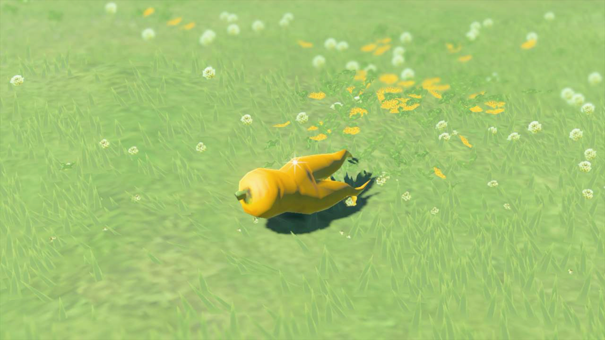
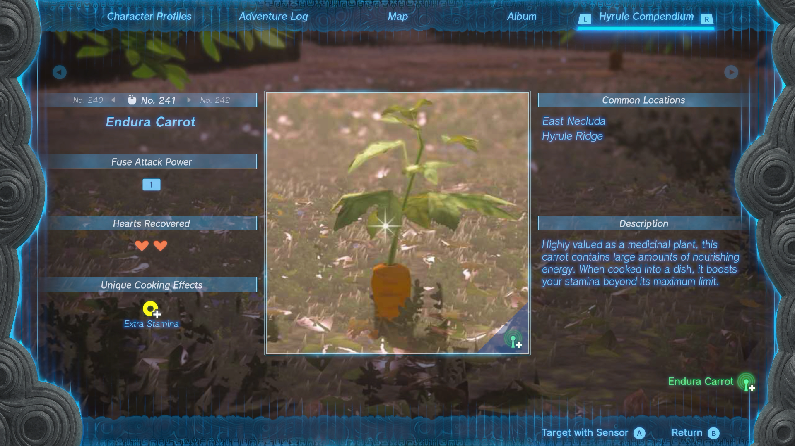
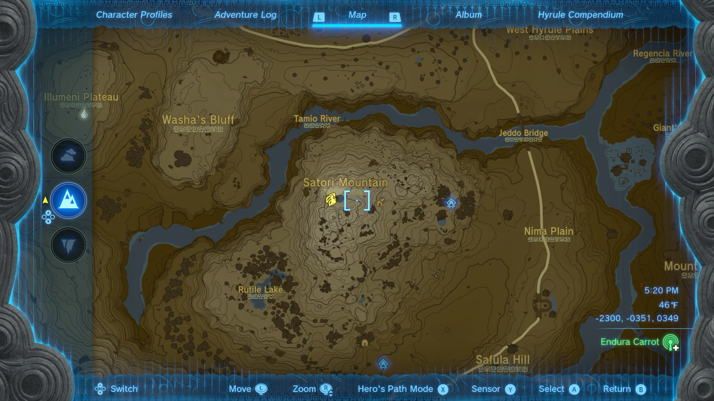
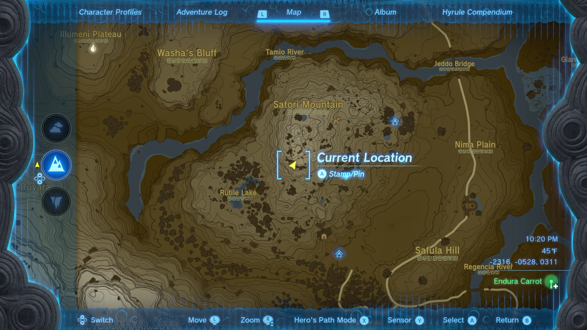
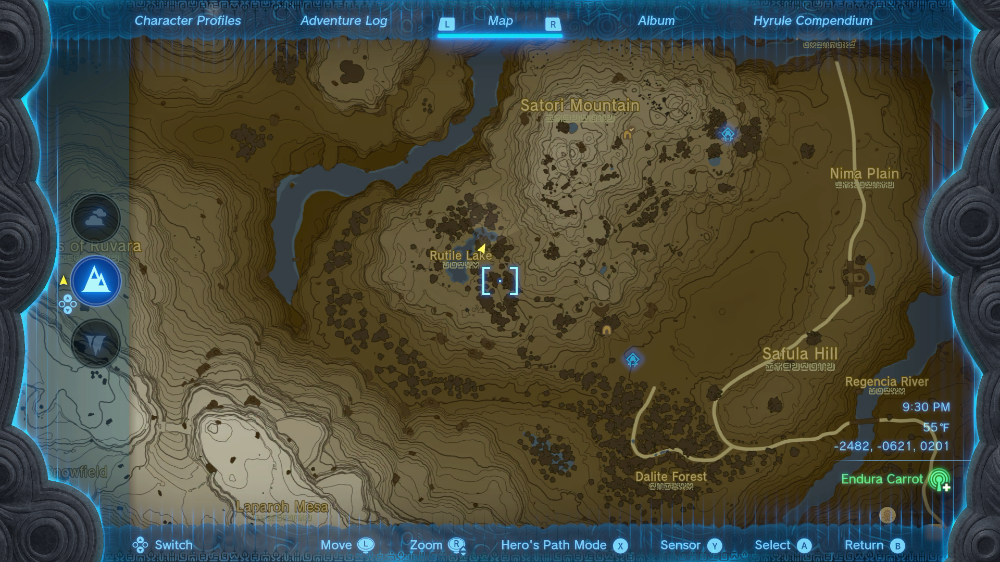
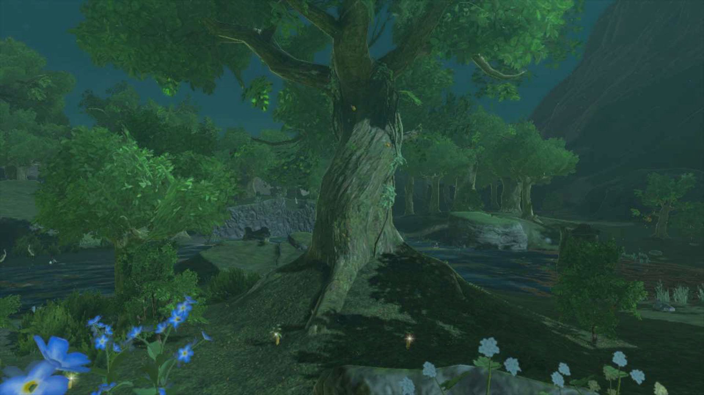
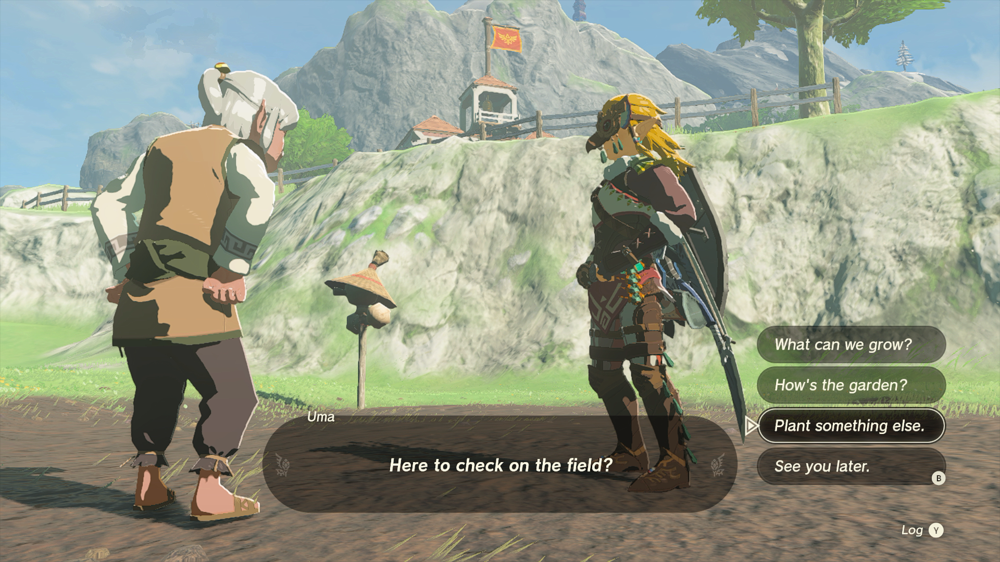

**Endura Carrot** is a scarce resource essential for unlocking the Horse God Fountain and cooking energizing meals that can fully restore depleted stamina wheels while granting a boon of extra stamina in The Legend of Zelda: Tears of the Kingdom. Endura Carrot, which has a distinct split on the lower half of its orange root, can be found around Cherry Blossom Trees and among the trees of Satori Mountain. Learn more about where to find Endura Carrots and their other uses with this handy TotK material guide. 

**Official Description** : "Highly valued as a medicinal plant, this carrot contains large amounts of nourishing energy. When cooked into a dish, it boosts your stamina beyond its maximum limit." 

**Compendium Number** : 241 

241 Endura Carrot

Jump to... 

  * Where to Find Endura Carrots
    * Cherry Blossom Tree, Satori Mountain
    * Moblin Camp, Satori Mountain
    * Rutile Lake, Satori Mountain
  * Tips for Finding Endura Carrots
  * Endura Carrot Uses
    * How to Grow Endura Carrots

## Where to Find Endura Carrot in The Legend of Zelda: Tears of the Kingdom

**Endura Carrot** is scarce in the wilds of Hyrule but can be found in fair quantities atop **Satori Mountain** , which is southwest of Lookout Landing and across the Regencia River, near the Usazum Shrine and Sonapan Shrine. More specifically, the Endura Carrots of Satori Mountain can be found on the peak next to a **Cherry Blossom** tree and near the large tree by **Rutile Lake**. 

Once you have at least one **Endura Carrot** in your inventory, you can grow and harvest them as crops in **Uma's Garden** at **Hateno Village** after completing the Teach Me a Lesson II side quest. Below, you'll find more details about where to find Endura Carrots on Satori Mountain, including their exact locations, uses, and how to grow them as crops. 

**Common Locations** : 

  * Satori Mountain
  * East Necluda
  * Hyrule Ridge

### Endura Carrot Location - Satori Cherry Blossom Tree, Satori Mountain

You can get up to four **Endura Carrots** from around the **Cherry Blossom Tree** that rests atop **Satori Mountain** by a small pond. You can reach this location, marked by yellow leaf icons on the map above, by trekking west from the nearby Sonapan Shrine, which can be unlocked as a fast travel point upon your first interaction with it. 

**Coordinates** : -2300, -0351, 0349 

For details on how to find **Sonapan Shrine** on **Satori Mountain** , be sure to check out our helpful guide link below. 

  * Sonapan Shrine - Walkthrough

### Endura Carrot Location - Moblin Camp, Satori Mountain

You can find up to four **Endura Carrots** growing near the white-trunked birch trees in a small birch tree grove on the southwest side of Satori Mountain, which also happens to be home to two dangerous Moblin. You can reach this location, marked by a yellow arrow icon on the map above, by traveling northwest from the nearby Usazum Shrine, which can be unlocked as a fast travel point upon your first interaction with it. 

**Coordinates** : -2316, -0528, 0311 

For details on how to reach **Usazum Shrine** near **Satori Mountain** , be sure to check out our helpful guide link below. 

  * Usazum Shrine - Walkthrough

### Endura Carrot Location - Rutile Lake, Satori Mountain

You can get up to three **Endura Carrots** from around the large tree that rests on the southwest shore of **Rutile Lake** in Satori Mountain. You can reach this location, marked by a yellow arrow icon on the map above, by traveling northwest from the nearby Usazum Shrine, which can be unlocked as a fast travel point upon your first interaction with it. 

**Coordinates** : -2482, -0621, 0201 

For details on how to reach **Usazum Shrine** near **Satori Mountain** , be sure to check out our helpful guide link below. 

  * Usazum Shrine - Walkthrough

**TIP** : While you're at Rutile Lake for Endura Carrots, you can get Rugged Rhino Beetles, Bladed Rhino Beetles, and Energetic Rhino Beetles from the nearby large tree, just be sure not to alert the beetles before collecting them. The beetles will usually spawn after 8 pm in-game time. 

## Tips for Finding Endura Carrots

  * There is usually at least one **Endura Carrot** found next to Satori Trees, also known as Cherry Blossoms, which can be found in each region of Hyrule.
  * Once you have at least one **Endura Carrot** , you can grow more in **Uma's Garden** in Hateno Village upon completing Teach Me a Lesson II.
  * Unlock the Camera and Sensor+ upgrades for your Purah Pad so you can eventually snap a photo of an **Endura Carrot** to add it to your Hyrule Compendium. Once you've done that, you can target **Endura Carrots** with the Purah Pad sensor, which will ping you as you close in on its location.

## Endura Carrot Uses

**Endura Carrots** are essential for unlocking access to Malanya at the Horse God Fountain. Malanya can revive your faithful steeds in exchange for Roasted Endura Carrots, as well as improve horse stats in exchange for food, including recipes that call for any carrot. 

**Endura Carrots** are handy for cooking carrot-related recipes that, when consumed, restore a few hearts, fully recover stamina, and grant a bit of extra stamina. Adding more Endura Carrots to the recipe will increase the potency of the effects. For example, cooking five Endura Carrots together makes a potent dish that restores twenty hearts, fully recovers depleted stamina, and grants a boon of two extra stamina wheels that remain until used. 

**Other uses for Endura Carrot include** : 

  * Feeding horses to increase Bond Level.
  * Growing more Endura Carrots in Uma's Garden.
  * Dyeing your armor light yellow at the Kochi Dye Shop in Hateno Village.

**Fuse Attack Power** : 1 

**Hearts Recovered** : 2 

**Unique Cooking Effect** : Extra Stamina 

**Armor Dye Color** : Light Yellow 

**Sell Price** : 20 Rupees 

### Growing Endura Carrot Crops in The Legend of Zelda: Tears of the Kingdom

Another use for **Endura Carrots** is to grow more of them in Uma's Garden at Hateno Village. With Uma's help, you can get three Swift Carrots per harvest. All you need to get started is at least one Endura Carrot in your inventory and to have completed the Teach Me a Lesson II side quest. 

You can find Uma's Garden just down the hill to the south of Hateno School, near the Hateno Village West Well. 

Speak with Uma and let her know what you'd like to plant in the garden to get started growing your very own Endura Carrots between your adventures across Hyrule. 

**Related and Other Helpful Guide Pages to Check Out Next** : 

  * All Recipes and Cookbook Guide
  * How to Dye Armor
  * Horse God Fountain and Upgrade Guide
  * Materials and Resources List
  * Monster List
  * Cheats and Secrets

### Up Next: Endura Shroom

Previous

Hearty Truffle

Next

Endura Shroom

### Top Guide Sections

  * Walkthrough
  * Zelda: Tears of The Kingdom Switch 2 Edition Guide
  * Zelda Notes Voice Memories
  * List of Side Quests and Side Adventures

### Was this guide helpful?

Leave feedback

### In This Guide

The Legend of Zelda: Tears of the KingdomNintendo EPD

Initial Release: May 12, 2023

Learn more

Go to comments