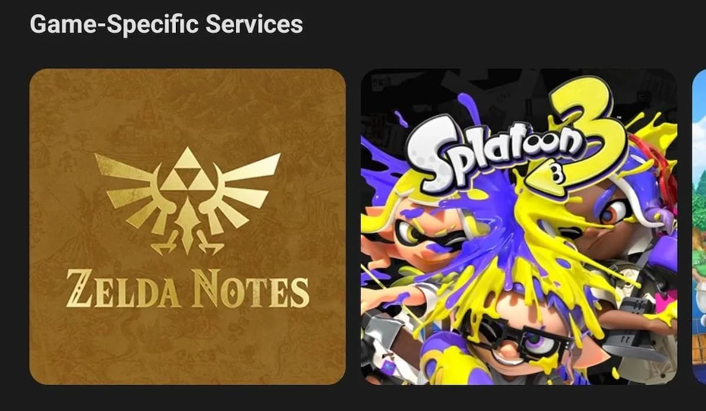
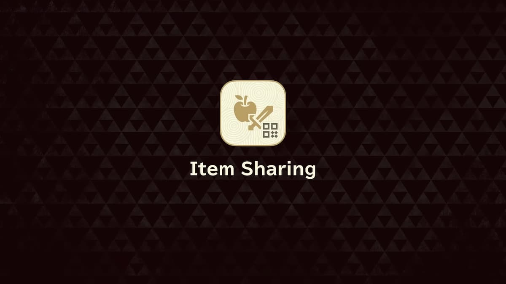
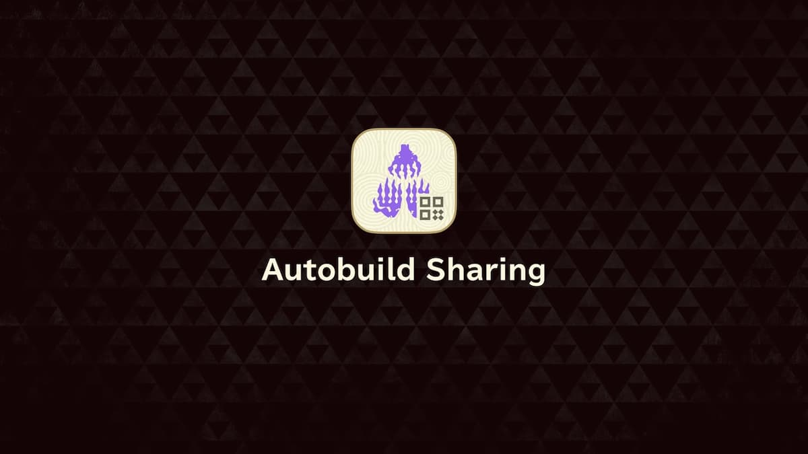

The Nintendo Switch 2 version of The Legend of Zelda: Tears of the Kingdom comes with a handful of features that were not included in the base game. These features are only available for those who own the Switch 2 Edition upgrade pack and play Tears of the Kingdom on their Switch 2. Some of these features require you to download the Nintendo Switch App to your smartphone to use them. This is everything new you can expect to find while playing The Legend of Zelda: TotK. 

  * Save Game Progress Transfer Over to The Nintendo Switch 2
  * Faster Load Times, Enhanced Resolution, and Improved Frame Rates
  * Zelda Notes
  * Item Sharing
  * Autobuild Sharing
  * Voice Memories

## Save Game Progress Transfer Over to The Nintendo Switch 2

You can pick up the Zelda: Tears of the Kingdom Nintendo Switch 2 Edition upgrade pack after acquiring a Nintendo Switch 2, but if you already have the game, there's a way to transfer your save information from your original Switch to your new console. This also works for any other game you've purchased from your Switch 1 to your Switch 2. 

To do this, you'll transfer your user account from your Switch 1 to your Switch 2. The option is available under the **System Settings Menu** on your Switch 1. From here, you have the option to **System Transfer to your Nintendo Switch 2** , but your console must be nearby for this to work. 

You'll want to complete the first-time setup options for your Switch 2 before proceeding to ensure a seamless transfer of your data. During setup, you'll receive a question about whether you already have a Nintendo Switch. Confirm that you do, and then go through the steps to accept the data. This should bring all of your TotK save data from your Switch 1 to your Switch 2. 

## Faster Load Times, Enhanced Resolution, and Improved Frame Rates

With TotK being available on a new console, there are multiple graphical and loading improvements for Switch 2 players to enjoy. These improvements are only available to those who purchase the upgraded version of TotK or buy a new copy designed for the Switch 2. 

The new console widely improves the performance of TotK. It is expected to run at 60 fps at 1080p. It also includes HDR support while you're using your Switch 2 in its handheld mode, rather than only seeing the improvements when it's hooked up to a Switch dock and connected to another screen. Not only will you get visual enhancements, but the load times when fast traveling or entering a new location make it much easier to bounce around the map. You'll feel more motivated to dash to the nearby shrine, rather than galloping across the plains with a trusty steed. 

## Zelda Notes

An exclusive feature available only to Nintendo Switch 2 players of Tears of the Kingdom is the Zelda Notes app, which you have to set up. However, this is not included on the Switch 2 console. Instead, it's available only through the Nintendo Switch App, which can be downloaded from your smartphone. You'll need to have it with you while playing the game and connected to your Nintendo Switch profile account. 

Through Zelda Notes, you'll gain access to a navigation feature that helps you track down Korok Seeds and Shrine locations. You can also review multiple milestones you accomplish while playing the game, such as how many enemies you've defeated or how many game-over screens have appeared from your play data. You can compare these stats with your friends or with other players worldwide. There's also a daily bonus you can earn each day, where you receive hearts, meals, or other random effects every time you log into the game once a day. 

When visiting specific locations, you'll also have the chance to view Voice Memories, which include dialogue from various characters from throughout TotK. 

## Item Sharing

Through the Zelda Notes feature, there's a chance to exchange items with other players. You can place any items you don't need during your adventure into your Zelda Notes item box. These become available to other players who are also using the Zelda Notes feature through the Nintendo Switch App, providing them with additional helpful items to use while they play. 

The items you place in your Zelda Notes box are ones you can share using a QR Code. These codes can be shared directly with your friends, or you can post them on your social media pages for anyone to use. 

## Autobuild Sharing

Similar to sharing items with other players, you can share the devices you make using the Link's Ultrahand Autobuild ability called Autobuild Sharing. This does mean you must first unlock the Autobuild ability while playing Tears of the Kingdom, after completing A Mystery in the Depths. 

Any design you've created in TotK can be transferred to your Zelda Notes account. You then offer it as a QR code, sharing it with friends or followers on any social media page. Players who scan the QR code will see it become available while playing their copy of the game, and then they can use the Autobuild ability to create it. 

## Voice Memories

Another significant feature coming to the Zelda Notes are the Voice Memories. These are distinct recordings provided by Princess Zelda and other notable characters from throughout the TotK game. These voice recordings only appear when visiting specific locations in the game, but the Zelda Notes application provides access to them. 

When you reach these locations in-game, sync it with the Nintendo Switch App, and you'll hear the audio playing from your smartphone. 

**For more The Legend of Zelda: Tears of the Kingdom on the Switch 2, check out:**

  * How to Use Autobuild Sharing
  * Zelda Notes Voice Memories
  * Everything New in Zelda: Tears of the Kingdom Switch 2

### Up Next: Tears of the Kingdom Switch 2 Setup Guide

Previous

Best Autobuild Sharing QR Codes

Next

Tears of the Kingdom Switch 2 Setup Guide

### Top Guide Sections

  * Walkthrough
  * Zelda: Tears of The Kingdom Switch 2 Edition Guide
  * Zelda Notes Voice Memories
  * List of Side Quests and Side Adventures

### Was this guide helpful?

Leave feedback

### In This Guide

The Legend of Zelda: Tears of the KingdomNintendo EPD

Initial Release: May 12, 2023

Learn more

Go to comments