The Evil Spirit Armor Set in The Legend of Zelda: Tears of the Kingdom is a nefarious-looking combination of armor which fittingly grants Link not only **Stealth Up increase** , but as a set grants a bonus of increasing your damage while using bone weapons and prevents skeleton-ized enemies such as Stalkoblins from attacking you. 

In this guide, you can find out more about the **Evil Spirit Armor Set** , including where to find each piece of Armor. 

## Evil Spirit Armor Set

Evil Spirit Set

Piece Effect  
Set / Upgrade Effect

Stealth Up  
Disguise; Bone Weap /

Evil Spirit Mask

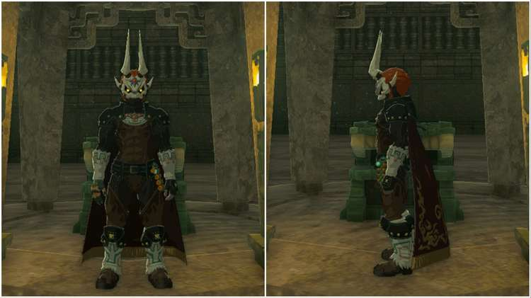

Evil Spirit Armor Set

Image  
Name

Evil Spirit Mask

Evil Spirit Armor

Evil Spirit Greaves

The Evil Spirit Set is comprised of three pieces of armor. Click the links above to learn more about a specific piece of armor or check out the table below for some quick stats: 

Evil Spirit Armor Set

Armor  
Defense  
Effect Bonus  
Sale Value

Evil Spirit Mask  
4  
1 Stealth Up  
600

Evil Spirit Armor  
4  
1 Stealth Up  
600

Evil Spirit Greaves  
4  
1 Stealth Up  
600

## Where to Find the Evil Armor Set in TotK

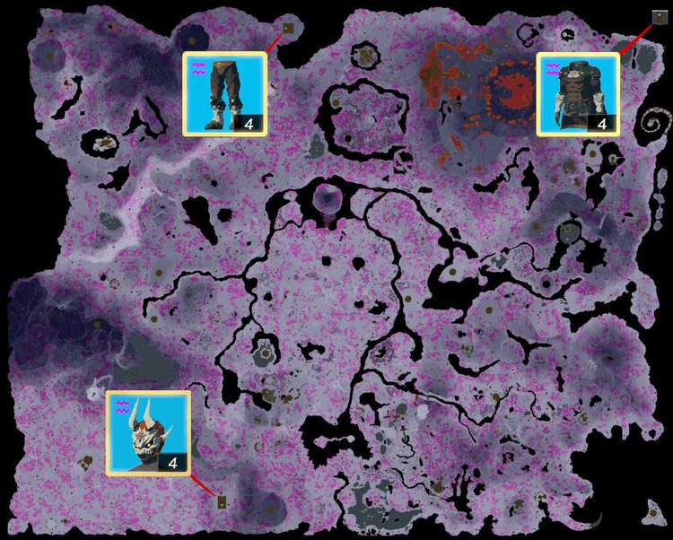

  * Where to Find the Evil Spirit Mask
  * Where to Find the Evil Spirit Armor
  * Where to Find the Evil Spirit Greaves

## Where to Find the Evil Spirit Mask in TotK

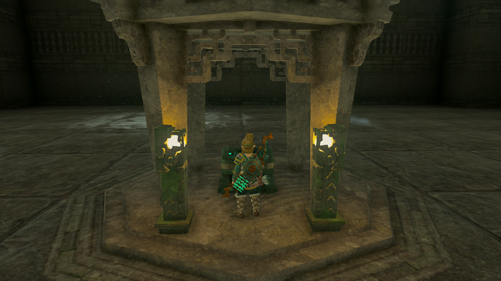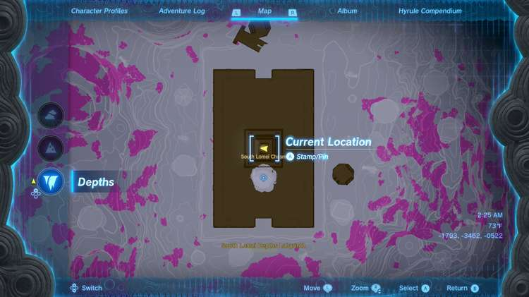

  * **Coordinates:** -1793, -3462, -0522

The Evil Spirit Mask is found in the **South Lomei Depths Labyrinth**, but before it can be collected, you need to reach the center of the South Lomei Labyrinth on the Surface, activate the Zonai panel found there, and complete The South Lomei Prophecy Side Quest. 

Having trouble making your way through the South Lomei Labyrinth? Check out our South Lomei Labyrinth guide or take an in-depth look at how to find the Evil Spirit Mask.

There are a couple of different ways to reach the center of the labyrinth, depending on how you want to go about it. The longer but more loot-filled solution is to start at the entrance in the north and follow the path acorns that a Zonai Research team has left leading to the center. 

Follow the short acorn path to reach the central chamber that houses the Motsusis Shrine and the Zonai panel needed to find the Evil Spirit Mask. Activate the Zonai panel near the shrine to unlock the sky labyrinth directly above it and begin The South Lomei Prophecy quest. 

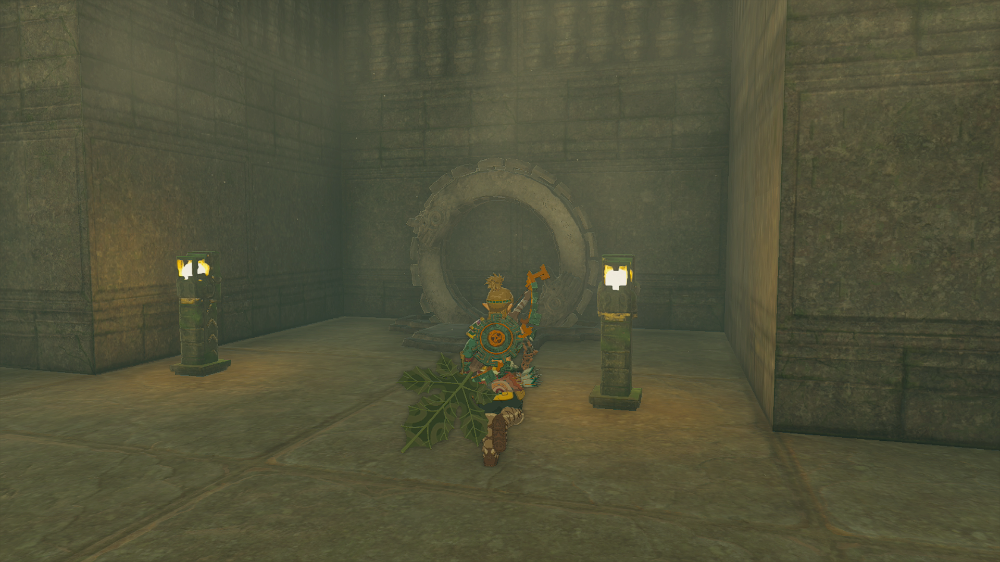

Once you’ve completed the labyrinth on the surface, the one in the sky above it will open up and have a shrine waiting for you as well. The quickest way to reach the entrance on the north side is to use the Gerudo Canyon Skyview Tower and glide to the nearby East Gerudo Sky Archipelago. 

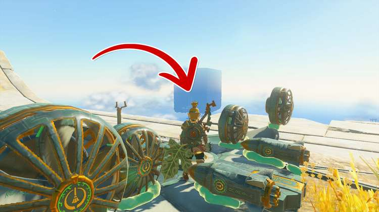

From there, you can build a flying machine out of a Zonai wing glider and a few fans to fly south. When you reach the sky labyrinth, you’ll able to complete the Siyamotsus Shrine outside its entrance, as well as activate the Zonai panel in order to enter this floorless labyrinth. 

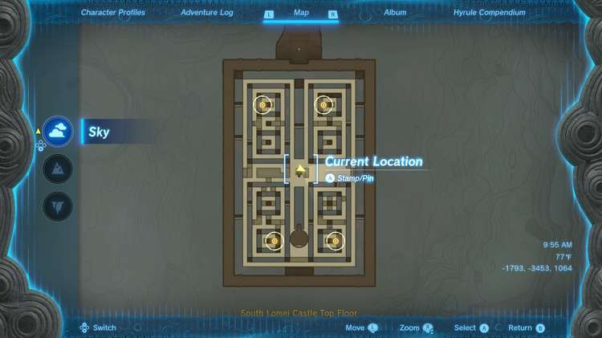

Make your way throw the maze to each of the **four panels** you need to activate, which are found at the bottom of the rectangular chutes found in each corner of the labyrinth. 

If you have The South Lomei Prophecy quest selected, these panels should be marked on your map as part of the labyrinth’s side quest. Once you've activated the four panels, the wind will start to blow harder, allowing you to fly above the labyrinth walls and to one final Zonai panel near the center. 

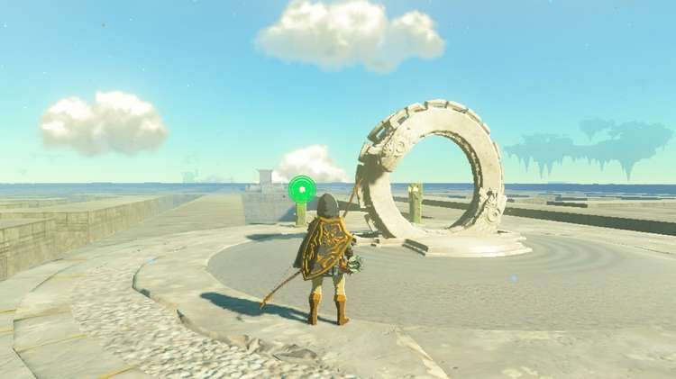

Activating this panel will unlock a chasm down in the surface maze, allowing you to dive from the sky labyrinth all the way down into the depths for one final labyrinth challenge. 

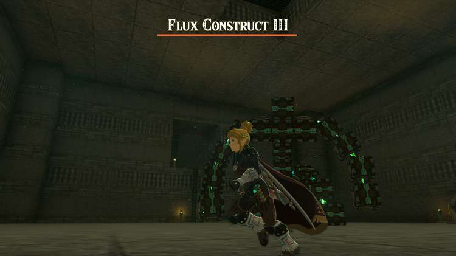

While it’s called a labyrinth, this final area isn’t actually much of a maze. There are some chests with powerful weapons hiding in the area, but to track down the Evil Spirit Mask, throw out some Brightbloom Seeds to help you find your way to the central chamber where a Flux Construct III is waiting to be defeated. 

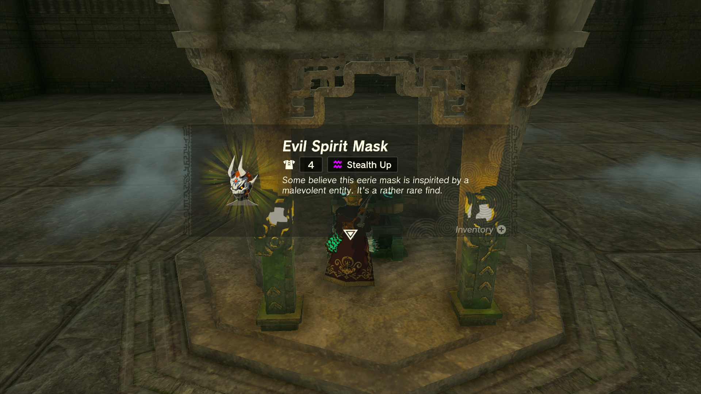

After defeating the Flux Construct, activate the nearby Zonai panel, and you’ll be rewarded with the Evil Spirit Mask! 

## Where to Find the Evil Spirit Armor in TotK

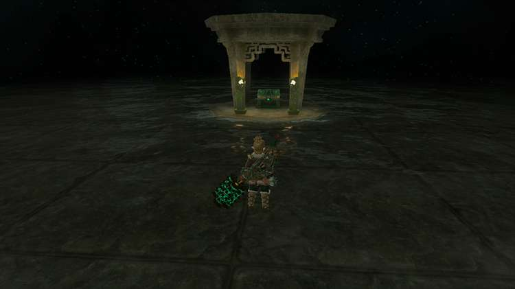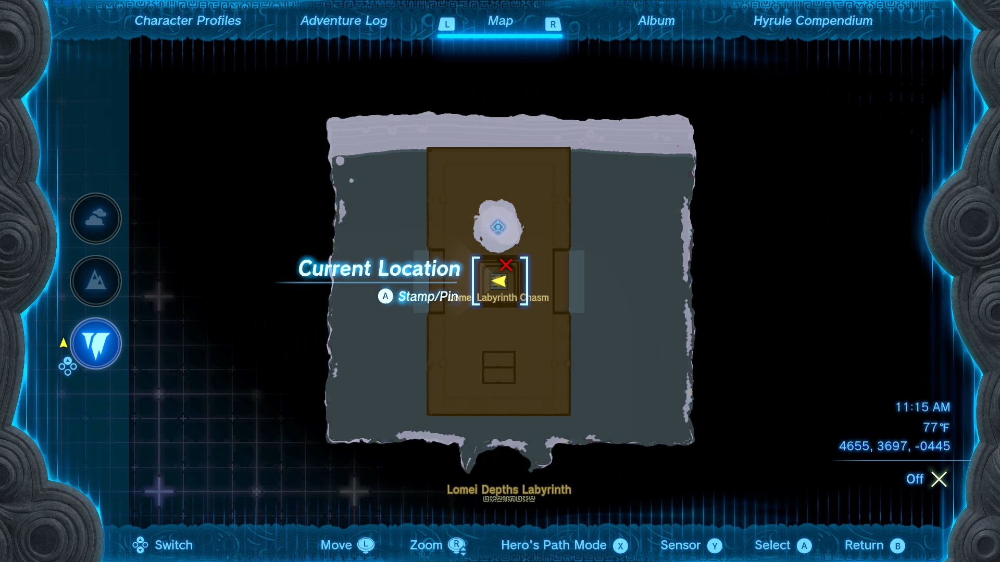

  * **Coordinates:** 4655, 3697, -0445

The Evil Spirit Armor is found in the**Lomei Depths Labyrinth** , but before it can be collected, you must complete all stages of **The Lomei Labyrinth Island Prophecy Side Quest** , by first solving the Lomei Labyrinth Island on the Surface, followed by the Lomei Sky Labyrinth, and lastly the Lomei Depths Labyrinth. 

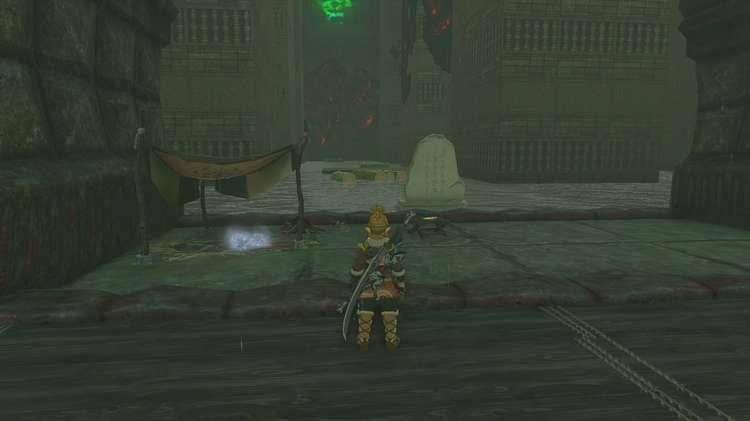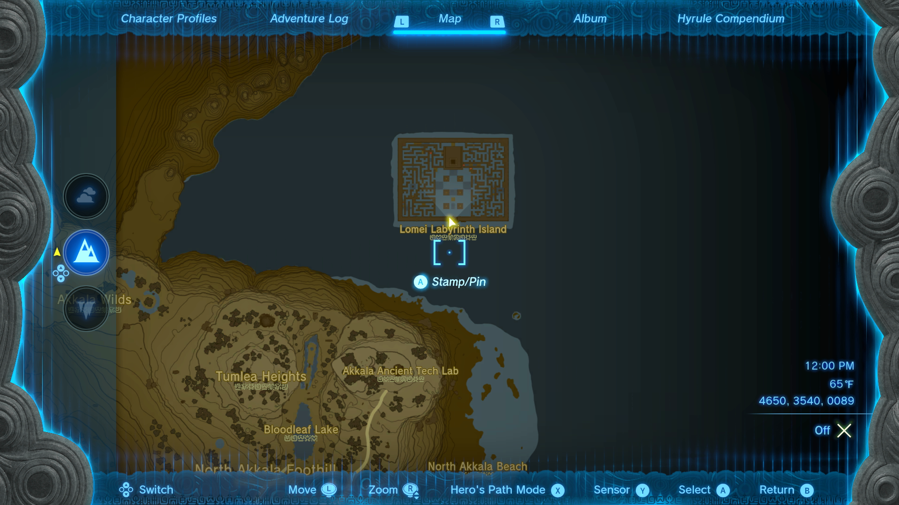

Need help finding your way through each of the Lomei Island Labyrinths? Check out our Lomei Labyrinth Island guide for a full walkthrough!

You can reach the south entrance of the **Lomei Labyrinth Island** by using your **Paraglider** to float off the northeast coast of Akkala, near the Akkala Anicent Tech Lab. At the entrance, you will find a **journal** left behind by a member of the Zonai Research Team, as well as a tent with a pile of Ice Fruit beneath it. 

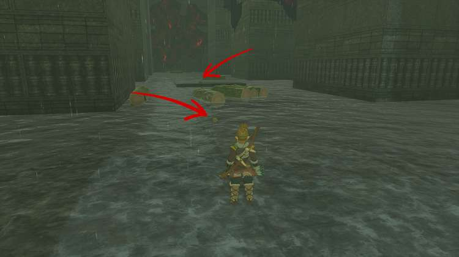

The Lomei Labyrinth Island is **filled with water** , both shallow and deep. The Zonai Researcher who traversed it beforehand left a **trail of Acorns and Chickaloo Nuts** so they could find their way back out of the maze after reaching the objective. **Follow this trail of nuts** through the maze to reach the Zonai terminal. 

**Having trouble following the trail of Acorns and Chickaloo Nuts?** If you’ve unlocked the improved tracker on your Purah Pad, you can take a picture of the item you are following and then set it to be tracked so that you always have an indication as to where the next closest one is waiting.

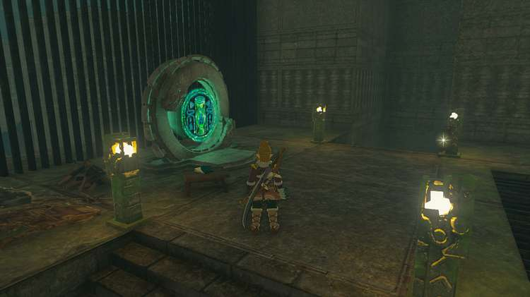

After activating the terminal at the center of the Lomei Labyrinth Island, you will trigger **The Lomei Labyrinth Island Prophecy Side Quest**. The entrance to the Lomei Sky Labyrinth, located directly above the Lomei Labyrinth Island on the Surface, will open up. 

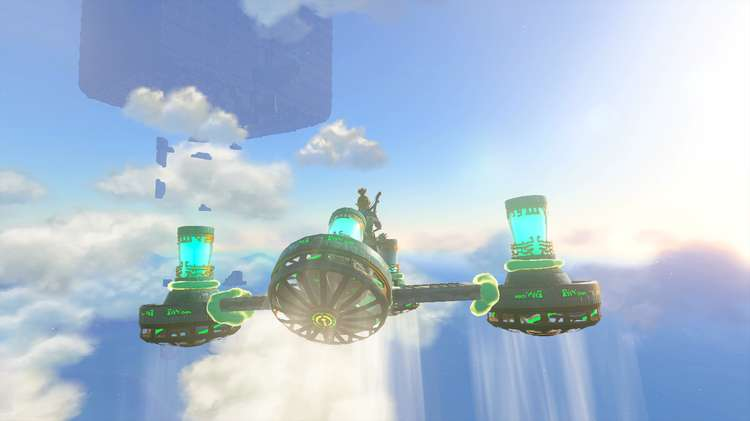

The quickest way to reach the Lomei Sky Labyrinth, located in the North Akkala Sky Archipelago, is to **launch from Ulri Mountain Skyview Tower**. 

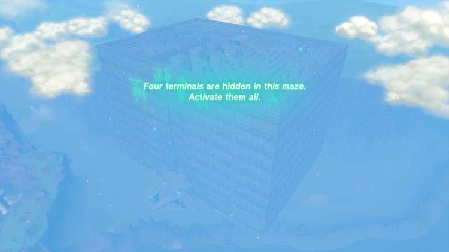

From there, you can use your Paraglider to drift to the nearest sky island of the **Sokkala Sky Archipelago**. Here you can find plenty of Zonai devices to **build a Fanplane** or any other flying Zonai vehicle to fly the rest of the way to the Lomei Sky Labyrinth. 

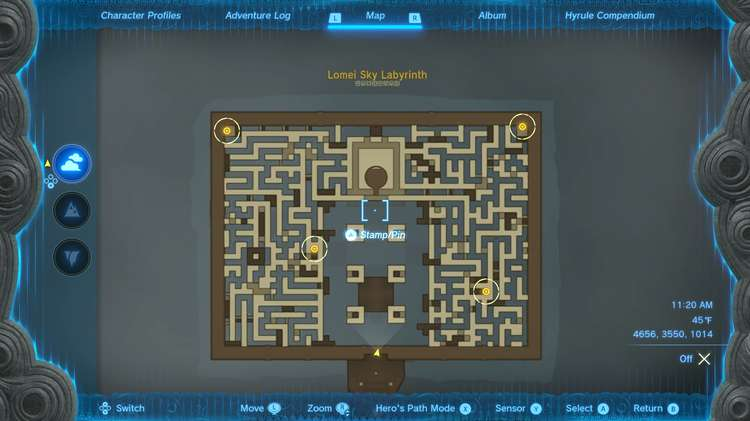

When you arrive at the south entrance of the Lomei Sky Labyrinth, be sure to unlock the **Mogisari Shrine** located there before continuing with the Lomei Labyrinth Island Prophecy Side Quest. Upon entering the Lomei Sky Labyrinth, you enter a field of blue glowing particles that applies a low-gravity effect. 

Use this **low-gravity effect** and the **natural wind currents** inside the**Lomei Sky Labryinth** to traverse the maze to find each of the four terminals located inside the Lomei Sky Labryinth. Once you have **activated each of the four terminals** , the final terminal for the Lomei Sky Labryinth will appear at the top of the maze. 

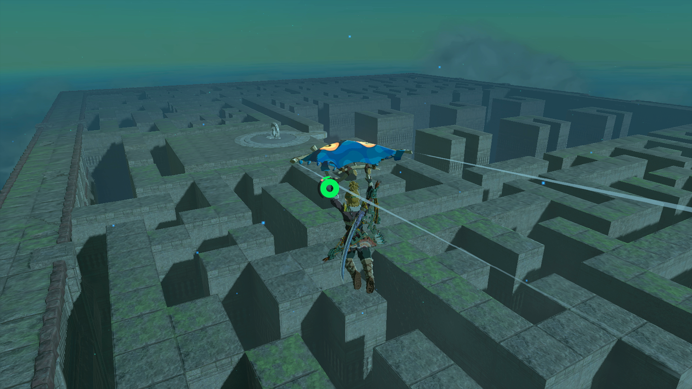

Ride the wind currents to the top of the maze to **activate this last terminal**. The iron gate blocking the entrance to the**Lomei Labryinth Chasm** down on the surface unlocks, allowing you to jump from the platform at the top of the Lomei Sky Labyrinth down into the **Lomei Depths Labyrinth**. 

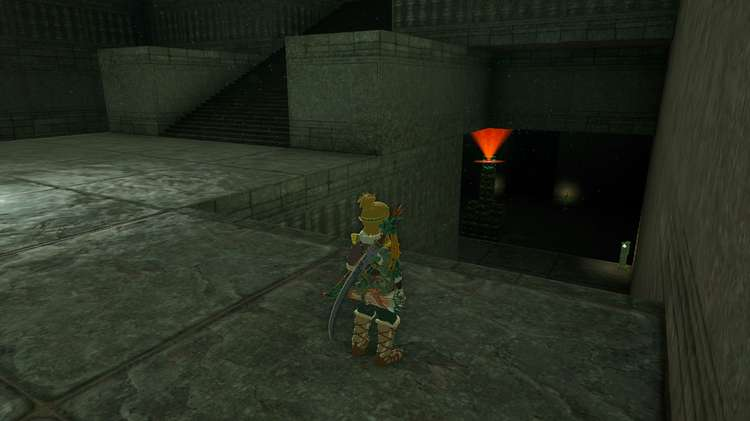

Dive from the Lomei Sky Labyrinth down through the Lomei Labyrinth Chasm to reach the Lomei Depths Labyrinth. Throw **Brighbloom Seeds** at the walls or floors to illuminate the area to find your down the stairs to the south. In the room immediately below the Lomei Labyrinth Chasm entrance, there is a Flux Construct III lying in wait. 

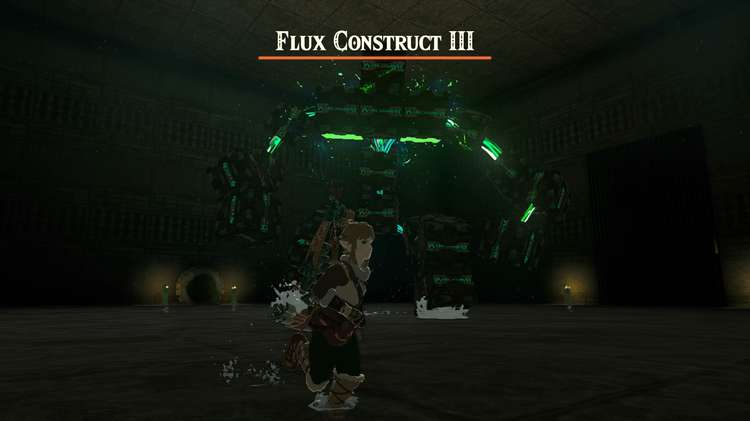

**Defeat the Flux Construct III** to complete the final challenge here in the Lomei Depths Labyrinth. When the Flux Construct III is dead, a terminal will appear against one of the walls. **Activate this terminal** to complete the Lomei Labyrinth Island Prophecy Side Quest and reveal your final reward... the **Evil Spirit Armor**. 

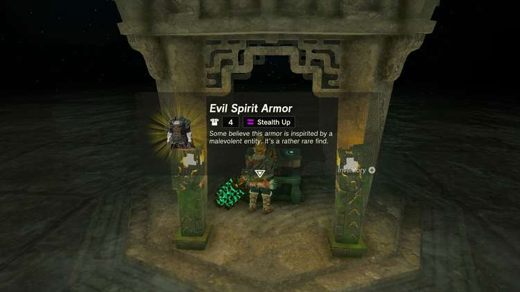

## Where to Find the Evil Spirit Greaves in TotK

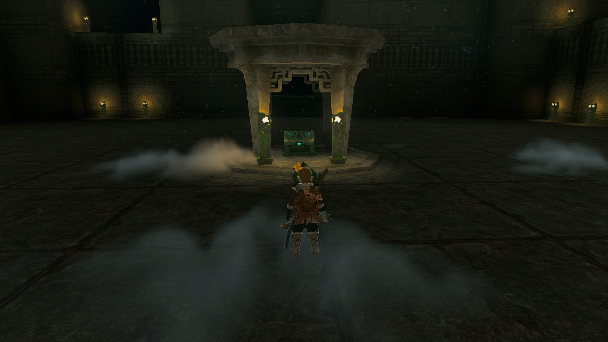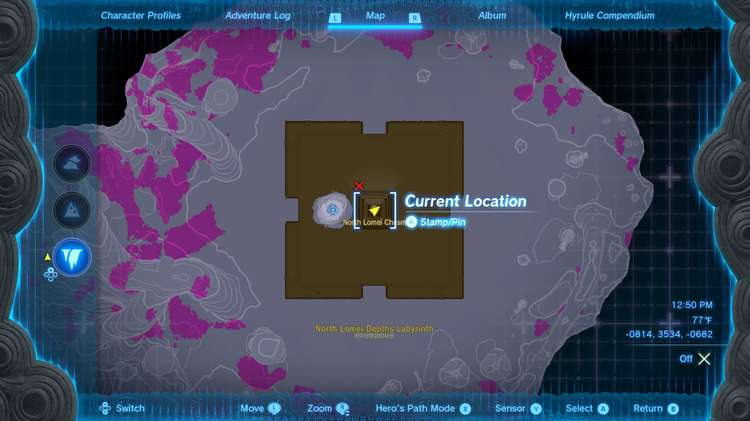

  * **Coordinates:** -0814, 3534, -0682

The Evil Spirit Greaves are found in the **North Lomei Depths Labyrinth** , but before it can be collected, you must complete all stages of **The North Lomei Prophecy Side Quest** , by first solving the North Lomei Surface Labyrinth, followed by the North Lomei Sky Labyrinth, and lastly the North Lomei Depths Labyrinth. 

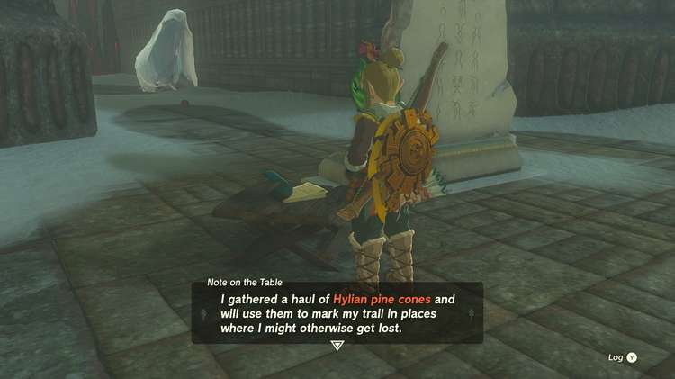

At the west entrance of the **North Lomei Labyrinth** located on the Surface, you can find a journal sitting on a small table beside a stone slab covered in ancient Zonai writing. The note has been left by a member of the Zonai Research Team who went in search for the **treasure** described on the ancient Zonai slab. 

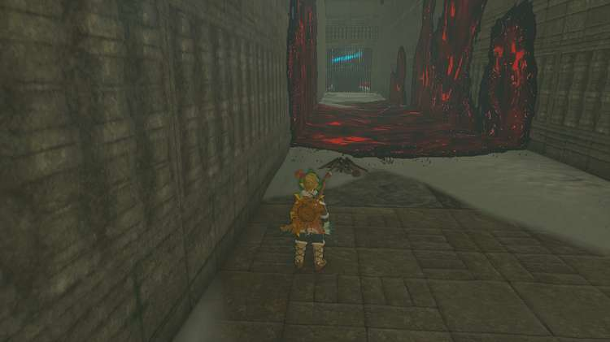

In this note, the researcher explains that they left a trail of Hylian Pine Cones as they traversed the maze, so that they would be able to follow the correct route back out of the North Lomei Labyrinth.**Follow the trail of Hylian Pine Cones** through the North Lomei Labyrinth, you can find the correct route through the maze. 

There are sections of the North Lomei Surface Labyrinth that are **covered in gloom** , and cannot be traversed without losing health. By building a fire and placing a Hylian Pine Cone into the flames, you can **create a surge of wind upward**. Use this wind current to sail over large puddles of gloom in the labyrinth. 

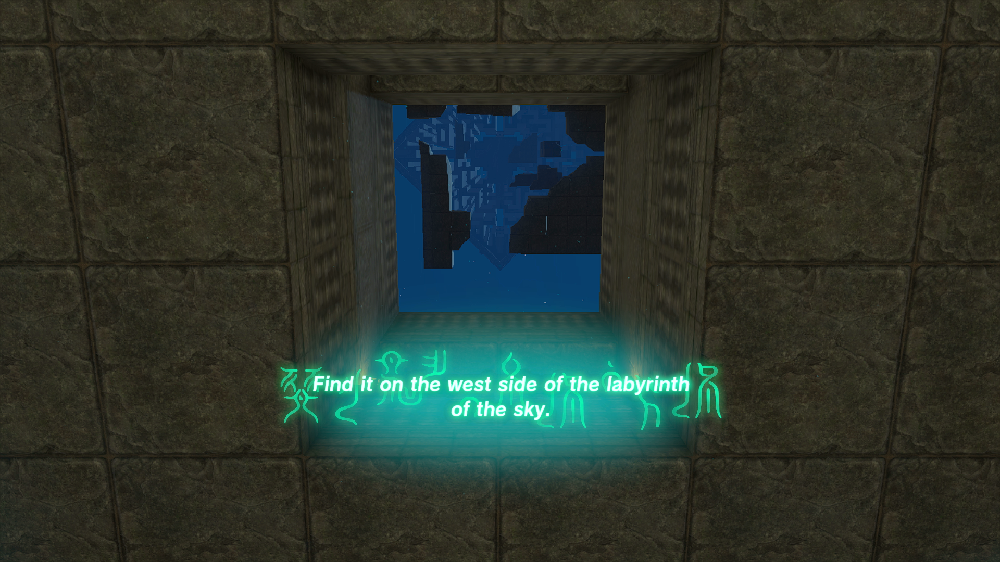

Find the **Mayaotaki Shrine** at the center of the **North Lomei Surface Labyrinth** by following this pine cone trail. Once there, a disembodied voice will congratulate you on completing this first challenge and offer you another. The entrance to the North Lomei Sky Labyrinth, directly above the maze on the surface, will open up. This officially starts the **North Lomei Prophecy Side Quest**. 

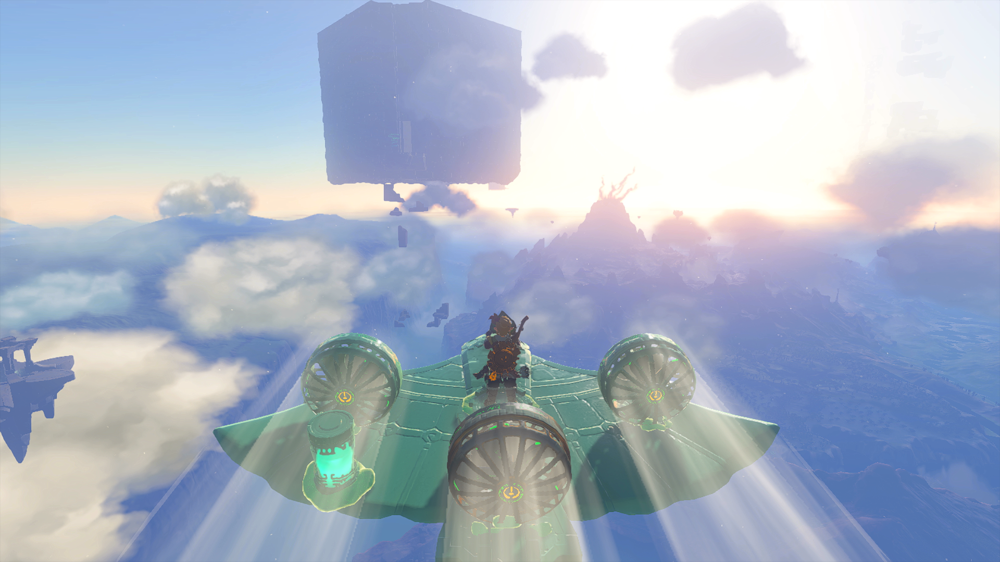

To reach the west entrance of the North Lomei Sky Labyrinth (or the **North Lomei Castle Top Floor**), you will need to travel from the **East Hebra Sky Archipelago**. You can reach this chain of sky islands from the **Pikida Stonegrove Skyview Tower**. 

From the sky island that houses the **Taninoud Shrine**, you can build a **Fanplane** or any other suitable Zonai device to travel east to the North Lomei Castle Top Floor. You may need to **consume Zonai Charges** in order to travel the full distance. 

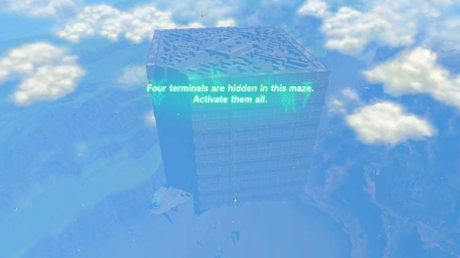

After arriving on the west side of the North Lomei Castle Top Floor and unlocking the **Tenbez Shrine**, the next stage of the side quest begins. This entire level of the maze is covered in strange blue particles that creates a **low-gravity effect**. Traverse this bottomless maze using your **Paraglider** and the low-gravity effect to **turn on the four terminals** located at the **maze's center** , **north corner** , **east corner** , and **south corner**. 

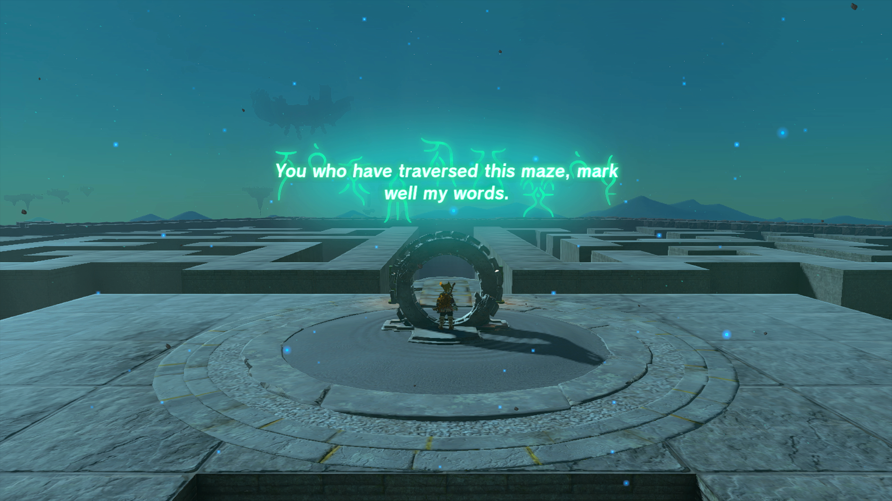

Once all four terminals are turned on, a terminal will reveal itself at the very top and center of the North Lomei Castle Top Floor. Strong gusts of wind will be activated, allowing you to paraglide onto the top of the maze effortlessly. Turn on this terminal, and the last stage of the North Lomei Prophecy Side Quest is revealed. 

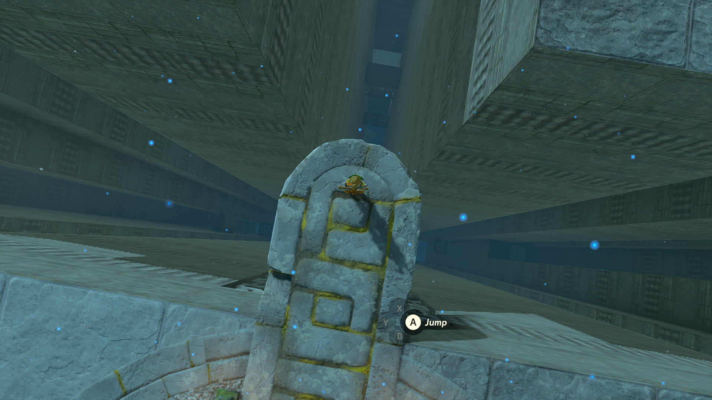

The gate barring the way into the **North Lomei Chasm** has been opened. You can now jump directly from the top of the North Lomei Castle Top Floor into the chasm on the surface down below. 

Plunge off the diving platform from the North Lomei Castle Top Floor and into the North Lomei Chasm to enter the third level of the maze... the **North Lomei Depths Labyrinth**. 

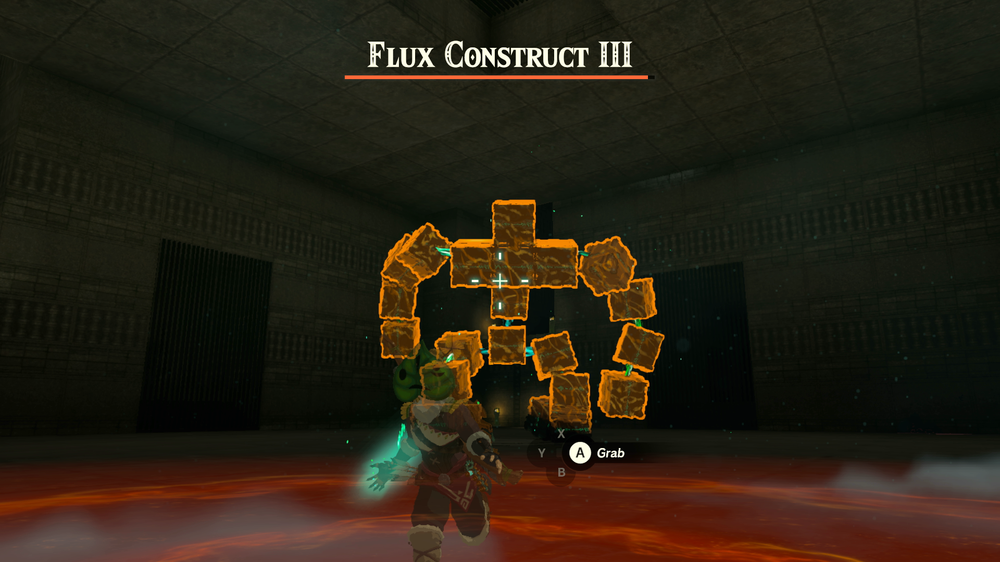

Not far from the room you start in, you can find a chamber with a Flux Construct III lurking inside. **Defeat this Flux Construct III** to complete the final challenge of the North Lomei Prophecy Side Quest. 

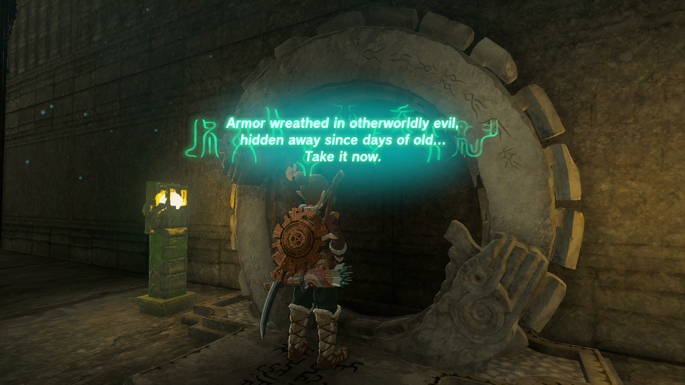

Once the Flux Construct III is defeated, a **terminal** along one of the walls will activate. Interact with this terminal to complete the North Lomei Prophecy Side Quest and reveal the final treasure... the chest containing the **Evil Spirit Greaves**. 

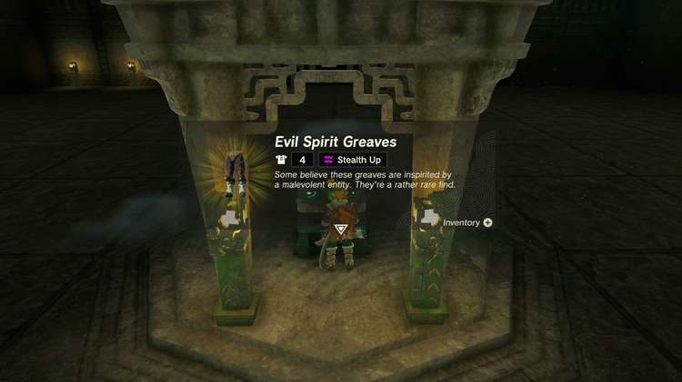

### Up Next: Fierce Deity Armor Set

Previous

Ember Armor Set

Next

Fierce Deity Armor Set

### Top Guide Sections

  * Walkthrough
  * Zelda: Tears of The Kingdom Switch 2 Edition Guide
  * Zelda Notes Voice Memories
  * List of Side Quests and Side Adventures

### Was this guide helpful?

Leave feedback

### In This Guide

The Legend of Zelda: Tears of the KingdomNintendo EPD

Initial Release: May 12, 2023

Learn more

Go to comments