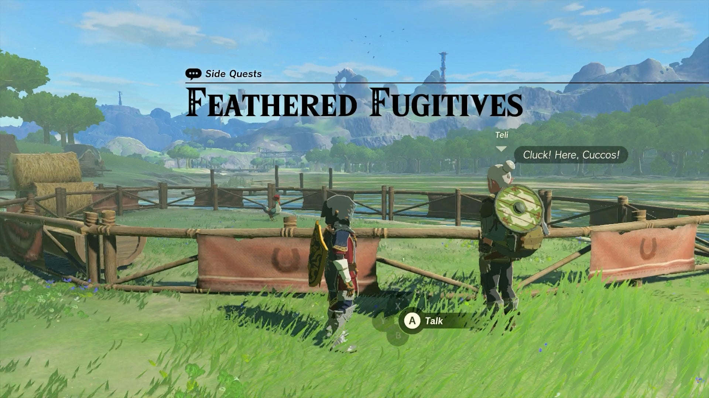
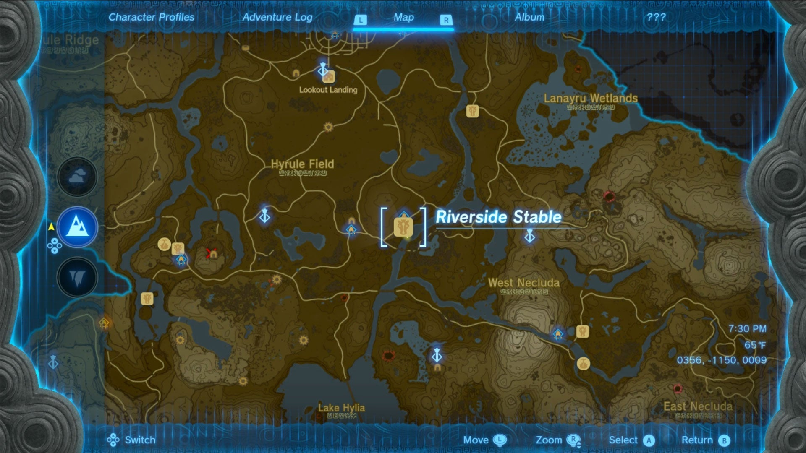
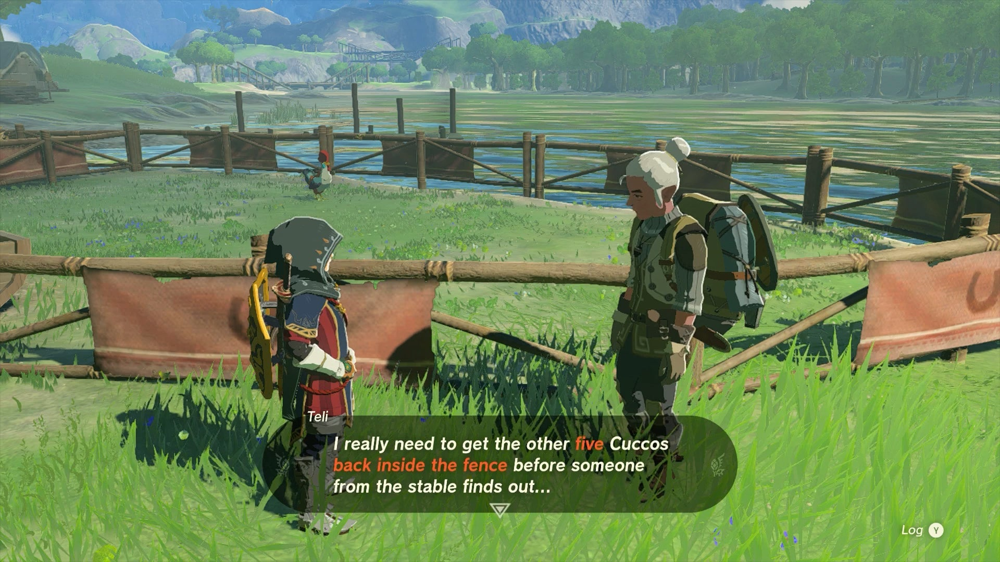
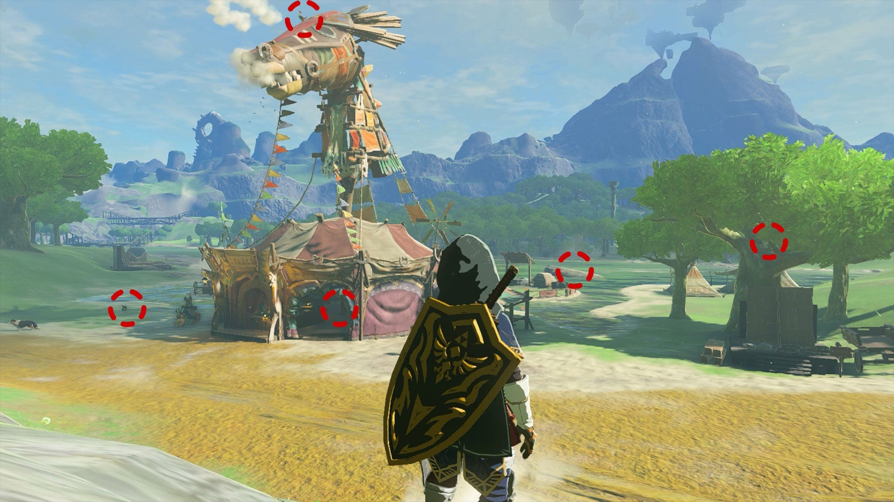
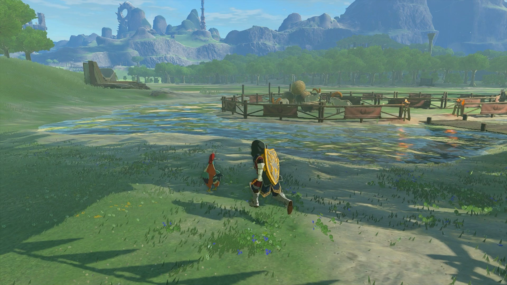
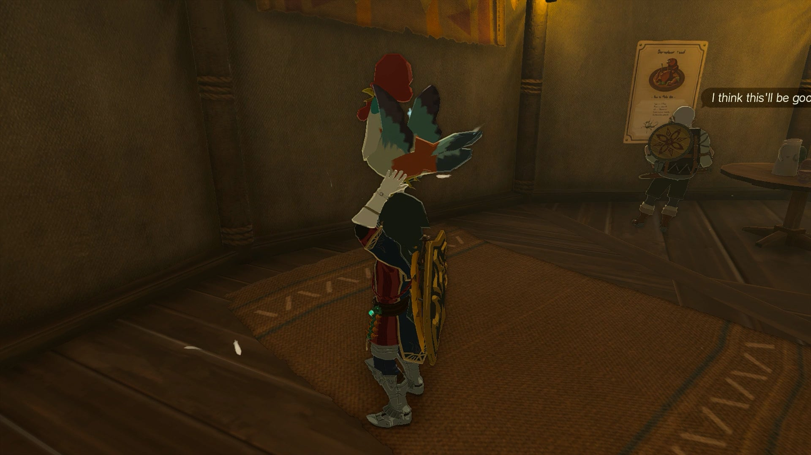
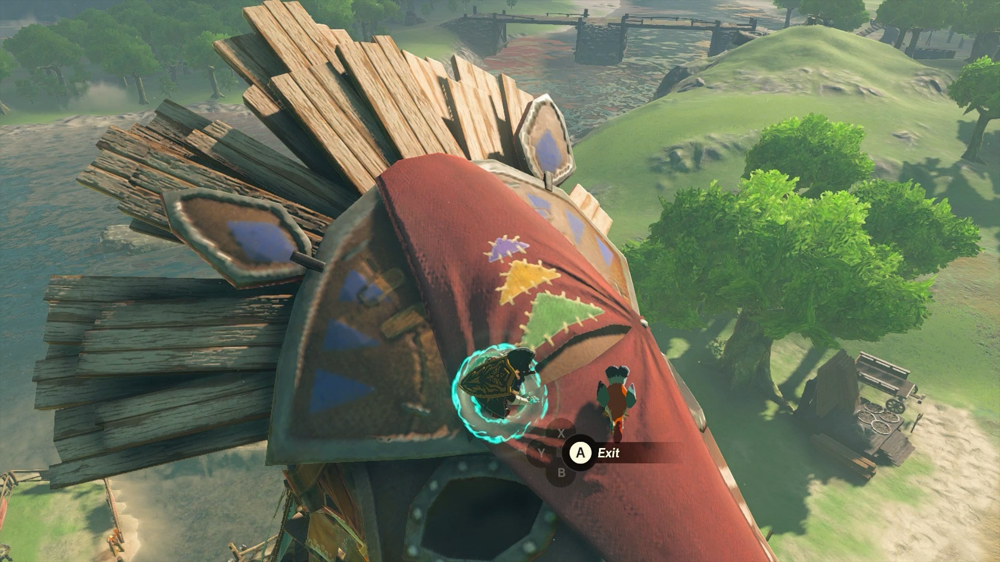
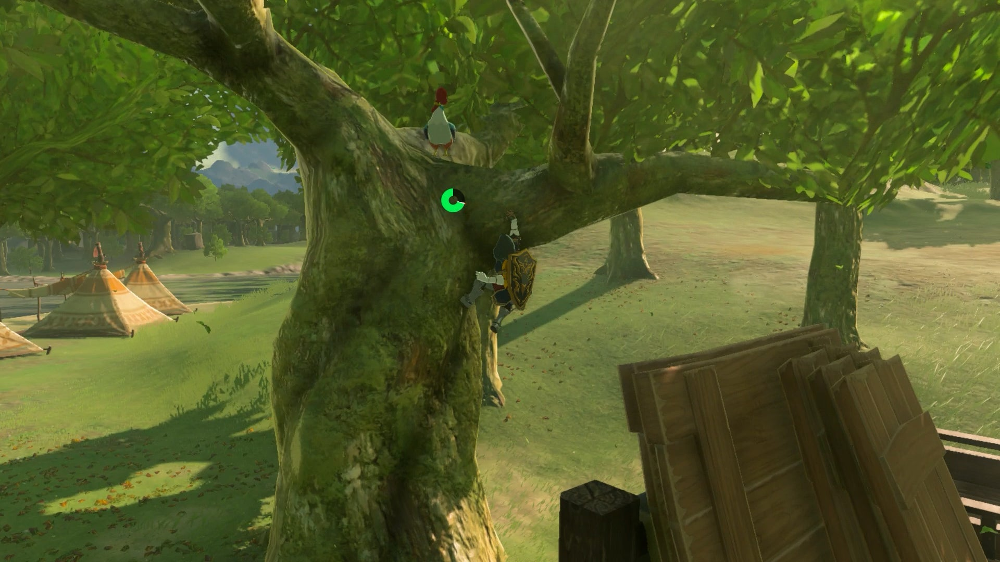
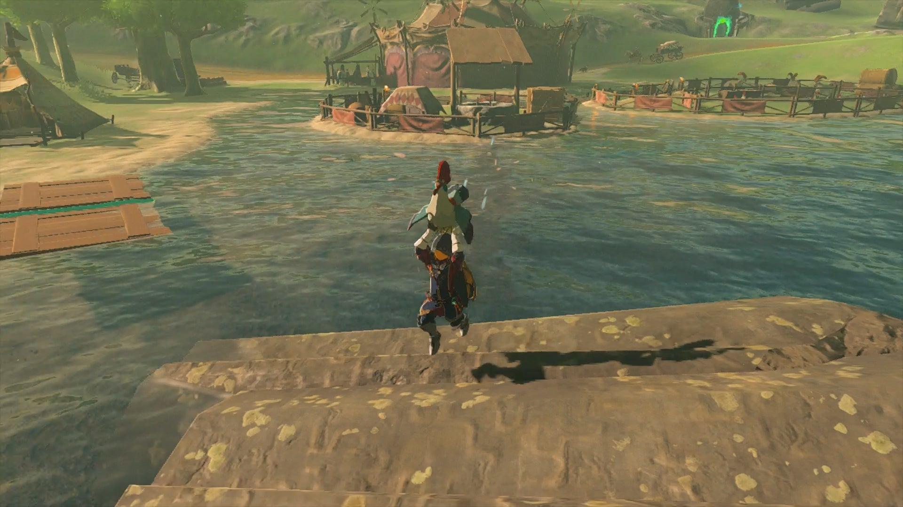
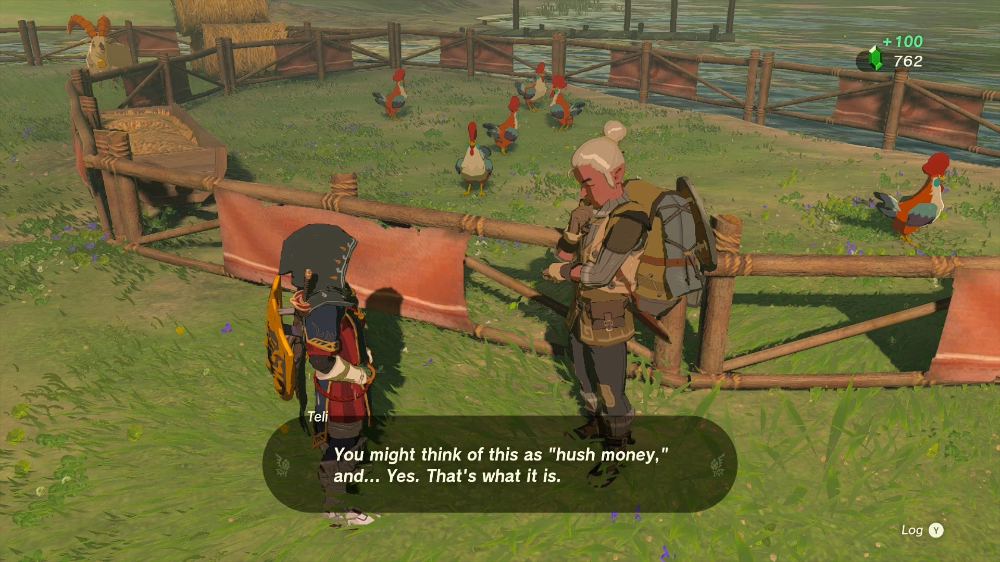

**Feathered Fugitives** is a Side Quest in Zelda: Tears of the Kingdom that requires Link to track down a missing group of Cuccos. You can find this quest at the Riverside Stable in Hyrule Field 

  * **Quest Giver** : Teli
  * **Prerequisite** : Complete Gourmets Gone Missing as part of the Potential Princess Sightings! Side Adventures
  * **Reward** : 100 Rupees

Once you've rescued the missing cooks near the Riverside Stable in the southeast part of Hyrule Field, they'll set up camp at the edge of the stable. 

If you've forgotten where the stable is, it's located along the Hylia River on the east side of Hyrule Field, just south of the Whistling Hill and located next to the Tajikats Shrine. 

Returning to the stable, you can find one of the gourmets, Teli, near one of the animal pens, where all but one Cucco has flown the coop! 

Speak to him, and he'll plead for you to track down the missing five Cuccos (which doesn't include the one still in the pen). Luckily, they aren't very far, so you don't have to worry about tracking them over a large distance. Contrary to what Teli tells you, they won't really run away from you either. 

In fact, the Cuccos can all be found within sight of the Riverside Stable, and all of their positions are marked in the image above, or you can see their individual spots below: 

  * The first Cucco is located just west of its pen, usually near where Beedle sits to rest.

  * The second Cucco is located within the Riverside Stable itself, near the back wall.

  * Use Ascend in the stable to reach the roof of the horse head, where you'll find the third Cucco on top, and you can jump off while holding it to glide down to the pen.

  * The fourth Cucco is stuck up a tree right to the south of the stable, right next to a stack of construction supplies you'll want to remember the location of.

  * The fifth Cucco is the hardest one to track down, as it's located out in the Hylia River on a fallen piece of a Sky Island. While it's not too far out into the water, trying to swim back with it will just have the Cucco panic and fly back. so try to build some wooden platforms with Ultrahand (using the wooden planks by the fourth Cucco) to toss it next to the shore, then carry it back.

Once all Cuccos are safely back in their pen, Teli will pay you for your troubles to the tune of 100 Rupees! He'll also reccomend you help yourself to eggs in the pen that you can cook, and speaking to him again you can learn the recipe to make Egg Tart, should you find the other ingredients! 

Feathered Fugitives

See the complete List of Side Quests and Side Adventures

### Up Next: Walkthrough

Previous

About IGN's Zelda TotK Guide Writers

Next

Walkthrough

### Top Guide Sections

  * Walkthrough
  * Zelda: Tears of The Kingdom Switch 2 Edition Guide
  * Zelda Notes Voice Memories
  * List of Side Quests and Side Adventures

### Was this guide helpful?

Leave feedback

### In This Guide

The Legend of Zelda: Tears of the KingdomNintendo EPD

Initial Release: May 12, 2023

Learn more

Go to comments