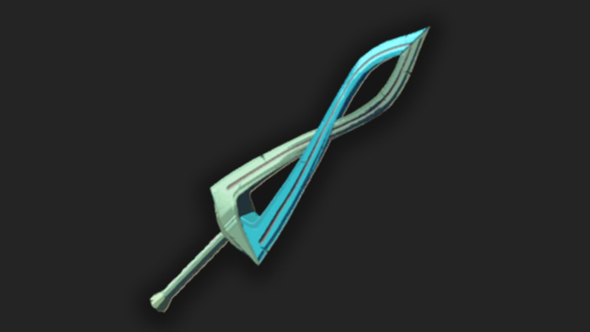

The Fierce Deity Sword is a two-handed weapon in The Legend of Zelda: Tears of the Kingdom. This weapon is part of the Fierce Deity Armor Set, so to get the Fierce Deity Sword, you'll need to get all three set pieces first. 

## Fierce Deity Sword Stats

A peculiar greatsword allegedly used by a hero from a world in which the moon threatened to fall. It slashes wildly in battle as if possessed by a Fierce Deity. 

  * **Hyrule Compendium number:** 394
  * **Base Damage:** 38

394 Fierce Deity Sword

Players will get this weapon by completing a quest called "Misko's Treasure: The Fierce Deity" to obtain the Fierce Deity Armor Set. 

Once you have the set, equip it and head to the cave north of the Foothill Stable, just past the Kisinona Shrine. Two explorers, Prissen and Domidak, will stop you when you try to enter the cave. Once they’ve finished talking, enter the cave and head towards the back. 

If you’re wearing all three parts of the Fierce Deity armor, a door will open, revealing another area of the cave and, crucially, a chest. Open it to get the Fierce Deity sword (chest location: 2617, 1418, 0135). 

You can check out our Fierce Deity Armor Set dedicated page to learn more about the armor set and how to get it. 

Learn more about The Legend of Zelda: Tears of the Kingdom with our helpful guide: 

  * Complete Walkthrough
  * Tips, Tricks, and Things to Know
  * Things to Do First in TotK

Or Jump back to our Weapons Hub

### Up Next: Walkthrough

Previous

About IGN's Zelda TotK Guide Writers

Next

Walkthrough

### Top Guide Sections

  * Walkthrough
  * Zelda: Tears of The Kingdom Switch 2 Edition Guide
  * Zelda Notes Voice Memories
  * List of Side Quests and Side Adventures

### Was this guide helpful?

Leave feedback

### In This Guide

The Legend of Zelda: Tears of the KingdomNintendo EPD

Initial Release: May 12, 2023

Learn more

Go to comments