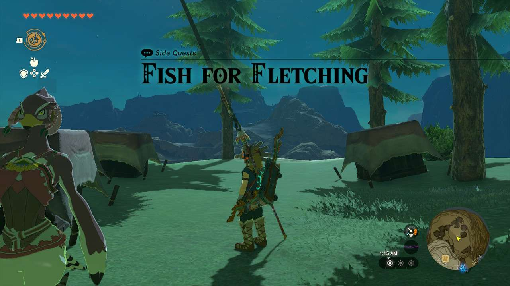
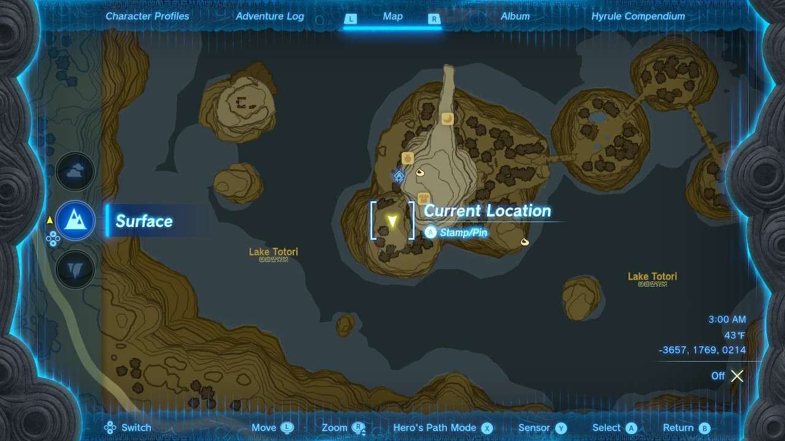
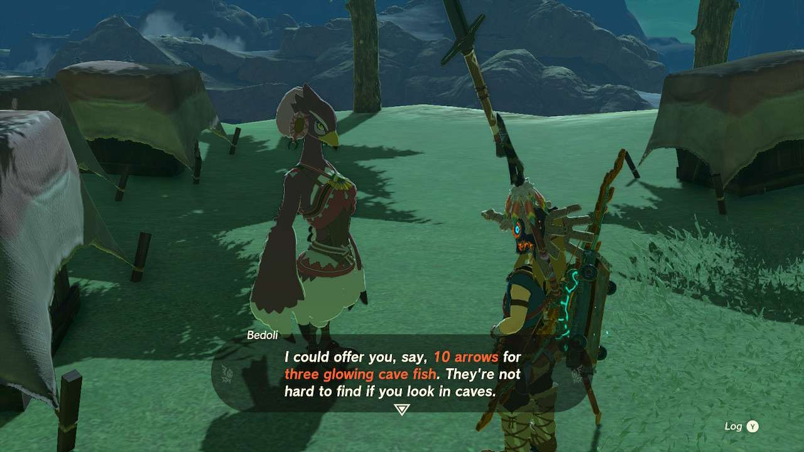
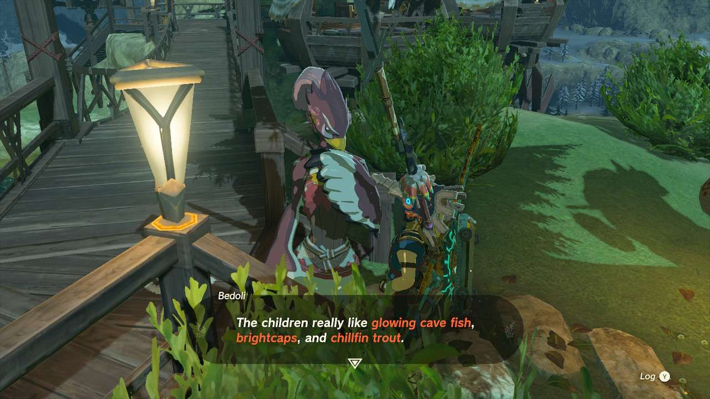

**Fish for Fletching** is one of the many Side Quests to complete in The Legend of Zelda: Tears of the Kingdom. In this guide, we will teach you everything you need to know to complete Fish for Fletching, including where to find it and what you will get as a reward. 

  * **Side Quest Location:** Rito Village
  * **Prerequisites:** Finish the Rito Village portion of Regional Phenomena
  * **Reward:** Arrows x10

Once you’ve freed Rito Village from its scourge, a Rito warrior named **Bedoli** can be found on a plateau across a bridge not too far up the village tower. She’ll explain her plight at getting more resources, and will ask if you have any glowing cave fish to spare. 

**She will trade 10 arrows for 3 of the glowing cave fish**. Once you give her the goods, the quest ends, but she will still remain open for trading materials. She will cycle through needing **glowing cave fish, chillfin trout, and brightcaps**. The reward for them all is Arrows x10, which is a fantastic way to stock up on arrows if you’re low on funds. 

If you’re having trouble finding any of those materials, they’re all over wells and caves in the Hebra Mountains, particularly **West Lake Totori Cave** , as well as the **Snowfield Stable Well** in the Tabantha Tundra. Bedoli even hints that you should go hunt in that well specifically. 

Fish for Fletching

See the complete List of Side Quests and Side Adventures

### Up Next: Walkthrough

Previous

About IGN's Zelda TotK Guide Writers

Next

Walkthrough

### Top Guide Sections

  * Walkthrough
  * Zelda: Tears of The Kingdom Switch 2 Edition Guide
  * Zelda Notes Voice Memories
  * List of Side Quests and Side Adventures

### Was this guide helpful?

Leave feedback

Go to comments