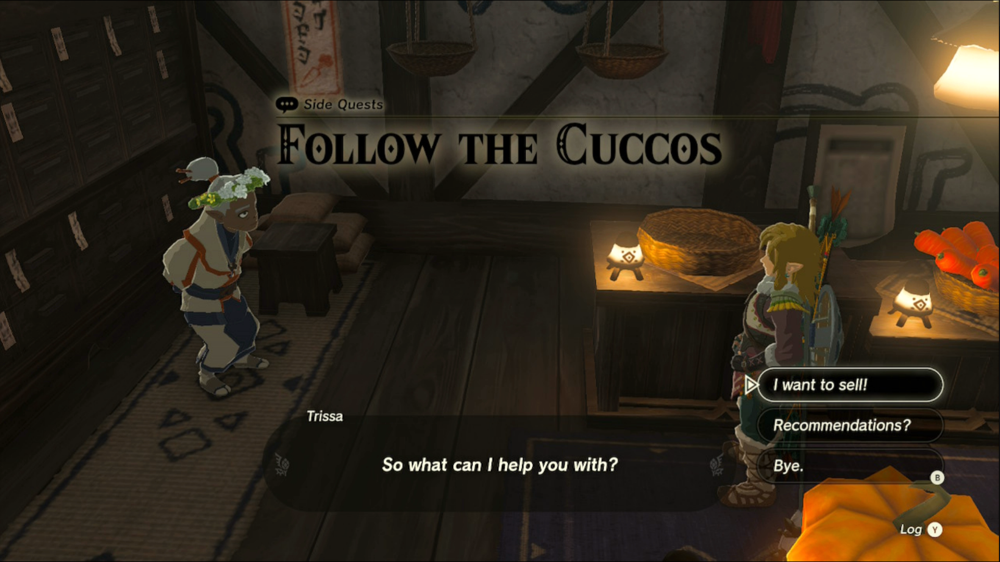
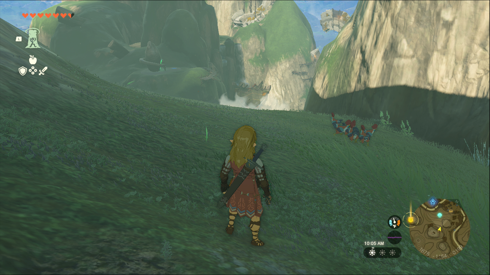
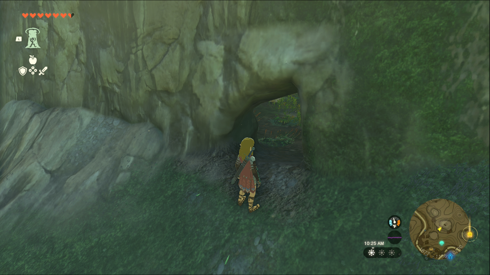

Follow the Cuccos is one of the Side Quests you’ll discover in Kakariko Village. Side Quests are quests in The Legend of Zelda: Tears of the Kingdom that are relatively short or simple chores that can earn you small rewards or services. 

## Follow the Cuccos Guide

To start the Side Quest “Follow the Cuccos” you first need to complete “Codgers’ Quarrel.” Then visit High Spirits Produce in Kakariko Village and speak to Trissa. She’ll let you know that the cuccos have changed where they lay their eggs, and she’d like you to find it for her. 

The cuccos head for their nest when morning comes, so you’ll need to locate some cuccos in Kakariko, then follow them when they head back to their nest. The cuccos are all around the village, particularly in front of the shops, plus they crow every once in a while to make it easier to find them. At around 5 am, they’ll start to move, so be ready to follow, because the cuccos will lead you out of the village, up near the ring ruins and the device dispenser south of Kakariko, and beyond. 

If you lost the cuccos and don’t want to wait until the next day to try again, or if you just want to know where to look, read on. Climb the hill behind the Zonai device dispenser and head to the large central mountain on this hillside. You’ll spot a small cave opening, at coordinates 1877, -1156, 0200. 

Head inside Cucco Hideaway to find many nests with eggs inside. Explore as much as you like, then gather at least ten eggs and head back to Trissa to complete this quest. 

### A Word of Warning

If you have at least ten bird eggs when starting this quest, you can speak to Trissa to immediately turn it in, but you may miss discovering the cave Cucco Hideaway. If you've already turned in the quest without discovering the cave, read this guide for directions to finding it. 

Follow the Cuccos

See the complete List of Side Quests and Side Adventures

### Up Next: Walkthrough

Previous

About IGN's Zelda TotK Guide Writers

Next

Walkthrough

### Top Guide Sections

  * Walkthrough
  * Zelda: Tears of The Kingdom Switch 2 Edition Guide
  * Zelda Notes Voice Memories
  * List of Side Quests and Side Adventures

### Was this guide helpful?

Leave feedback

Go to comments