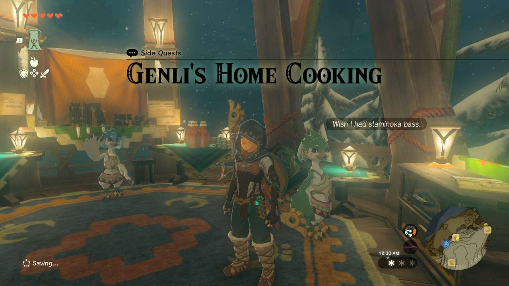
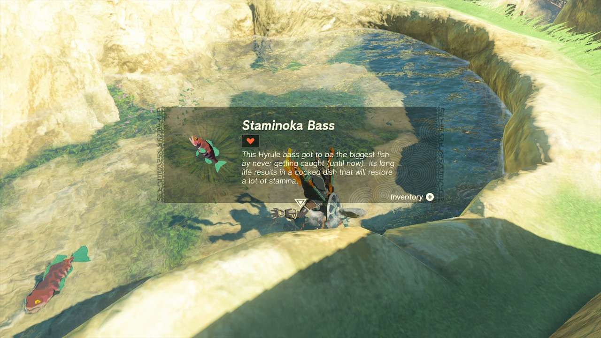

**Genli’s Home Cooking** is one of the many Side Quests to complete in The Legend of Zelda: Tears of the Kingdom. In this guide, we will teach you everything you need to know to complete Molli the Fletcher’s Quest, including where to find it and what you will get as a reward. 

  * **Side Adventure Location** : Rito Village
  * **Prerequisites** : Hearing the Rito children’s song
  * **Rewards** : Biting Simmered Meat (food)

After you find the children of Rito Village and listen to their song (tied to the Regional Phenomena), they go off in different directions. Genli, the pink Green child, will head towards the General Store. 

Speaking to Genli will begin the quest. She’ll ask for one **Staminoka Bass** , which can be found in one of the small ponds between the series of bridges that lead to Rito Village. Because the pond is small and pretty self-contained, you can easily just walk in and snap up the one or two fish in there. 

Return to Genli to deliver the Staminoka Bass to receive some **Biting Simmered Meat** , a food item that can increase your offensive power when in cold weather. 

Genli's Home Cooking

See the complete List of Side Quests and Side Adventures

### Up Next: Walkthrough

Previous

About IGN's Zelda TotK Guide Writers

Next

Walkthrough

### Top Guide Sections

  * Walkthrough
  * Zelda: Tears of The Kingdom Switch 2 Edition Guide
  * Zelda Notes Voice Memories
  * List of Side Quests and Side Adventures

### Was this guide helpful?

Leave feedback

### In This Guide

The Legend of Zelda: Tears of the KingdomNintendo EPD

Initial Release: May 12, 2023

Learn more

Go to comments