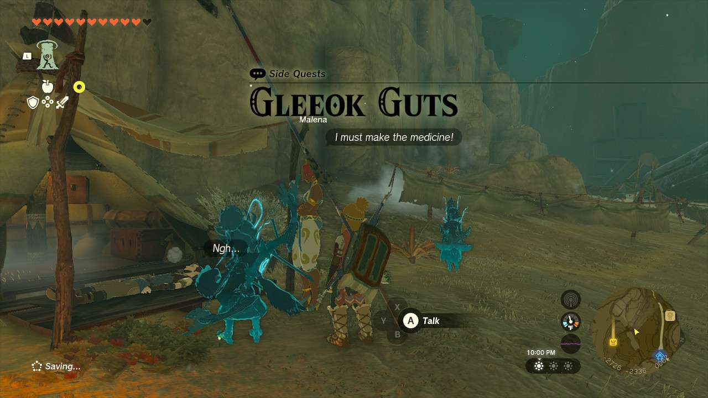
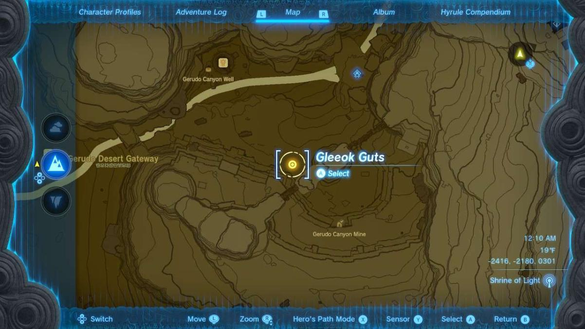
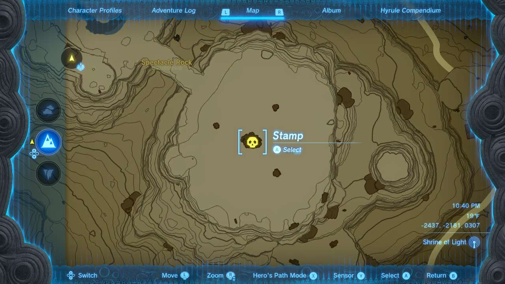
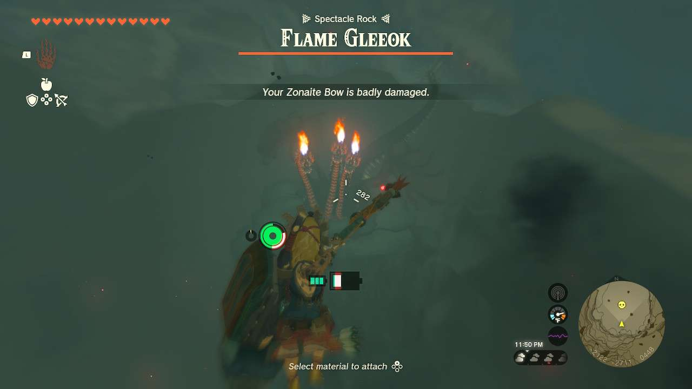
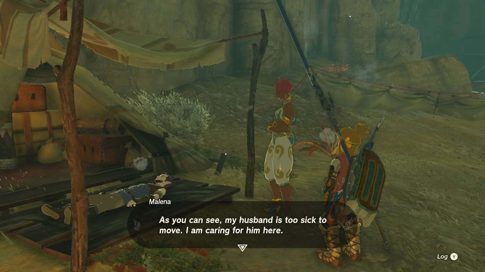

**Gleeok Guts** is one of the many Side Quests to complete in The Legend of Zelda: Tears of the Kingdom. In this guide, we will teach you everything you need to know to complete Gleek Guts, including where to find it and what you will get as a reward. 

  * **Side Quest Location** : Gerudo Highlands
  * **Prerequisites** : n/a
  * **Rewards** : 300 Rupees

Situated perfectly between **Gerudo Canyon Stable** and **Gerudo Canyon Mine** is a Gerudo named **Malena**. Her husband is injured and she needs to create an elixir to heal him. Unfortunately, she needs a key component: Gleeok Guts, which are a rare drop for one of the toughest species of Minibosses in the entire game. 

Thankfully, once you accept the quest, defeating the nearby Flame Gleeok atop Spectacle Rock will guarantee a drop of the Guts. 

 Gleeoks are possibly the most difficult miniboss characters in Tears of the Kingdom, and it will take the right equipment and weapons to take them down. We highly advise you take a look at our page for taking on the **Flame Gleeok** in our **Minibosses****Guides**. 

Once you take down the monster, you can return to Malena with the material for her husband. She’ll reward you with **300 Rupees** …which might not be _nearly_ enough for having to take down a three-headed cyclops demon dragon, but whatever. 

Gleeok Guts

See the complete List of Side Quests and Side Adventures

### Up Next: Walkthrough

Previous

About IGN's Zelda TotK Guide Writers

Next

Walkthrough

### Top Guide Sections

  * Walkthrough
  * Zelda: Tears of The Kingdom Switch 2 Edition Guide
  * Zelda Notes Voice Memories
  * List of Side Quests and Side Adventures

### Was this guide helpful?

Leave feedback

Go to comments