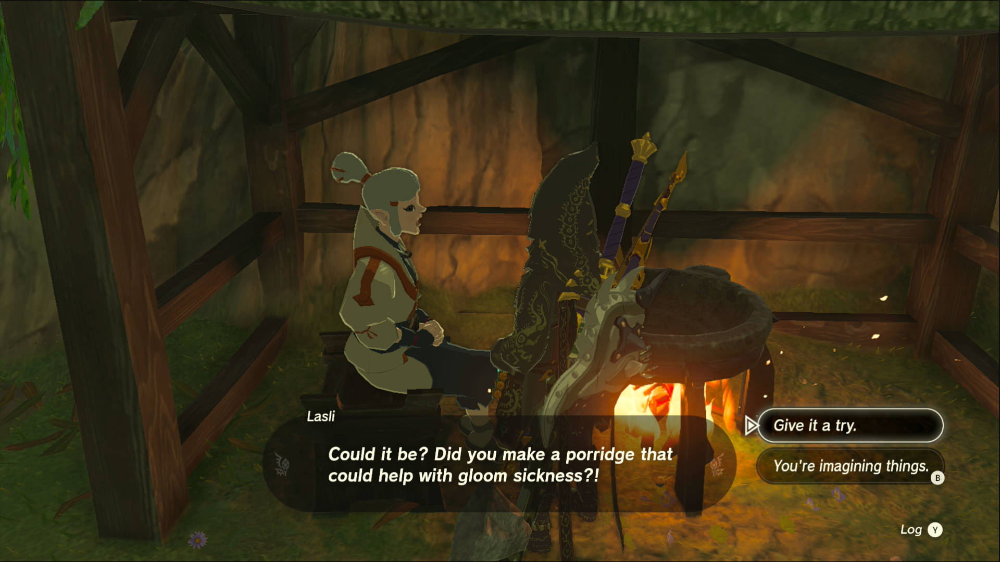

Gloom-Borne Illness is one of the Side Quests you’ll discover in Kakariko Village. Side Quests are quests in The Legend of Zelda: Tears of the Kingdom that are relatively short or simple chores that can earn you small rewards or services. 

## Gloom-Borne Illness Guide

To start the Side Quest “Gloom-Borne Illness you need to speak to **Lasli** , who can be found in front of her grandmother’s house on the east end of **Kakariko Village**. Her grandmother has fallen ill due to the gloom near the village, and she needs ingredients to make her some porridge so her health doesn’t get any worse. 

As it so happens, Sundelions are good for counteracting gloom sickness. These golden flowers grow on the ring ruins around the village and on sky islands, so if you haven’t already gathered some, head back up to the starting sky islands to find some. 

As for the other porridge ingredients, Lasli says she uses **Hylian rice, fresh milk** , and wild greens. Lasli will tell you where to find some if you ask her; she bought the Hylian rice and milk from traveling merchants on the road west of Kakariko Village. For this recipe, **Sundelions** will serve as your replacement for the wild greens. 

Once you have the three ingredients in hand, it’s time to cook them! Lasli has a cooking pot in front of her usual spot by the house, so toss them in and speak to her to give her the result. As a reward, you’ll receive **Energizing Veggie Porridge**. It won’t cure any gloom sickness, but it does refill some of your Stamina Wheel. Additionally, the **prices at the clothing shop Enchanted will be lowered**! 

Gloom-Borne Illness

See the complete List of Side Quests and Side Adventures

### Up Next: Walkthrough

Previous

About IGN's Zelda TotK Guide Writers

Next

Walkthrough

### Top Guide Sections

  * Walkthrough
  * Zelda: Tears of The Kingdom Switch 2 Edition Guide
  * Zelda Notes Voice Memories
  * List of Side Quests and Side Adventures

### Was this guide helpful?

Leave feedback

Go to comments