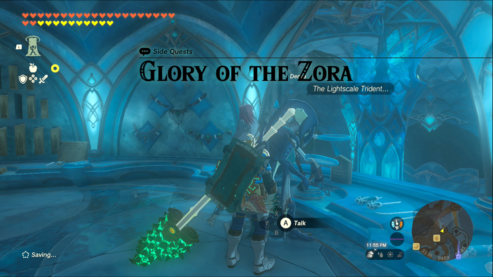
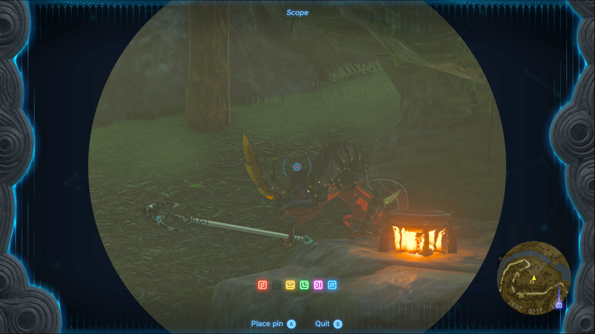
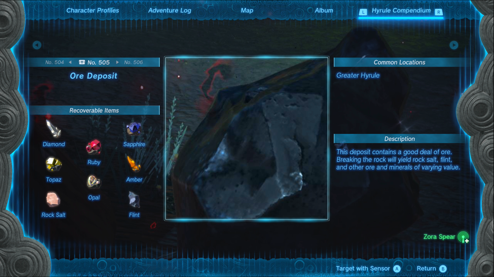
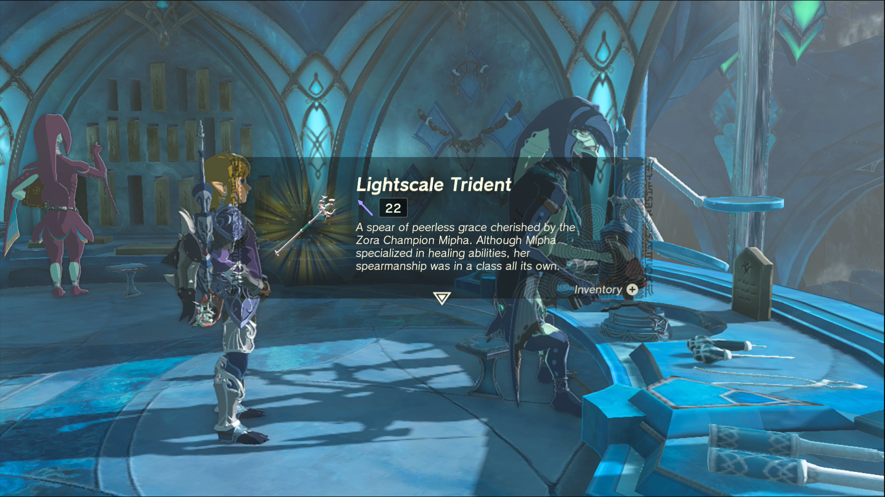

Glory of the Zora is one of the Side Quests you’ll discover in the Lanayru Great Spring region. Side Quests are quests in The Legend of Zelda: Tears of the Kingdom that are relatively short or simple chores that can earn you small rewards or services. 

## Glory of the Zora

To start the Side Quest “Glory of the Zora” you first need to complete the Main Quest “Sidon of the Zora.” Then go to Coral Reef, the general store in Zora’s Domain, and speak to Dento, the blacksmith Zora in the back. 

He wants to give you a weapon worthy of saving the world, but first he needs you to gather materials for it. You need to gather three kinds of materials: a Zora spear, 3 diamonds, and 5 pieces of flint. 

If you completed the Mired in Muck quest, Bazz gave you a Zora Spear as a reward, but if you haven’t held onto it, you may find one in the Tabahl Woods Cave, southwest of Zora’s Domain, or with the Lizalfos outside of the cave. 

If you’re missing 3 diamonds, we have a handy guide that can point you to a few of their locations. 

If you need help finding flint, any cave can contain Ore, Rare Ore, or Luminous Stone Deposits and flint can drop from any of them. 

If you have the Sensor+ upgrade for your Purah Pad, you can set it to locate Ore Deposits to make the process even easier. Once you’ve acquired the materials, return to Dento in Zora’s Domain to receive the Lightscale Trident, a moderately powerful spear weapon. 

Dento will even replace it for you if it gets lost or destroyed. 

Glory of the Zora

See the complete List of Side Quests and Side Adventures

### Up Next: Walkthrough

Previous

About IGN's Zelda TotK Guide Writers

Next

Walkthrough

### Top Guide Sections

  * Walkthrough
  * Zelda: Tears of The Kingdom Switch 2 Edition Guide
  * Zelda Notes Voice Memories
  * List of Side Quests and Side Adventures

### Was this guide helpful?

Leave feedback

### In This Guide

The Legend of Zelda: Tears of the KingdomNintendo EPD

Initial Release: May 12, 2023

Learn more

Go to comments