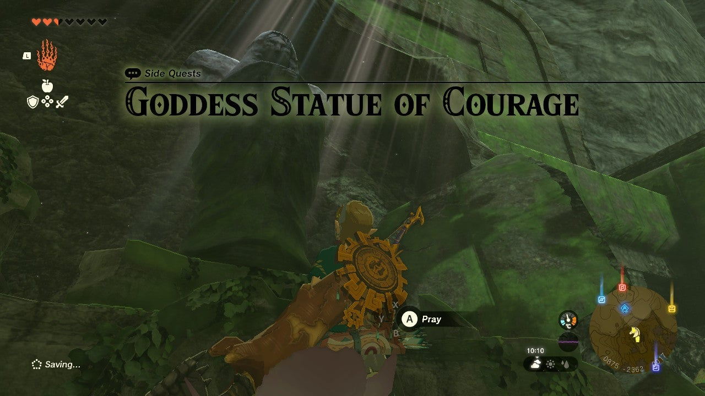
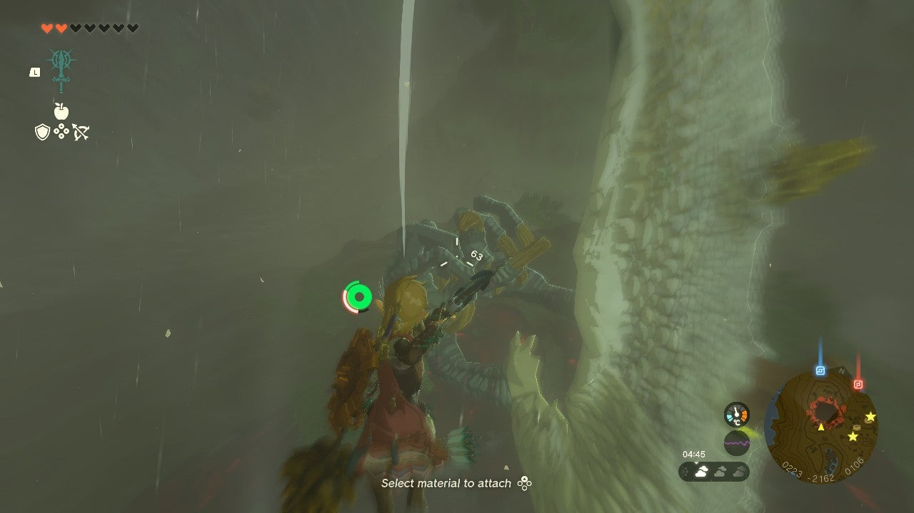
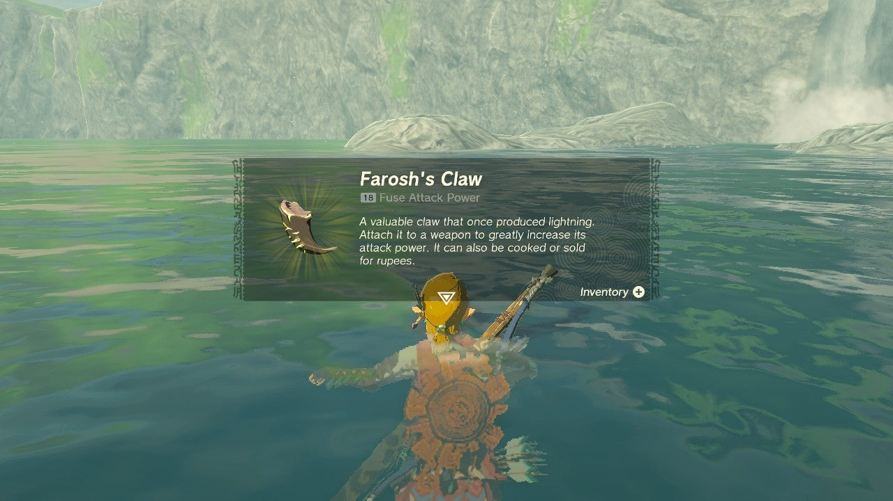

**The Goddess Statue of Courage** Side Quest is one part of a larger quest to save the Goddess Statue that has fallen in the Forgotten Temple. In this guide, we will walk you through the entire quest from start to finish, so you can help restore the Mother Goddess Statue. 

You can trigger this leg of the journey by visiting the Goddess Statue of Courage in Dracozu Lake in the Faron region. 

Make your way up the river until you reach a great stone dragon head and head inside to speak with the Goddess Statue of Courage. She will tell you that she can no longer feel the presence of the Mother Goddess Statue and ask that you go and check up on her. 

The Mother Goddess Statue is in the Forgotten Temple, which is a huge stone Temple structure nestled at the very back of a deep valley in the Southernmost part of the Tabantha region. You may or may not have already visited this temple as part of The Dragon's Tears Quest. 

Once you interact with the toppled Mother Goddess Statue in the Forgotten Temple, head back to the Goddess Statue of Courage to report your findings. She will ask that you collect a claw from the Great Dragon Farosh to help repair the Mother Statue. 

## Finding Farosh

The easiest way to find Farosh is from the Popla Foothills Skyview Tower. Launch yourself up into the air and land on the flower-shaped Sky Island to the West. Then you must wait. 

The Dragon will fly in from the West and enter the Chasm on the Hills of Baumer, but unlike The Legend of Zelda: Breath of the Wild, they do not seem to appear in any predictable pattern. The best thing you could do is direct your camera toward the Chasm and wait. 

Once you see Farosh heading toward the Chasm, fly down to meet it. Farosh releases balls of lighting that can be lethal if you get too close, so be careful. When you get close enough to take a shot, draw your bow and aim toward Farosh's claw. If you hit your target, a sparkle will appear and the claw will fall to the ground below. 

If it lands on the Gloom around the Chasm opening, the claw will be irretrievable. It also may fall into the Chasm itself, so be prepared to go hunting for it once it hits the ground. Thankfully, the claw has a glow about it that should help you find it. 

## Bring Farosh’s Claw Back to the Goddess Statue of Courage

Once you retrieve Farosh's claw, bring it back to the Goddess Statue of Courage so she can send its strength to the Mother Statue. She will thank you for your efforts and reward you with a **Topaz** before asking you to visit the other Goddess Statues to complete their quests and eventually bring the Mother Statue back to her former glory. 

Goddess Statue of Courage

See the complete List of Side Quests and Side Adventures

### Up Next: Walkthrough

Previous

About IGN's Zelda TotK Guide Writers

Next

Walkthrough

### Top Guide Sections

  * Walkthrough
  * Zelda: Tears of The Kingdom Switch 2 Edition Guide
  * Zelda Notes Voice Memories
  * List of Side Quests and Side Adventures

### Was this guide helpful?

Leave feedback

Go to comments