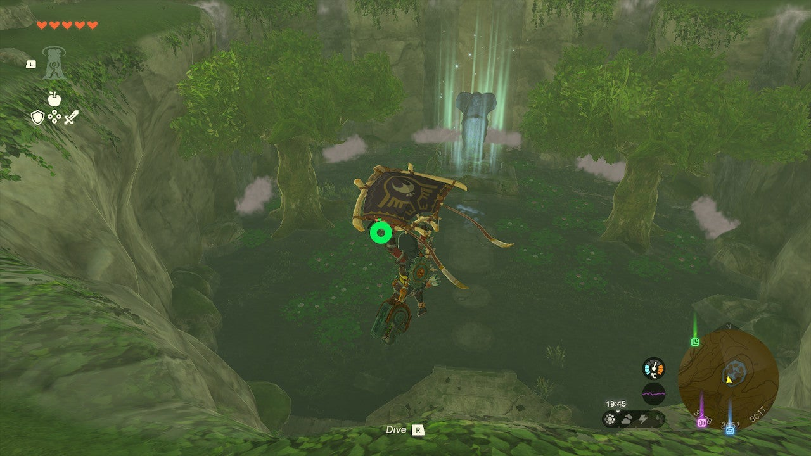
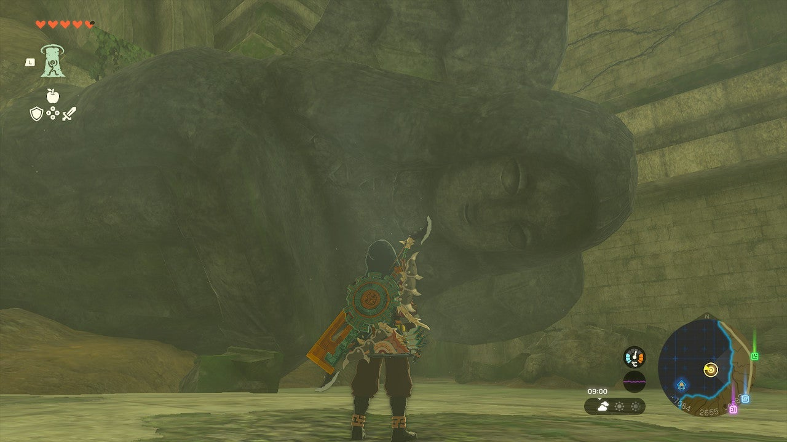
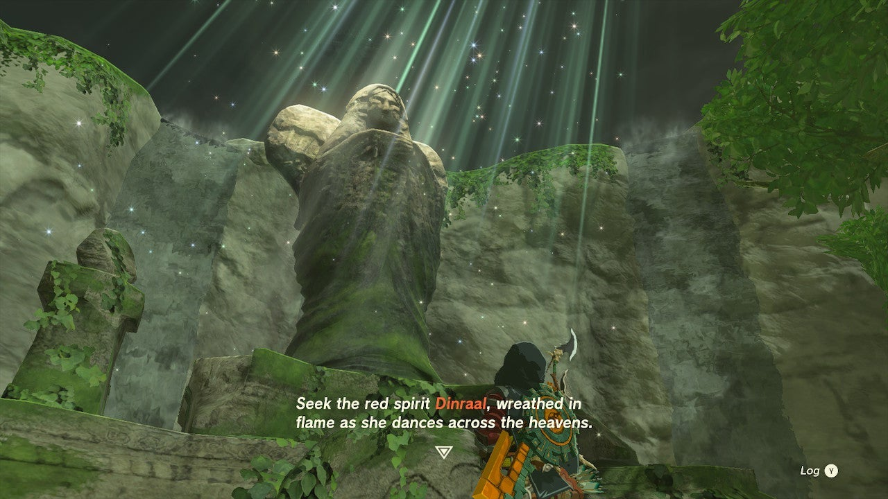
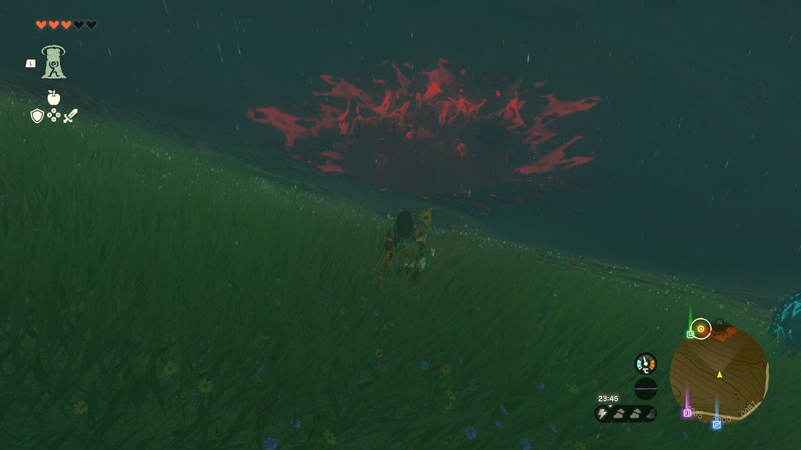

The Goddess Statue in Akkala needs your help, but don't worry... You only need to shoot the claw of a massive flying dragon! This The Legend of Zelda: Tears of the Kingdom side quest takes some guts, good aim, and the know-how on the correct locations. 

Here's how to find the Akkala Goddess Statue and how to solve the **Goddess Statue of Power** side quest. 

## Goddess Statue of Power Walkthrough

To start this side quest, you first need to discover the Goddess Statue of Power in Akkala. It's located in the **Spring of Power** , at coordinates 3750, 2670, 0002, which is in the valley between Death Mountain and the East Akkala Stable. 

Walk up to the Goddess of Power statue, and choose "pray". If this is your first Goddess Statue quest, you'll have to visit the Mother Goddess Statue before you can proceed. She's located near the Mayausiy Shrine, at the edge of the Tabantha Tundra. 

Once you've interacted with the Mother Goddess Statue, you can return to the Goddess of Power statue in Akkala to receive your next quest objective, which is to **find the red spirit Dinraal and obtain Dinraal's Claw**. 

The easiest way to find Dinraal, is by fast-traveling to the nearby Sinatanika Shrine and going to the **East Akkala Plains Chasm** in the southeast (see picture below). Circling between this chasm and the one north of the Great Hyrule Forest, Dinraal will eventually emerge from the chasm's depths - but be warned that it may take a while, as he doesn't show up at a fixed time. 

You need to hit Dinraal's claws with an arrow to obtain the item you need, but beware that you'll require protection against **intense heat** in order to get close. It's easiest to jump on Dinraal first, then jump off while you're close to his claws, and then hit them while slowing time (by taking aim with your bow). Luckily, the Dinraal's Claw glows, so you won't have too much trouble finding it even if it drops in The Depths. 

Return to the Spring of Power and drop Dinraal's Claw in front of the statue to complete this quest. You'll be rewarded with a **Ruby**. 

Goddess Statue of Power

See the complete List of Side Quests and Side Adventures

### Up Next: Walkthrough

Previous

About IGN's Zelda TotK Guide Writers

Next

Walkthrough

### Top Guide Sections

  * Walkthrough
  * Zelda: Tears of The Kingdom Switch 2 Edition Guide
  * Zelda Notes Voice Memories
  * List of Side Quests and Side Adventures

### Was this guide helpful?

Leave feedback

Go to comments