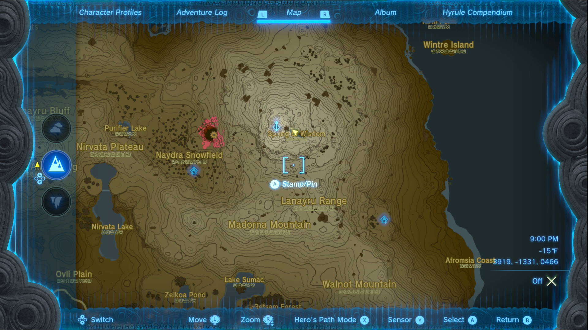
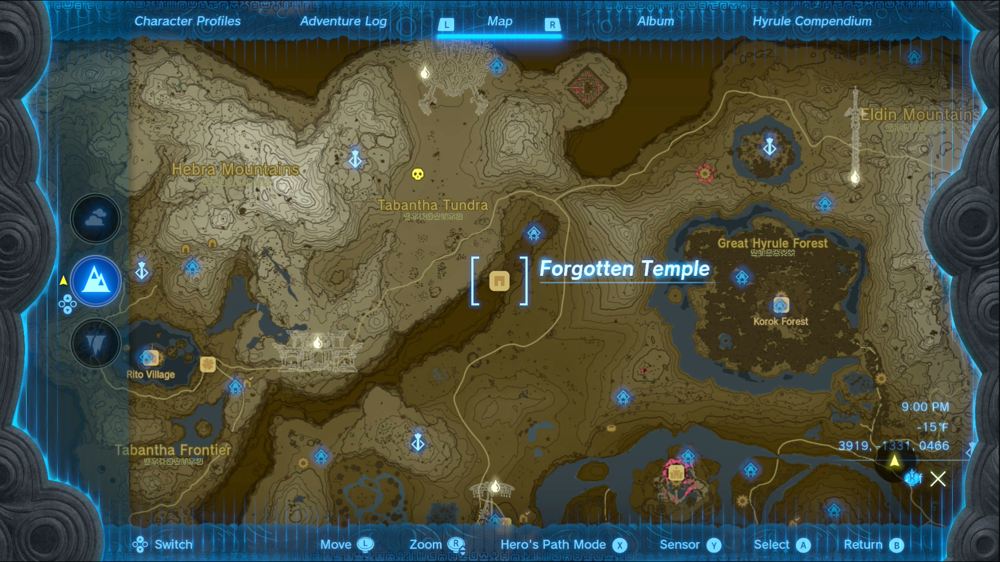
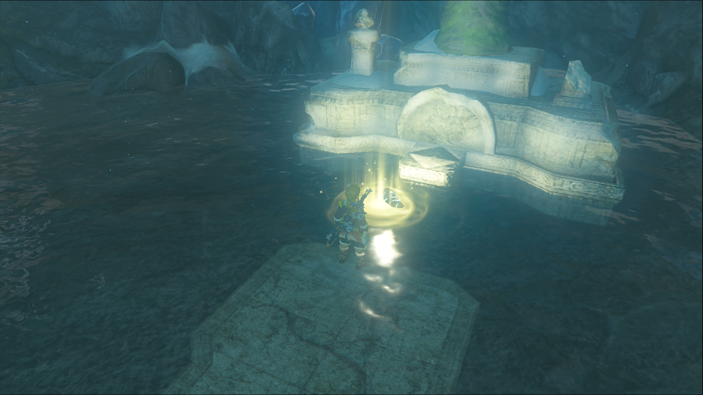

Goddess Statue of Wisdom is one of the Side Quests you’ll discover in the Mount Lanayru region. Side Quests are quests in The Legend of Zelda: Tears of the Kingdom that are relatively short or simple chores that can earn you small rewards or services. 

## Goddess Statue of Wisdom

To start the Side Quest “Goddess Statue of Wisdom” you need to head to the Spring of Wisdom, located near the summit of Mount Lanayru. If you’ve already unlocked the Mount Lanayru Skyview Tower you can jump down to the spring from the summit, otherwise you’ll have to make the climb. Hateno Village is a good place to set out for the summit. 

Once you arrive, pray to the Goddess Statue. If this is the first of the three springs you’ve visited, the Goddess Statue will ask you to check on the great Goddess Statue at the Forgotten Temple. The Temple is in the large canyon northwest of Hyrule Castle, near the Tabantha region. 

Once you’ve investigated the large statue, return to the Goddess Statue of Wisdom to tell her what you saw. In return, the statue will ask you to provide Naydra’s Claw to help restore power to the great Goddess Statue. Naydra’s Claw can only be retrieved from Naydra, the massive ice dragon that can usually be seen flying around the East Necluda and Mount Lanayru regions. If you don’t see the dragon from Mount Lanayru, it may be flying around the depths, in which case you can check for it by entering Naydra Snowfield Chasm, just west of the Mount Lanayru Skyview Tower. 

Once you’ve located Naydra, you’ll need to shoot one of its claws, at which point it will streak to the ground waiting for you to pick it up. If you have trouble getting up to Naydra, the Mount Lanayru Skyview Tower can get you close enough to shoot the claw. If you miss and get a scale or a horn fragment, land on the dragon and wait about ten minutes for another chance at the claw. Once you’ve got the claw, head back to the Spring of Wisdom and drop the claw into the water. You’ll receive a Sapphire in return. 

Goddess Statue of Wisdom

See the complete List of Side Quests and Side Adventures

### Up Next: Walkthrough

Previous

About IGN's Zelda TotK Guide Writers

Next

Walkthrough

### Top Guide Sections

  * Walkthrough
  * Zelda: Tears of The Kingdom Switch 2 Edition Guide
  * Zelda Notes Voice Memories
  * List of Side Quests and Side Adventures

### Was this guide helpful?

Leave feedback

Go to comments