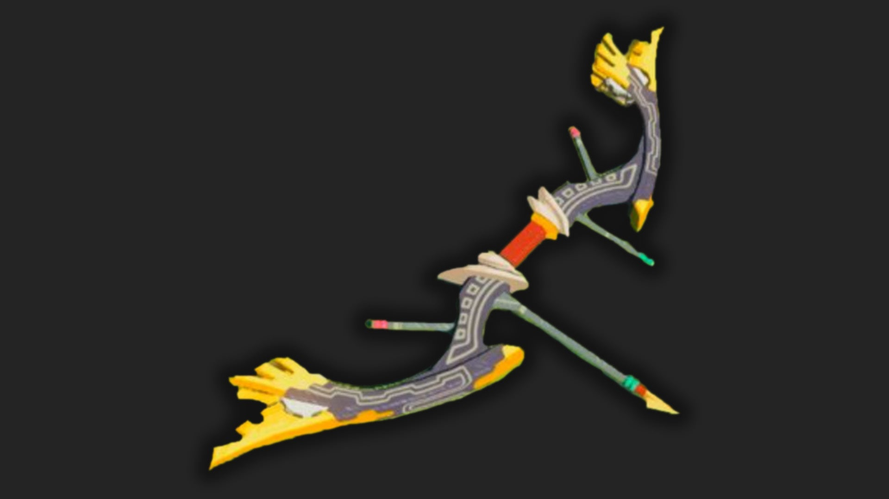

The Great Eagle Bow is a Bow The Legend of Zelda: Tears of the Kingdom. This bow used to belong to the Rito Champion Revali. Some believe this bow was the reason the champion had no competition during aerial combat. 

## Great Eagle Bow Stats

 _"A bow without equal wielded by the Rito Champion, Revali. It's said Revali could lose arrows with the speed of a gale, making him supreme in aerial combat.'_

  * **Hyrule Compendium number:** 451
  * **Base Damage:** 28 x3

451 Great Eagle Bow

To get this bow, you'll need to speak with Teba after clearing out the blizzard that was affecting the Rito village. He'll tell you he can craft you a great weapon if you bring him the following materials: 

  * Swallow Bow
  * 5x Wood Bundles
  * 3x Diamonds

Once you have all the materials, talk to Teba again to get the bow. 

Learn more about The Legend of Zelda: Tears of the Kingdom with our helpful guide: 

  * Complete Walkthrough
  * Tips, Tricks, and Things to Know
  * Things to Do First in TotK

Or Jump back to our Weapons Hub

### Up Next: Walkthrough

Previous

About IGN's Zelda TotK Guide Writers

Next

Walkthrough

### Top Guide Sections

  * Walkthrough
  * Zelda: Tears of The Kingdom Switch 2 Edition Guide
  * Zelda Notes Voice Memories
  * List of Side Quests and Side Adventures

### Was this guide helpful?

Leave feedback

### In This Guide

The Legend of Zelda: Tears of the KingdomNintendo EPD

Initial Release: May 12, 2023

Learn more

Go to comments