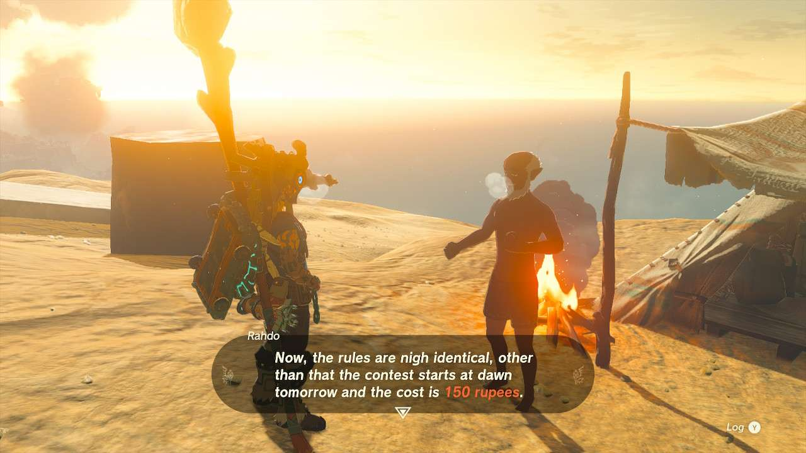
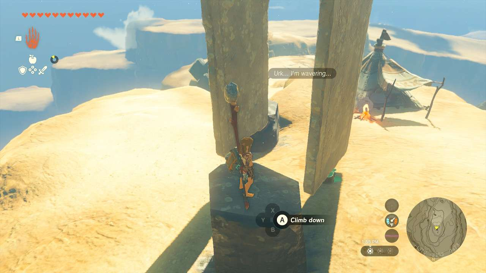

**Heat-Endurance Contest!** is one of the many Side Quests to complete in The Legend of Zelda: Tears of the Kingdom. In this guide, we will teach you everything you need to know to complete Heat-Endurance Contest!, including where to find it and what you will get as a reward. 

  * **Side Quest Location** : Mount Granajh, Gerudo Canyon
  * **Prerequisites** : Complete Cold-Endurance Contest!
  * **Rewards** : 300 Rupees

You can speak to **Rahdo** at the peak of **Mount Granajh** after completing Cold-Endurance Contest!, where he’ll issue another challenge: both of you put up 150 Rupees to see who can make it through the day in the extreme desert heat. The same catch applies that you can’t wear any clothing or have your feet touch the floor from the pillar you start on. However, everything else is fair game. 

As it is in the prior Side Quest, you can use food and elixirs to help you make it through. Although again, you’ll be testing the extreme temperature from around 8 AM to 4 AM, so you would need to make plenty. Fusing a weapon with a Sapphire is a simpler strategy similar to the Ruby Rod, as the ice energy will consistently keep your temperature down. 

Like last time, there are several things to Ultrahand sitting around. You can use these to create shade that you can stay in; you may have to move it throughout the day to counter the positioning of the sun, but if you use the Zonai stakes that are also around, it should be able to stay no matter where you put it. _**Note: If you intend to place something over the pillar to shield you, don’t erect it until the contest starts. If you do it beforehand, Rahdo will dismantle it and you’ll lose the materials to even Autobuild**_. 

Another strategy is to actually climb down to the sides of the pillar, continually shifting away from the sun to always stay in the shade of the pillar. Just make sure you don’t touch the floor. In any case, however you choose to make it through the day, Rahdo will reward you with a Gold Rupee for beating him. 

Heat-Endurance Contest!

See the complete List of Side Quests and Side Adventures

### Up Next: Walkthrough

Previous

About IGN's Zelda TotK Guide Writers

Next

Walkthrough

### Top Guide Sections

  * Walkthrough
  * Zelda: Tears of The Kingdom Switch 2 Edition Guide
  * Zelda Notes Voice Memories
  * List of Side Quests and Side Adventures

### Was this guide helpful?

Leave feedback

### In This Guide

The Legend of Zelda: Tears of the KingdomNintendo EPD

Initial Release: May 12, 2023

Learn more

Go to comments