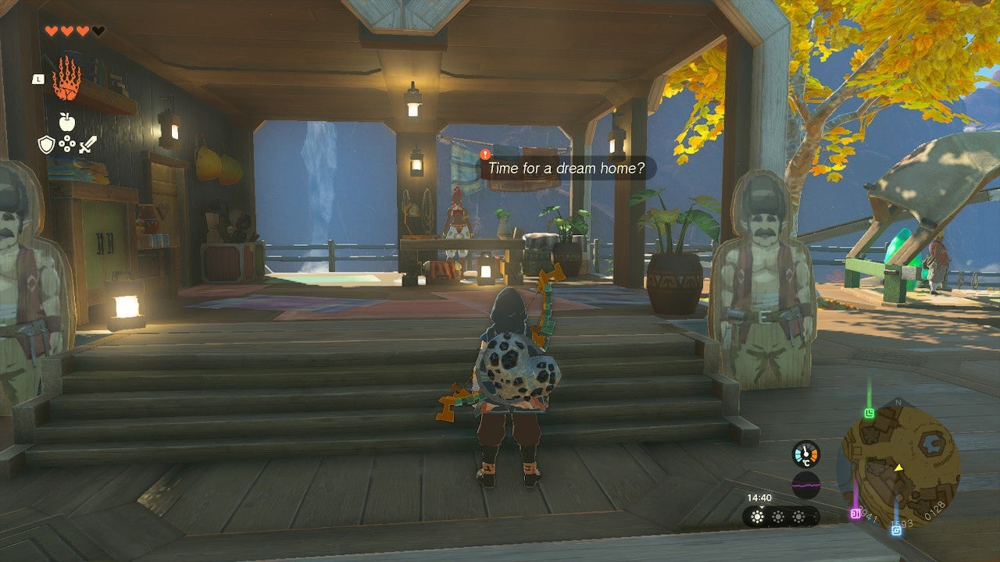
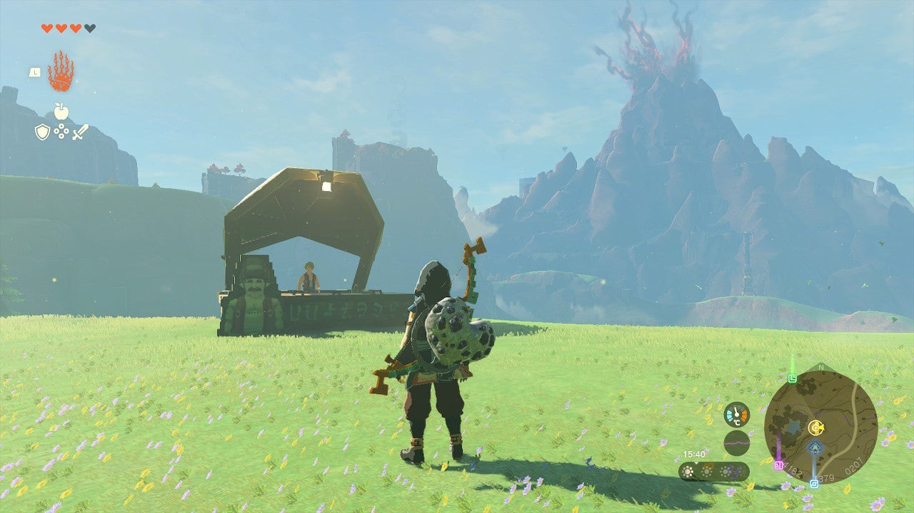
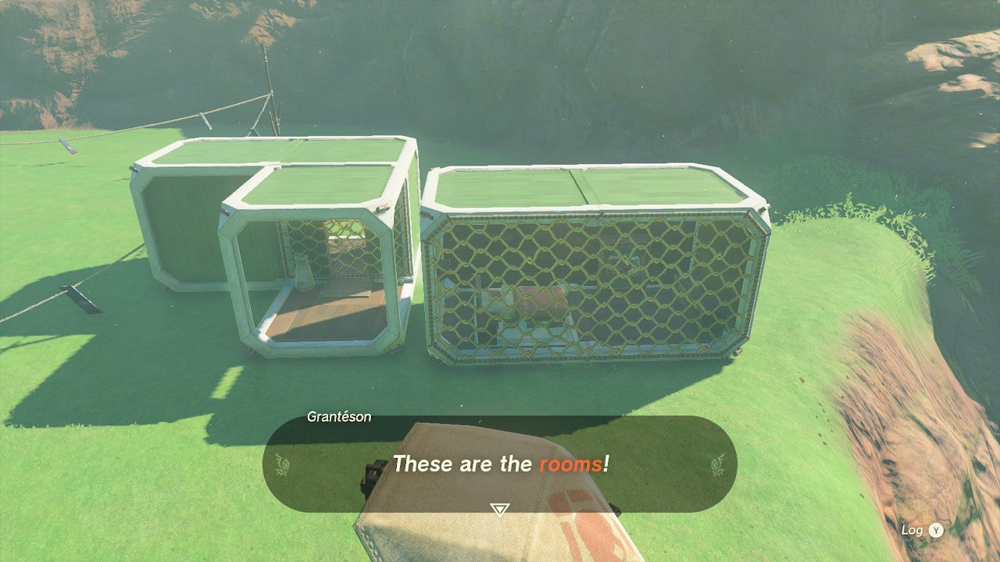

Ready to get your dream home in Hyrule? The **Home on Arrange** side quest will make that dream come through - you even get to design it yourself! So, if building your own house in The Legend of Zelda: Tears of the Kingdom sounds like a fun adventure, here's how to start. 

## Home on Arrange Walkthrough

To start the Home on Arrange quest, speak to **Rhondson** in Tarrey Town, Akkala. Beware that you have to complete the side adventure Mattison's Independence first if you haven't done so already. Rhondson will offer to sell you a plot of land and two free rooms for **1,500 rupees**. You have to accept this offer to continue the quest. 

Next, travel to the area **southeast of Tarrey Town** , just north of the Rasitakiwak Shrine (use fast travel to get there faster). Look for the wooden Hudson Construction stand and speak to Grantéson (see the picture below - it's hard to miss). 

Grantéson will show you the first two rooms. You can place them inside the roped-off area on the left using your Ultrahand ability. Place them however you like, but don't stress it; you can rearrange them later on. 

Once you're done, speak to Grantéson again and allow him to inspect the house. If he approves, Rhondson will come over and reward you with a **Hudson Construction Fabric**. You've completed the Home on Arrange side quest, but you can return to Grantéson to change your house and add rooms whenever you like. 

Home on Arrange

See the complete List of Side Quests and Side Adventures

### Up Next: Walkthrough

Previous

About IGN's Zelda TotK Guide Writers

Next

Walkthrough

### Top Guide Sections

  * Walkthrough
  * Zelda: Tears of The Kingdom Switch 2 Edition Guide
  * Zelda Notes Voice Memories
  * List of Side Quests and Side Adventures

### Was this guide helpful?

Leave feedback

Go to comments