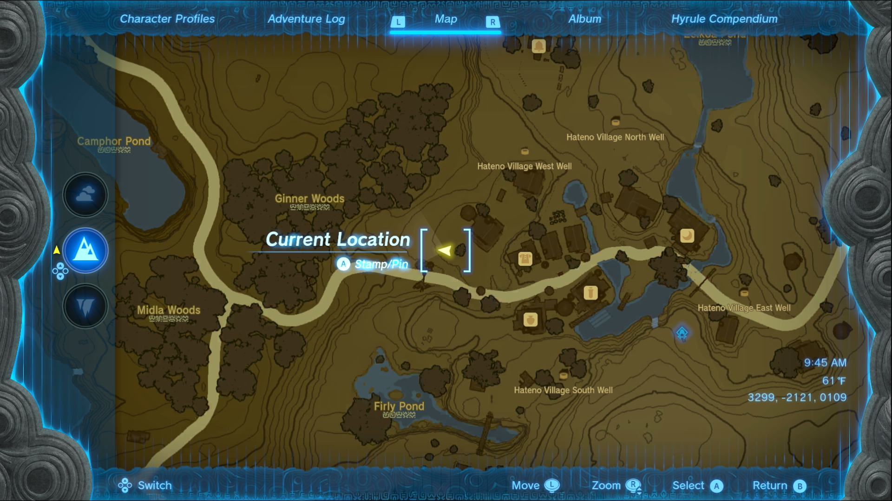
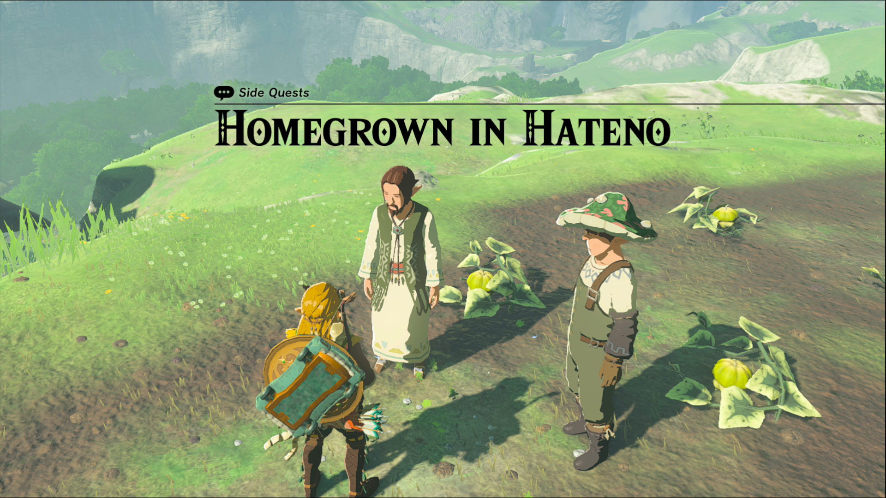
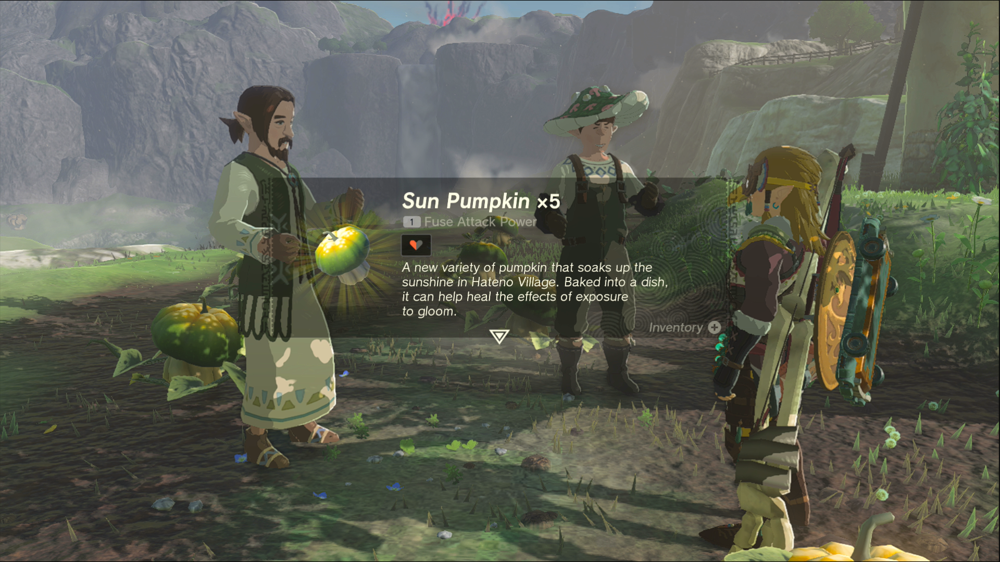

Homegrown in Hateno is one of the Side Quests you’ll discover in Hateno Village. Side Quests are quests in The Legend of Zelda: Tears of the Kingdom that are relatively short or simple chores that can earn you small rewards or services. 

## Homegrown in Hateno

To start the Side Quest, “Homegrown in Hateno”, speak to Mayor Reede after completing the Mayoral Election questline in Hateno Village. He’ll be standing in a vegetable field on the west side of the village. 

He wants your help to protect his crops at night from monsters. They come at night, but speaking to Reede allows you to skip to nighttime to defend the crops. This is a battle of endurance, since you’ll be facing several waves of monsters. Luckily, the enemy forces are composed entirely of stal-enemies, skeletons that are very brittle, but they will reassemble their bodies until their head is destroyed. 

Even a farming hoe or pitchfork can be enough to destroy them while keeping a safe distance. As you defeat them, they’ll drop their arms to use as melee weapons, we recommend using these to avoid damaging your normal weapons. 

While you fight, keep Reede safe, because if he takes too much damage you fail the attempt for the night. Archers should be prioritized because they can attack from a distance, but bomb arrows are useful for any group up melee attackers. Once you’ve taken out a couple of waves, Reede will skip to morning, claiming a successful endeavor. For your efforts, Reede will give you some of his new crop, Sun Pumpkins, which can cure the effects of gloom when cooked. They are now also available to purchase at the East Winds General Goods Store. 

Homegrown in Hateno

See the complete List of Side Quests and Side Adventures

### Up Next: Walkthrough

Previous

About IGN's Zelda TotK Guide Writers

Next

Walkthrough

### Top Guide Sections

  * Walkthrough
  * Zelda: Tears of The Kingdom Switch 2 Edition Guide
  * Zelda Notes Voice Memories
  * List of Side Quests and Side Adventures

### Was this guide helpful?

Leave feedback

Go to comments