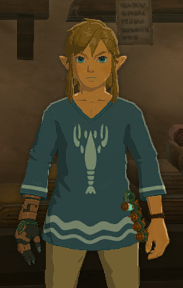
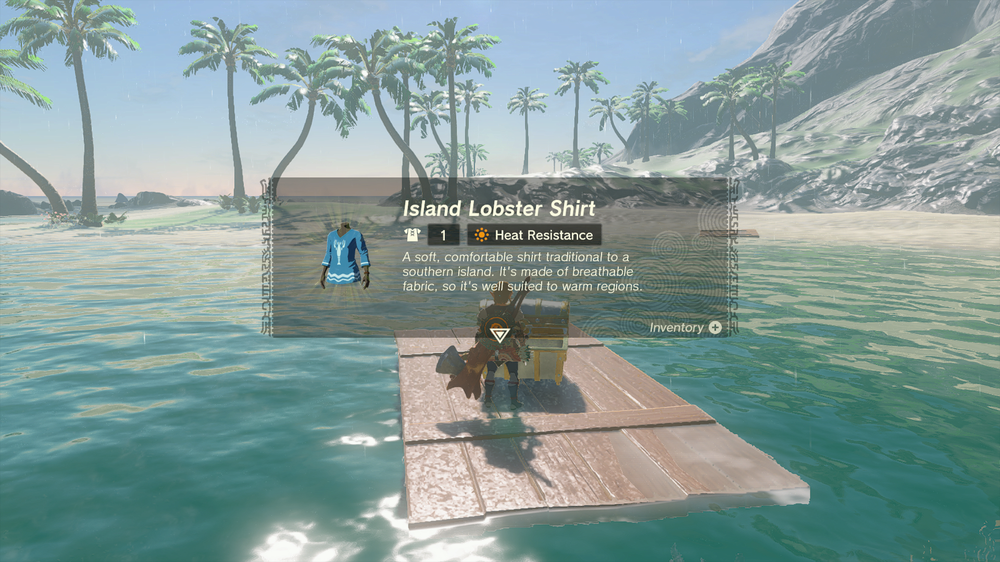
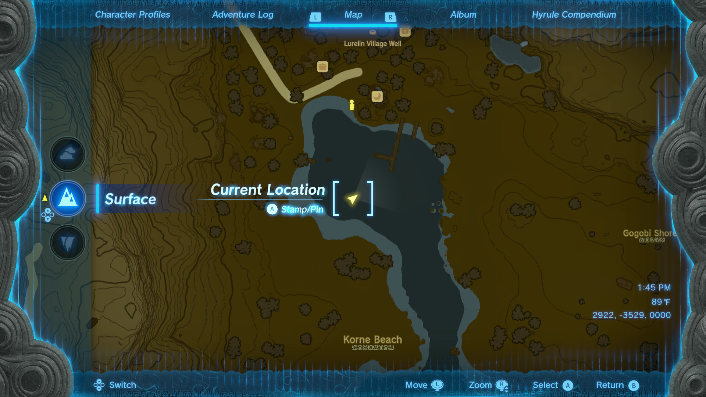
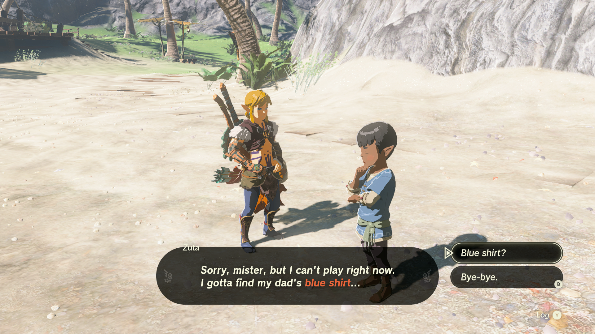

The Island Lobster Shirt is a particular piece of body gear that may be familiar to fans of the Zelda franchise. While it does require some amount of story progression to obtain, it's a fun nod to a past game that allows players to stay cool in the heat. This piece of armor cannot be upgraded or dyed. 

In this Tears of the Kingdom guide, you'll learn how to unlock the Island Lobster Shirt and get details on this item's stats. 

## Island Lobster Shirt

  * **Description:** _"A soft, comfortable shirt traditional to a southern island. It's made of breathable fabric, so it's well suited to warm regions._ "

Island Lobster Shirt Base Stats

Defense  
Effect Bonus  
Cost  
Sale Value

1  
Heat Resistance  
N/A  
600

Island Lobster Shirt

## Where to Find the Island Lobster Shirt

It is required to complete the side adventures Ruffian-Infested Village and Lurelin Village Restoration Project before finding this shirt. 

The Island Lobster shirt is obtained as a reward for completing the side quest Dad's Blue Shirt. Talking to Zuta on the beach just south of his family's restaurant you learn he's in search of a shirt locked in a chest that may have sunk in the bay. 

  * **Zuta's Coordinates:** 2892, -3433, 0000

Using Ultrahand, you can spot several chests underwater. The one containing the shirt is just southwest of the center of the bay and cannot be reached from the shore. Use one of the wood platforms to get close enough to pull the chest from the water. Return to Zuta and his father Sebasto gifts the shirt to you. 

### Up Next: Korok Mask

Previous

Horriblin Mask

Next

Korok Mask

### Top Guide Sections

  * Walkthrough
  * Zelda: Tears of The Kingdom Switch 2 Edition Guide
  * Zelda Notes Voice Memories
  * List of Side Quests and Side Adventures

### Was this guide helpful?

Leave feedback

### In This Guide

The Legend of Zelda: Tears of the KingdomNintendo EPD

Initial Release: May 12, 2023

Learn more

Go to comments