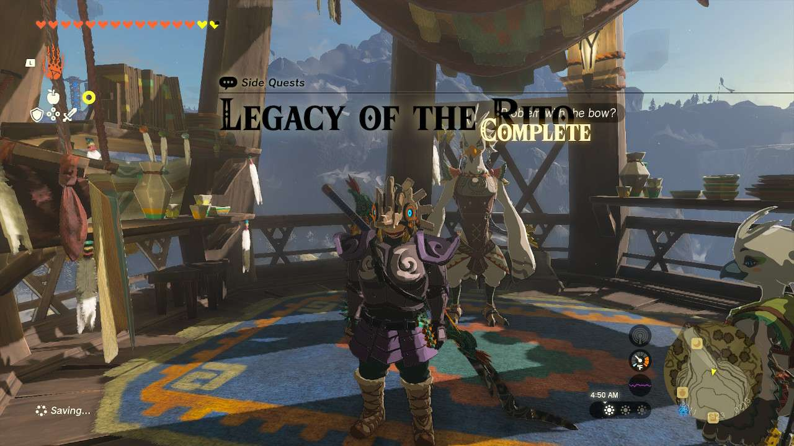
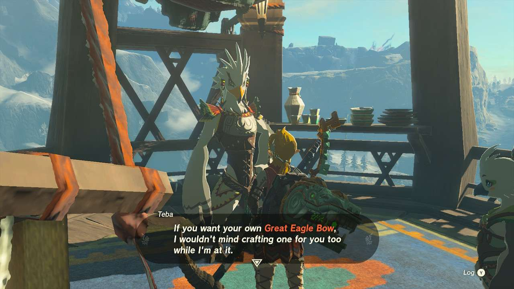
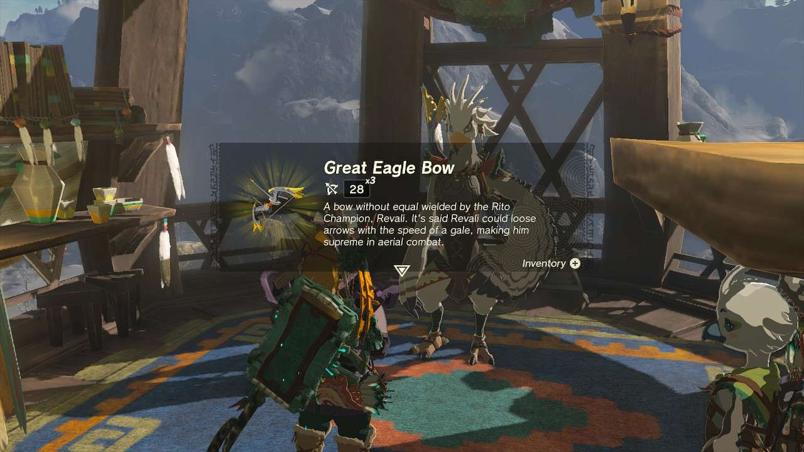

**Legacy of the Rito** is one of the many Side Quests to complete in The Legend of Zelda: Tears of the Kingdom. In this guide, we will teach you everything you need to know to complete Legacy of the Rito, including where to find it and what you will get as a reward. 

  * **Side Quest Location** : Rito Village, Tabantha Frontier
  * **Prerequisites** : Finish the Hebra Mountains portion of Regional Phenomena
  * **Rewards** : Great Eagle Bow

You can only activate this quest to get this legendary-ish weapon after the events of Tulin of Rito Village. Speak to **Teba** sometime afterwards and he’ll let you know that he can craft a Great Eagle Bow for you if you can collect the materials. 

The materials are **3****Diamonds****, 5 bundles of wood, and a****Swallow Bow**. Click on any of those materials there to go to our pages on those respective items. The wood is probably the easiest to farm, while Diamonds are obviously going to be a bit more rare and requires some strategy. 

The Swallow Bow can be found in multiple places across the Hebra Mountains and the Tabantha Frontier, though there is a guaranteed one right next to **Kaneli** in **Dronoc’s Pass** if you go and hit up his flight range. 

Once you have all the materials, you can speak to Teba again for the powerful bow that can shoot three arrows at a time. Teba also tells you **he can craft the weapon for you again if you bring him the materials once more**. 

Legacy of the Rito

See the complete List of Side Quests and Side Adventures

### Up Next: Walkthrough

Previous

About IGN's Zelda TotK Guide Writers

Next

Walkthrough

### Top Guide Sections

  * Walkthrough
  * Zelda: Tears of The Kingdom Switch 2 Edition Guide
  * Zelda Notes Voice Memories
  * List of Side Quests and Side Adventures

### Was this guide helpful?

Leave feedback

Go to comments