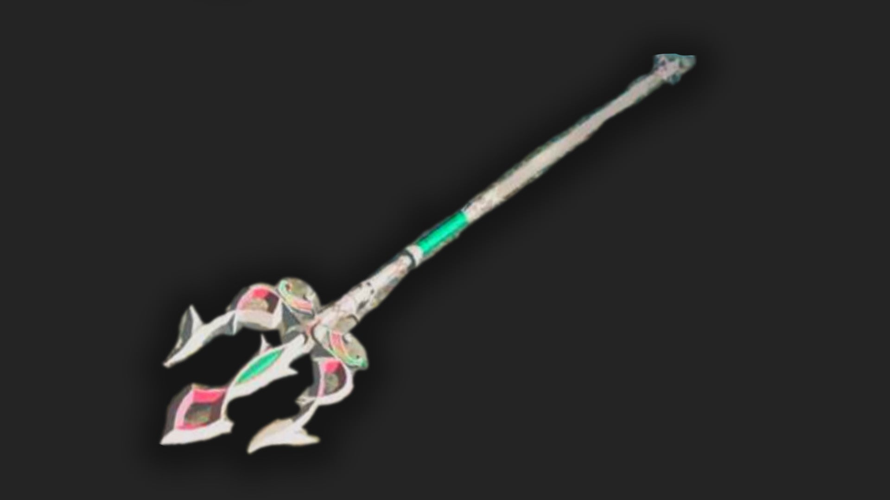

The Lightscale Trident is a spear in The Legend of Zelda: Tears of the Kingdom. The Zora Champion Mipha once favored this weapon, but now it can be yours by completing the side quest Glory of the Zora. 

## Lightscale Trident Stats

 _"A spear of peerless grace cherished by the Zora Champion Mipha. Although Mipha specialized in healing abilities, her spearmanship was in a class all its own. "_

  * **Hyrule Compendium number:** 424
  * **Base Damage:** 22
  * **Passive Ability** : Water Warrior

424 Lightscale Trident

You'll get this weapon by completing the side quest “Glory of the Zora.” 

Learn more about The Legend of Zelda: Tears of the Kingdom with our helpful guide: 

  * Complete Walkthrough
  * Tips, Tricks, and Things to Know
  * Things to Do First in TotK

Or Jump back to our Weapons Hub

### Up Next: Walkthrough

Previous

About IGN's Zelda TotK Guide Writers

Next

Walkthrough

### Top Guide Sections

  * Walkthrough
  * Zelda: Tears of The Kingdom Switch 2 Edition Guide
  * Zelda Notes Voice Memories
  * List of Side Quests and Side Adventures

### Was this guide helpful?

Leave feedback

### In This Guide

The Legend of Zelda: Tears of the KingdomNintendo EPD

Initial Release: May 12, 2023

Learn more

Go to comments