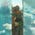
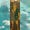
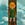

The Legend of Zelda: Tears of the Kingdom features a wide variety of optional missions in the form of both Side Quests and Side Adventures. Like Breath of the Wild, TotK spans a massive open world, and there are many side quests hiding in all corners of Hyrule - and can be tracked in Link's Adventure Log. These quests can be often be found by looking for characters that have a text box above their heads with a red !, but some can be found in very different ways. This guide has been tested by IGN and confirmed to work for all versions of TOTK, including the Tears of the Kingdom Switch 2 Edition released in 2025 (which added no new Side Quests, but did add Zelda's Voice Memories as a collectible set). 

Note that not all quests are immediately available, as many can be found in major towns after the completion of a dungeon. The difference between Side Quests and Side Adventures appears to be how involved the objectives are - Side Adventures tend to tie into multiple questlines and characters, while Side Quests are usually one-off or simple objectives. 

Tears of the Kingdom can now be enjoyed on the new Nintendo Switch 2! We've confirmed that there are**no new side quests** for TotK added in the Switch 2 Edition.  
  
Looking for more info on everything new added to Tears of the Kingdom for the Switch 2? **Check out our****Switch 2 Edition guides****!**

There are**60 Side Adventures and 139 Side Quests**. You can view the entire list below, and click on a link to learn more about it and how to complete them. Similar to Side Quests, there are also 31 Shrine Quests. 

Click the links below to head straight to the section you're looking for: 

  * List of Side Adventures
  * List of Side Quests

### What's the Best Armor Set in Zelda: Tears of the Kingdom?

### 

Pick a winner

New duel

1ST

2ND

3RD

See your Results

Finish playing for your personal results or see the community’s!

Continue playingSee results

## List of Side Adventures

Here's every Side Adventure in Tears of the Kingdom, listed by its in-game order so you can compare your list to this one just by pausing your game. The table of TOTK Side Adventures lists location, quest giver and reward. Click on the Side Adventure name for the full walkthrough for each. This table can also be sorted alphabetically. 

### Tears of the Kingdom Side Adventures

Side Adventure Name  
Starting Settlement Region  
Quest Giver  
Reward  
Completed

Hateno Village Research Lab  
Lookout Landing, Central Hyrule  
Robbie  
Shrine Sensor  
Hateno Village Research Lab

Filling Out the Compendium  
Hateno Village, East Necluda  
Robbie  
Robbie's Fabric  
Filling Out the Compendium

Presenting: The Travel Medallion  
Hateno Village, East Necluda  
Robbie  
Travel Medallion  
Presenting: The Travel Medallion!

Presenting: Hero's Path Mode!  
Hateno Village, East Necluda  
Robbie  
Hero's Path Mode  
Presenting: Hero's Path Mode!

Presenting: Sensor +!  
Hateno Village, East Necluda  
Robbie  
Sensor +  
Presenting: Sensor +!

Mattison's Independence  
Tarrey Town, Akkala  
Hudson  
200 Rupees  
Mattison's Independence

A Letter to Koyin  
Hateno Village's Lake Sumac, East Necluda  
Koyin  
Hateno Cheese  
A Letter to Koyin

A New Signature Food  
Hateno Village, East Necluda  
Reede  
100 Rupees  
A New Signature Food

Reede's Secret  
Hateno Village, East Necluda  
Clavia  
10 x Hylian Tomatoes  
Reede's Secret

Cece's Secret  
Hateno Village, East Necluda  
Sophie  
10 x Ironshrooms  
Cece's Secret

Team Cece or Team Reede?  
Hateno Village Clothing Shop, East Necluda  
Cece  
Use of Clothing Shop  
Team Cece or Team Reede?

The Mayoral Election  
Hateno Village, East Necluda  
Cece and Reede  
Cece hat  
The Mayoral Election

Ruffian-Infested Village  
Sifimum Shrine, East Necluda  
Rozel  
Lurelin Village Restored  
Ruffian-Infested Village

Lurelin Village Restoration Project  
Lurelin Village, East Necluda  
Bolson  
Free Village Services  
Lurelin Village Restoration Project

Potential Princess Sightings!  
Lucky Clover Gazette, Tabantha Frontier  
Traysi  
Froggy Armor  
Potential Princess Sightings!

The Beckoning Woman  
Outskirt Stable, Central Hyrule  
Penn  
Rupees  
The Beckoning Woman

Gourmets Gone Missing  
Riverside Stable, Central Hyrule  
Penn  
Rupees  
Gourmets Gone Missing

The Beast and the Princess  
New Serenne Stable, Hyrule Ridge  
Penn  
Rupees  
The Beast and the Princess

Zelda's Golden Horse  
Snowfield Stable, Tabantha Tundra  
Harlow  
Zelda's Golden Horse, Royal Bridle, Royal Saddle  
Zelda's Golden Horse

White Goats Gone Missing  
Tabantha Bridge Stable, Hyrule Ridge  
Penn  
Rupees  
White Goats Gone Missing

For Our Princess!  
Foothill Stable, Eldin Canyon  
Penn  
Rupees  
For Our Princess!

The All-Clucking Cucco  
South Akkala Stable, Akkala Highlands  
Penn  
Rupees  
The All-Clucking Cucco

The Missing Farm Tools  
Wetlands Stable, West Necluda  
Penn  
Rupees  
The Missing Farm Tools

Princess Zelda Kidnapped?!  
Dueling Peaks Stable, West Necluda  
Penn  
Rupees  
Princess Zelda Kidnapped?!

An Eerie Voice  
Highland Stable, Faron  
Penn  
Rupees  
An Eerie Voice

The Blocked Well  
Gerudo Canyon Stable, Gerudo Highlands  
Penn  
Rupees  
The Blocked Well

The Flute Player's Plan  
Highland Stable, Faron  
Pyper  
Big Hearty Truffle  
The Flute Player's Plan

Honey, Bee Mine  
West Necluda  
Beetz  
100 Rupees  
Honey, Bee Mine

The Hornist's Dramatic Escape  
Tabantha Frontier  
Eustus  
3 Courser Bee Honey  
The Hornist's Dramatic Escape

Serenade to a Great Fairy  
Woodland Stable, Eldin Canyon  
Penn  
100 Rupees  
Serenade to a Great Fairy

Serenade to Kaysa  
Outskirt Stable, Central Hyrule  
Mastro  
100 Rupees  
Serenade to Kaysa

Serenade to Cotera  
Dueling Peaks Stable, West Necluda  
Mastro  
100 Rupees  
Serenade to Cotera

Serenade to Mija  
Snowfield Stable, Tabantha Tundra  
Mastro  
100 Rupees  
Serenade to Mija

Bring Peace to Hyrule Field!  
Hyrule Field, Central Hyrule  
Captain Hoz  
100 Rupees  
Bring Peace to Hyrule Field!

Bring Peace to Necluda!  
West Necluda  
Captain Hoz  
100 Rupees  
Bring Peace to Necluda!

Bring Peace to Eldin!  
North of Death Mountain, Eldin  
Toren  
100 Rupees  
Bring Peace to Eldin!

Bring Peace to Akkala!  
Akkala Highlands  
Toren  
100 Rupees  
Bring Peace to Akkala!

Bring Peace to Faron!  
Pirate Ship West of Highland Stable, Faron  
Flaxel  
100 Rupees  
Bring Peace to Faron!

Bring Peace to Hebra!  
Tabantha Tundra, South Tabantha Snowfield  
Flaxel  
100 Rupees  
Bring Peace to Hebra!

Hestu's Concerns  
Hyrule Ridge  
Hestu  
Inventory Expansion  
Hestu's Concerns

The Hunt for Bubbul Gems!  
Woodland Stable, Eldin Canyon  
Kilton  
Bokoblin Mask  
The Hunt for Bubbul Gems!

The Search for Koltin  
Tarrey Town, Akkala  
Kilton  
Koltin's Shop  
The Search for Koltin

A Monstrous Collection I  
Tarrey Town, Akkala  
Kilton  
Monster Extract  
A Monstrous Collection I

A Monstrous Collection II  
Tarrey Town, Akkala  
Kilton  
Sneaky Monster Soup, Monster Extract  
A Monstrous Collection II

A Monstrous Collection III  
Tarrey Town, Akkala  
Kilton  
Monster Bridle, Monster Extract  
A Monstrous Collection III

A Monstrous Collection IV  
Tarrey Town, Akkala  
Kilton  
Monster Saddle, Monster Extract  
A Monstrous Collection IV

A Monstrous Collection V  
Tarrey Town, Akkala  
Kilton  
Diamond, Monster Extract  
A Monstrous Collection V

Investigate the Thyphlo Ruins  
Thyphlo Ruins, Great Hyrule Forest  
Kazul  
Large Zonai Charge, Big Battery, Diamond  
Investigate the Thyphlo Ruins

The Owl Protected by Dragons  
Thyphlo Ruins, Great Hyrule Forest  
Kazul  
Sapphire x3  
The Owl Protected by Dragons

The Corridor between Two Dragons  
Thyphlo Ruins, Great Hyrule Forest  
Kazul  
Ruby x3  
The Corridor between Two Dragons

The Six Dragons  
Thyphlo Ruins, Great Hyrule Forest  
Kazul  
Opal x5  
The Six Dragons

The Long Dragon  
Thyphlo Ruins, Great Hyrule Forest  
Kazul  
Topaz x3  
The Long Dragon

Legend of the Great Sky Island  
Temple of Time, Great Sky Island  
Steward Construct  
Zonai Fabric  
Legend of the Great Sky Island

Messages From An Ancient Era  
Lookout Landing, Central Hyrule  
Wotsworth  
Rupees, Zonai Survey Team Paraglider Fabric  
Messages from an Ancient Era

A Deal With The Statue  
Royal Hidden Passage, Central Hyrule  
Horned Statue  
Ability to swap Stamina and Heart containers  
A Deal With the Statue

A Call from the Depths  
Great Plateau, Central Hyrule  
Goddess Statue  
1 Heart Container or Stamina Essence  
A Call from the Depths

Infiltrating the Yiga Clan  
Yiga Clan Hideout, Gerudo Highland  
Mimos  
Access to the Yiga Clan Hideout, Earthwake Technique, Thunder Helm  
Infiltrating the Yiga Clan

The Yiga Clan Exam  
Yiga Blademaster Station, Gerudo Highland  
Yiga Blademaster  
Ruby, Eightfold Longblade (Untarnished)  
The Yiga Clan Exam

Master Kohga of the Yiga Clan  
Great Abandoned Central Mine, The Depths  
Kohga  
Schema Stones  
Master Kohga of the Yiga Clan

Who Goes There?  
Lookout Landing, Central Hyrule  
Jerrin  
Red Rupee  
Who Goes There?

60 Rows

## List of Side Quests

Here's every Side Quest, listed by its in-game order so you can compare your list to this one just by pausing your game. The table of TOTK Side Quests lists location, quest giver and reward. This table can also be sorted alphabetically. 

### Tears of the Kingdom Side Quests

Side Quest Name  
Starting Settlement Region  
Quest Giver  
Reward  
Completed

Spotting Spot  
Lookout Landing, Central Hyrule  
Lester  
50 RupeesSwift CarrotSpot the Horse  
Spotting Spot

Village Attacked by Pirates  
Lookout Landing, Central Hyrule  
Garini  
Mighty Salt-Grilled Crab  
Village Attacked by Pirates

Today's Menu  
Lookout Landing, Central Hyrule  
Burmano  
Fruit and Mushroom Mix  
Today's Menu

The Incomplete Stable  
Lookout Landing, Central Hyrule  
Karson  
Mini Stable  
The Incomplete Stable

WANTED: Stone Talus  
Lookout Landing, Central Hyrule  
Gralens  
100 Rupees  
WANTED: Stone Talus

WANTED: Molduga  
Lookout Landing, Central Hyrule  
Gralens  
100 Rupees  
WANTED: Molduga

WANTED: Hinox  
Lookout Landing, Central Hyrule  
Gralens  
100 Rupees  
WANTED: Hinox

Unknown Sky Giant  
Lookout Landing, Central Hyrule  
Gralens  
100 Rupees  
Unknown Sky Giant

Unknown Three-Headed Monster  
Lookout Landing, Central Hyrule  
Gralens  
100 Rupees  
Unknown Three-Headed Monster

Unknown Huge Silhouette  
Lookout Landing, Central Hyrule  
Gralens  
100 Rupees  
Unknown Huge Silhouette

The Horse Guard's Request  
Outskirt Stable, Central Hyrule  
Toffa  
100 RupeesPony Point  
The Horse Guard's Request

A Picture for Outskirt Stable  
Outskirt Stable, Central Hyrule  
Embry  
Pony PointEgg Tart  
A Picture for Outskirt Stable

Feathered Fugitives  
Riverside Stable, Central Hyrule  
Teli  
100 Rupees  
Feathered Fugitives

A Picture for Riverside Stable  
Riverside Stable, Central Hyrule  
Ember  
Pony PointEnergizing Crab Stir-Fry  
A Picture for Riverside Stable

Horse-Drawn Dreams  
New Serenne Stable, Hyrule Ridge  
Zumi  
100 Rupees  
Horse-Drawn Dreams

A Picture for New Serenne Stable  
New Serenne Stable, Hyrule Ridge  
Sprinn  
Pony PointBright Tomato Mushroom Stew  
A Picture for New Serenne Stable

Genli's Home Cooking  
Rito Village, Tabantha Frontier  
Genli  
Biting Simmered Meat  
Genli's Home Cooking

Treasure of the Secret Springs  
Rito Village, Tabantha Frontier  
Tulin  
Vah Medoh Divine Helm  
Treasure of the Secret Springs

Molli the Fletcher's Quest  
Rito Village, Tabantha Frontier  
Molli  
x10 Arrows  
Molli the Fletcher's Quest

Legacy of the Rito  
Rito Village, Tabantha Frontier  
Teba  
Great Eagle Bow  
Legacy of the Rito

Fish for Fletching  
Rito Village, Tabantha Frontier  
Bedoli  
x10 Arrows  
Fish for Fletching

The Rito Rope Bridge  
Lucky Clover Gazette, Tabantha Frontier  
Gesane  
100 Rupees  
The Rito Rope Bridge

A Picture for Tabantha Bridge Stable  
Tabantha Bridge Stable, Hyrule Ridge  
Dabi  
Pony PointHasty Elixir  
A Picture for Tabantha Bridge Stable

A Picture for Snowfield Stable  
Snowfield Stable, Hebra Tabantha Tundra  
Varke  
Pony PointSpicy Meat Stew  
A Picture for Snowfield Stable

Crossing the Cold Pool  
Corvash Peak, Hebra Mountains  
Verla  
50 Rupees  
Crossing the Cold Pool

Open the Door  
Tabantha Hills, Hebra  
Jogo  
Spicy Elixir  
Open the Door

Supply-Eyeing Fliers  
Tabantha Hills, Hebra  
Huck  
50 Rupees  
Supply-Eyeing Fliers

The Blocked Cave  
Rospro Pass, Hebra Mountains  
Mazli  
20 Rupees  
The Blocked Cave

The Duchess Who Disappeared  
Biron Snowshelf, Hebra Mountains  
Russ  
Strong Zonaite ShieldShield Surfing time trials unlocked  
The Duchess Who Disappeared

Kaneli’s Flight Training  
Dronoc's Pass, Herba Mountains  
Kaneli  
50 RupeesFlight Training time trials unlocked  
Kaneli’s Flight Training

Cave Mushrooms That Glow  
Tabantha Frontier  
Nat  
Spicy Tomato Mushroom Stew  
Cave Mushrooms That Glow

The Captured Tent  
Snowfield Stable, Hebra Tabantha Tundra  
Nat  
Spicy Steamed Mushrooms  
The Captured Tent

Who Finds the Haven  
Snowfield Stable, Hebra Tabantha Tundra  
Nat  
Mushrooms  
Who Finds the Haven

Whirly Swirly Things  
Korok Forest, Great Hyrule Forest  
Kula  
x5 Endura Carrots  
Whirly Swirly Things

The Secret Room  
Korok Forest, Great Hyrule Forest  
Oaki  
Korok Fabric  
The Secret Room

Walton's Treasure Hunt  
Korok Forest, Great Hyrule Forest  
Walton  
Forest Dweller's Weapons  
Walton's Treasure Hunt

Amber Dealer  
Goron City, Eldin Canyon  
Ramella  
200 Rupees  
Amber Dealer

The Ancient City Gorondia!  
North of Goron City  
Dugby  
Zonai Charge  
The Ancient City Gorondia!

The Ancient City Gorondia?  
Goron City, Eldin  
Dugby  
Large Zonai Charge  
The Ancient City Gorondia?

Soul of the Gorons  
Goron City, Eldin  
Fugo  
Boulder Breaker  
Soul of the Gorons

Moon-Gazing Gorons  
Goron City, Eldin  
Tray  
100 Rupees  
Moon-Gazing Gorons

The Hidden Treasure at Lizard Lakes  
Goron City, Eldin  
Bludo  
Vah Rudania Divine Helm  
The Hidden Treasure at Lizard Lakes

Simmerstone Springs  
Goron City, Eldin  
Kima  
100 Rupees  
Simmerstone Springs

Cash In on Ripened Flint  
Bedrock Bistro, Eldin  
Gomo  
1,000 Rupees  
Cash In on Ripened Flint

Meat for Meat  
Bedrock Bistro, Eldin  
Mezer  
Large Zonai Charge  
Meat for Meat

Rock Roast or Dust  
Bedrock Bistro, Eldin  
Cooke  
Seared Gourmet Steak  
Rock Roast or Dust

Mine-Cart Land: Open for Business!  
Southern Mine, Eldin  
Bayge  
20 Rupees  
Mine-Cart Land: Open for Business!

Mine-Cart Land: Quickshot Course  
Southern Mine, Eldin  
Heehl  
50 Rupees  
Mine-Cart Land: Quickshot Course

Mine-Cart Land: Death Mountain  
Southern Mine, Eldin  
Kabetta  
Goron Fabric  
Mine-Cart Land: Death Mountain

A Picture for Woodland Stable  
Woodland Stable, Great Hyrule Forest  
Kish  
Pony PointHasty Vegetable Curry  
A Picture for Woodland Stable

A Picture for Foothill Stable  
Foothill Stable, Eldin Canyon  
Ozunda  
Pony PointFireproof Elixir  
A Picture for Foothill Stable

Fell into a Well!  
Central Hyrule  
Dillie  
50 Rupees  
Fell into a Well!

The Abandoned Laborer  
Death Mountain West Tunnel, Eldin  
Mota  
Large Zonai Charge  
The Abandoned Laborer

The Treasure Hunters  
Rauru Hillside, Great Hyrule Forest  
Domidak  
x3 Bomb Flowers  
The Treasure Hunters

Misko's Cave of Chests  
Cephla Lake, Eldin Canyon  
Domidak  
Ember Trousers  
Misko's Cave of Chests

Misko's Treasure: The Fierce Deity  
Cephla Lake, Eldin Canyon  
Misko's Letter  
Fierce Deity Sword  
Misko's Treasure: The Fierce Deity

Misko's Treasure: Twins Manuscript  
Cephla Lake, Eldin Canyon  
Domidak  
Tingle's Shirt  
Misko's Treasure: Twins Manuscript

Misko's Treasure: Pirate Manuscript  
Cephla Lake, Eldin Canyon  
Domidak  
Tingle's Tights  
Misko's Treasure: Pirate Manuscript

Misko's Treasure: Heroines Manuscript  
Cephla Lake, Eldin Canyon  
Domidak  
Tingle's Hood  
Misko's Treasure: Heroines Manuscript

Misko's Treasure of Awakening I  
Goronbi River Cave, Eldin  
Misko's Letter  
Tunic of Awakening  
Misko's Treasure of Awakening I

Misko's Treasure of Awakening II  
Ancient Columns Cave, Tabantha Frontier  
Misko's Letter  
Trousers of Awakening  
Misko's Treasure of Awakening II

Misko's Treasure of Awakening III  
Coliseum Ruins Cave, Central Hyrule  
Misko's Letter  
Mask of Awakening  
Misko's Treasure of Awakening III

The Tarrey Town Race Is On!  
Tarrey Town Race, Akkala  
Fernison  
Zonai Charges  
The Tarrey Town Race Is On!

Secrets Within  
Hudson Construction Site, Akkala  
Pulcho  
Sundelion  
Secrets Within

Master the Vehicle Prototype  
Hudson Construction Site, Akkala  
Fernison  
100 RupeesStable Sleepover Ticket  
Master the Vehicle Prototype

Home on Arrange  
Tarrey Town, Akkala  
Rhondson  
Ability to Build Link's Home  
Home on Arrange

Strongest in the World  
East Akkala Stable, Akkala  
Chabi  
50 Rupees  
Strongest in the World

The Gathering Pirates  
East Akkala Stable, Akkala  
Aya  
x2 Pony PointsEndura Carrot  
The Gathering Pirates

A Picture for East Akkala Stable  
East Akkala Stable  
Rudi  
Pony PointMeat and Rice Bowl  
A Picture for East Akkala Stable

Eldin's Colossal Fossil  
East Akkala Stable, Akkala  
Loone  
50 Rupees  
Eldin's Colossal Fossil

Hebra's Colossal Fossil  
Hebra North Summit, Hebra Mountains  
Loone  
50 Rupees  
Hebra's Colossal Fossil

Gerudo's Colossal Fossil  
Gerudo Great Skeleton, Gerudo Desert  
Loone  
50 Rupees  
Gerudo's Colossal Fossil

One-Hit Wonder!  
South Akkala Stable  
Parcy  
Various Gemstones  
One-Hit Wonder!

A Picture for South Akkala Stable  
South Akkala Stable  
Dmitri  
Pony PointPrime Meat Stew  
A Picture for South Akkala Stable

True Treasure  
Lodrum Headland, Lanayru  
Kodah  
x2 Opal  
True Treasure

Secret Treasure Under the Great Fish  
Zora's Domain, Lanayru  
Sidon  
Vah Ruta Divine Helm  
Secret Treasure Under the Great Fish

The Never-Ending Lecture  
Zora's Domain, Lanayru  
Chroma  
Zora Helm  
The Never-Ending Lecture

The Moonlit Princess  
Zora's Domain, Lanayru  
Seggin  
Zora Sword  
The Moonlit Princess

The Fort at Ja'Abu Ridge  
Zora's Domain, Lanayru  
Gaddison  
100 Rupees  
The Fort at Ja'Abu Ridge

Glory of the Zora  
Zora's Domain, Lanayru  
Dento  
Lightscale Trident  
Glory of the Zora

A Crabulous Deal  
Zora's Domain, Lanayru  
Cleff  
Sapphire  
A Crabulous Deal

A Wife Wafted Away  
Zora's Domain, Lanayru  
Fronk  
Hearty Bass Meal  
A Wife Wafted Away

A Token of Friendship  
Zora's Domain, Lanayru  
Yona  
Zora Greaves  
A Token of Friendship

A Picture for Wetland Stable  
Wetland Stable, West Necluda  
Lawdon  
Pony PointElectro Elixir  
A Picture for Wetland Stable

An Uninvited Guest  
Wetland Stable, West Necluda  
Ami  
x2 Pony Points  
An Uninvited Guest

The Blue Stone  
East Resevoir Lake, Lanayru  
Ledo  
Zora Fabric  
The Blue Stone

The Ultimate Dish?  
Rikoka Hills Well, Lanayru  
Moza  
Repair Ruined Meals  
The Ultimate Dish?

Mired in Muck  
Zora's Domain, Lanayru  
Bazz  
Zora Spear  
Mired in Muck

Out of the Inn  
Kakariko Village, West Necluda  
Dai  
Sticky ElixirRestores Use of Inn  
Out of the Inn

Follow the Cuccos  
Kakariko Village, West Necluda  
Trissa  
Eggs Restocked at High Spirits Produce  
Follow the Cuccos

A Trip Through History  
Kakariko Village, West Necluda  
Bugut  
x3 Thunderwing Butterflies  
A Trip Through History

Codgers' Quarrel  
Kakariko Village, West Necluda  
Trissa  
Other groceries restocked at High Spirits Produce  
Codgers' Quarrel

Gloom-Borne Illness  
Kakariko Village, West Necluda  
Lasli  
Reduced Prices at clothing store Enchanted  
Gloom-Borne Illness

A New Champion's Tunic  
Hateno Village, East Necluda  
Zelda's Diary  
Champion's Leathers  
A New Champion's Tunic

Teach Me a Lesson I  
Hateno School, East Necluda  
Symin  
x10 Hylian Rice  
Teach Me a Lesson I

Teach Me a Lesson II  
Hateno School, East Necluda  
Symin  
Access to the school's field for planting  
Teach Me a Lesson II

Dantz's Prize Cows  
Hateno Village's Lake Sumac, East Necluda  
Dantz  
Fresh Milk  
Dantz's Prize Cows

Homegrown in Hateno  
Hateno Village, East Necluda  
Mayor Reede  
x10 Sun Pumpkin  
Homegrown in Hateno

Photographing a Chuchu  
Hateno Village, East Necluda  
Sayge  
Paraglider Fabric  
Photographing a Chuchu

Uma's Garden  
Hateno Village, East Necluda  
Uma  
Ability to grow vegetables  
Uma's Garden

Manny's Beloved  
Hateno Village, East Necluda  
Manny  
x10 Rushrooms  
Manny's Beloved

Lurelin Resort Project  
Lurelin Village, East Necluda  
Rozel  
Lurelin Water Rally  
Lurelin Resort Project

Dad's Blue Shirt  
Lurelin Village, East Necluda  
Zuta  
Island Lobster Shirt  
Dad's Blue Shirt

A Way to Trade, Washed Away  
Lurelin Village, East Necluda  
Garini  
Star Fragment  
A Way to Trade, Washed Away

Rattled Ralera  
Lurelin Village, East Necluda  
Ralera  
New Glider Design  
Rattled Ralera

A Picture for Dueling Peaks Stable  
Dueling Peaks Stable, West Necluda  
Tasseren  
Pony PointHasty Apple Pie  
A Picture for Dueling Peaks Stable

A Bottled Cry for Help  
Hateno Bay, East Necluda  
Message in a Bottle  
100 Rupees  
A Bottled Cry for Help

Seeking the Pirate Hideout  
Eventide Island, East Necluda  
Sesami  
Blue-Maned Lynel Saber Horn  
Seeking the Pirate Hideout

Ousting The Giants  
Lakeside Stable, Faron  
Kampo  
Mighty Fried Bananas  
Ousting The Giants

A Picture for Lakeside Stable  
Lakeside Stable, Faron  
Anly  
Pony PointTough Tomato Seafood Soup  
A Picture for Lakeside Stable

A Picture for Highland Stable  
Highland Stable, Faron  
Padok  
Pony PointEnergizing Honey Crepe  
A Picture for Highland Stable

The Heroines' Secret  
Gerudo Town, Gerudo Desert  
Rotana  
100 Rupees  
The Heroines' Secret

Treasure of the Gerudo Desert  
Gerudo Town, Gerudo Desert  
Riju  
Vah Naboris Divine Helm  
Treasure of the Gerudo Desert

Pride of the Gerudo  
Gerudo Town, Gerudo Desert  
Isha  
Scimitar of the SevenDaybreaker Shield  
Pride of the Gerudo

Dalia's Game  
Gerudo Town, Gerudo Desert  
Dalia  
Orb  
Dalia's Game

The Mysterious Eighth  
Gerudo Town, Gerudo Desert  
Rotana  
Diamondx7 Hydromelon  
The Mysterious Eighth

The Missing Owner  
Gerudo Town, Gerudo Desert  
Cara  
Diamond  
The Missing Owner

To the Ruins!  
Gerudo Town, Gerudo Desert  
Pokki  
100 Rupees  
To the Ruins!

Decorate with Passion  
Kara Kara Bazaar, Gerudo Desert  
Boraa  
Electric Keese Eye  
Decorate with Passion

Lost in the Dunes  
Kara Kara Bazaar, Gerudo Desert  
Benja  
Orb  
Lost in the Dunes

A Picture for Closed Stable I  
Gerudo Canyon Stable, Gerudo Canyon  
Piaffe  
Pony PointChilly Mushroom Risotto  
A Picture for Closed Stable I

A Picture for Closed Stable II  
Gerudo Canyon Stable, Gerudo Canyon  
Piaffe  
Pony PointSpicy Mushroom Risotto  
A Picture for Closed Stable II

Piaffe, Packed Away  
Gerudo Canyon Stable, Gerudo Canyon  
Piaffe  
Pony Point  
Piaffe, Packed Away

Gleeok Guts  
Gerudo Canyon  
Malena  
300 Rupees  
Gleeok Guts

Disaster in Gerudo Canyon  
Gerudo Canyon Pass  
Qunice  
x10 Bomb Flower  
Disaster in Gerudo Canyon

The Great Tumbleweed Purge  
Daval Peak, Gerudo Canyon  
Barles  
Royal Shield  
The Great Tumbleweed Purge

Heat-Endurance Contest!  
Mount Granajh, Gerudo Canyon  
Rahdo  
300 Rupees  
Heat-Endurance Contest!

Cold-Endurance Contest!  
Mount Granajh, Gerudo Canyon  
Rahdo  
100 Rupees  
Cold-Endurance Contest!

The Iceless Icehouse  
Northern Icehouse, Gerudo Highlands  
Anche  
50 Rupees  
The Iceless Icehouse

Where Are the Wells?  
South Akkala Stable Well  
Fera  
10 Rupees per Well LocationAll's Well (after finding all wells)  
Where Are the Wells?

Ancient Blades Below  
Spirit Temple  
Mining Construct  
Ancient Blade  
Ancient Blades Below

The North Lomei Prophecy  
North Lomei Labyrinth, Hebra  
Mysterious Voice  
Evil Spirit Greaves  
The North Lomei Prophecy

The Lomei Labyrinth Island Prophecy  
Lomei Labyrinth Island, Akkala  
Mysterious Voice  
Evil Spirit Armor  
The Lomei Labyrinth Island Prophecy

The South Lomei Prophecy  
South Lomei Labyrinth, Gerudo  
Mysterious Voice  
Evil Spirit Mask  
The South Lomei Prophecy

Goddess Statue of Wisdom  
Spring of Wisdom, Mount Lanayru  
Goddess Statue  
Sapphire  
Goddess Statue of Wisdom

Goddess Statue of Power  
Spring of Power, Akkala  
Goddess Statue  
Ruby  
Goddess Statue of Power

Goddess Statue of Courage  
Spring of Courage, Faron  
Goddess Statue  
Topaz  
Goddess Statue of Courage

The Mother Goddess Statue  
Forgotten Temple, Hyrule Ridge  
Goddess Statue  
White Sword of the Sky  
The Mother Goddess Statue

The Shrine Explorer  
Shrine of Light  
Rauru  
Ancient Hero's Aspect  
The Shrine Explorer

139 Rows

### Shop ToTK Merch

If you want to celebrate your fandom with a new collectible, our commerce editors are loving this amiibo available right now on Amazon:

To shop more Zelda fan favorites, see this cool Zelda 3D lamp, ToTK unisex hoodie and the impressive collectible Master Sword Proplica. 

_If you buy through our links, IGN may earn an affiliate commission.__Learn more_ _._

### Up Next: Hateno Village Research Lab

Previous

Master Kohga Voice Memories 1 - 55

Next

Hateno Village Research Lab

### Top Guide Sections

  * Walkthrough
  * Zelda: Tears of The Kingdom Switch 2 Edition Guide
  * Zelda Notes Voice Memories
  * List of Side Quests and Side Adventures

### Was this guide helpful?

Leave feedback

### In This Guide

The Legend of Zelda: Tears of the KingdomNintendo EPD

Initial Release: May 12, 2023

Learn more

Go to comments