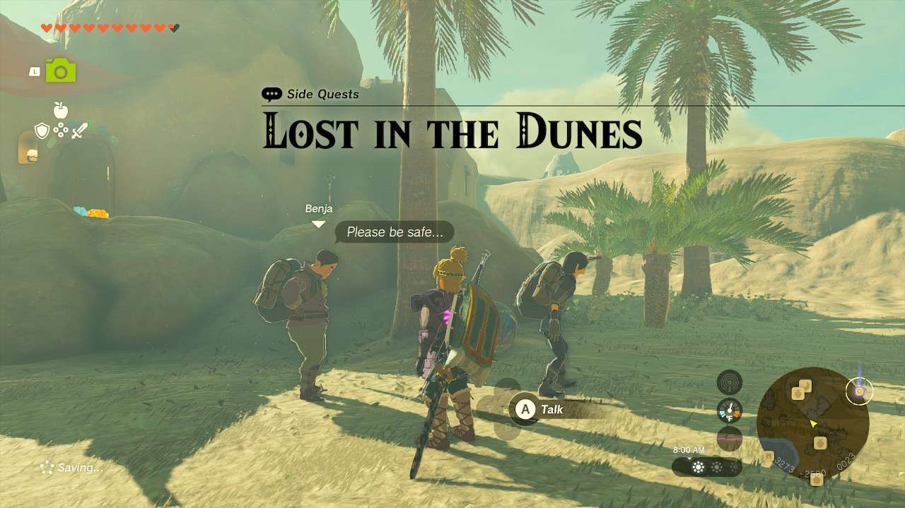
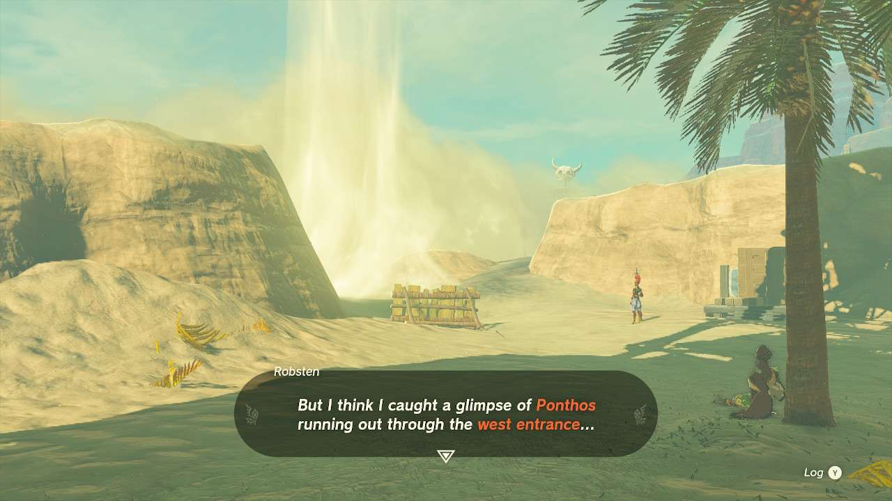
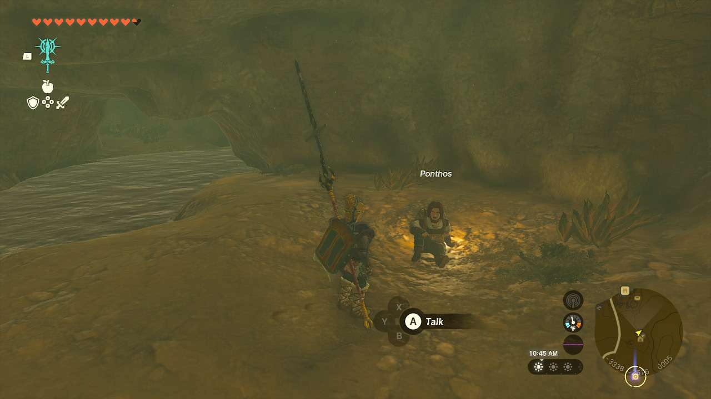
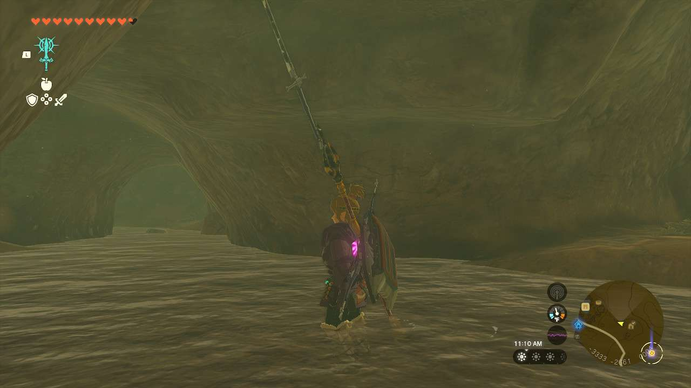

**Lost in the Dunes** is one of the many Side Quests to complete in The Legend of Zelda: Tears of the Kingdom. In this guide, we will teach you everything you need to know to complete Lost in the Dunes, including where to find it and what you will get as a reward. 

  * **Side Quest Location** : Gerudo Desert, Kara Kara Bazaar
  * **Prerequisites** : Defend the Kara Kara Bazaar during Riju of Gerudo Town
  * **Rewards** : Rare Orb

After you defend the Kara Kara Bazaar from the mass Gibdo attack, you’ll notice the male travelers who hang out at the Bazaar have been reduced to two instead of three. Speak with **Benja** , who explains that Ponthos has gone missing. 

Luckily, he’s not too terribly far. If you exit the Bazaar through the west entrance and head to the left, you’ll find a sinkhole right beside a campfire. Enter it and you’ll drop to where Panthos has fallen. **Alternatively** , you can enter the **Kara Kara Bazaar Well** and travel down the only real way around into the Oasis Source, which can also lead you to Panthos. 

When you find Panthos, you’ll need to open up the destructible wall at the end of the stream. Explode it or mash it with a weapon and Panthos will find his own way out of the area. Head back to the Bazaar and speak to Benja again for the reward you might not know what to do with yet. 

Lost in the Dunes

See the complete List of Side Quests and Side Adventures

### Up Next: Walkthrough

Previous

About IGN's Zelda TotK Guide Writers

Next

Walkthrough

### Top Guide Sections

  * Walkthrough
  * Zelda: Tears of The Kingdom Switch 2 Edition Guide
  * Zelda Notes Voice Memories
  * List of Side Quests and Side Adventures

### Was this guide helpful?

Leave feedback

Go to comments