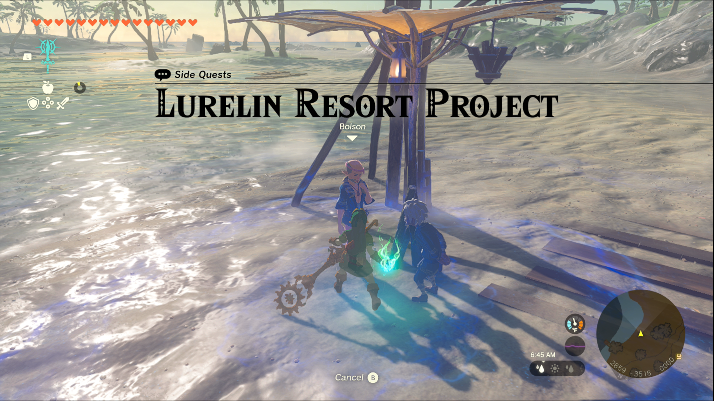
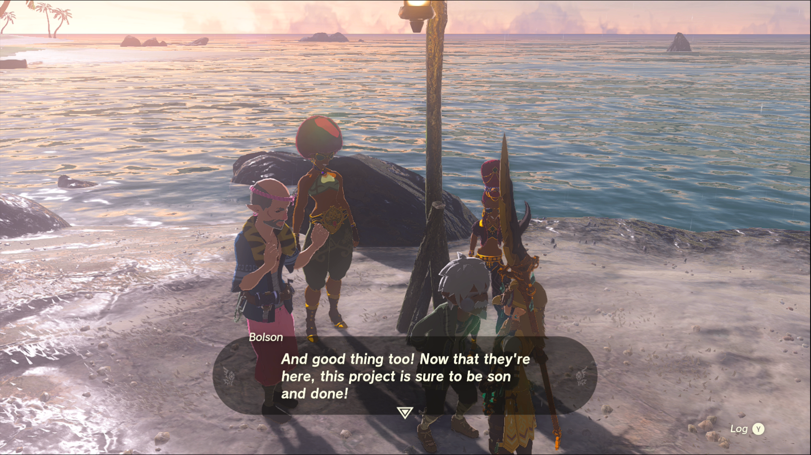

Lurelin Resort Project is a Side Quest you can accept in Lurelin Village. Side Quests are quests in The Legend of Zelda: Tears of the Kingdom that are relatively short or simple chores that can earn you small rewards or services. 

## Lurelin Resort Project

To start the Side Quest “Lurelin Resort Project” you need to complete “Ruffian-Infested Village” and “Lurelin Village Restoration Project.” Then speak to Rozel and Bolson on the west shore of Lurelin Village. They would like to throw something together to revitalize the village’s tourism, and with your help they decide on a water rally race. 

Your first order of business is to visit Tarrey Town in the Akkala region and ask some of the pro racers there to come down for the race. If you’re not sure where Tarrey Town is, select Lurelin Resort Project as your main quest and it’ll be marked on your map. 

### Important Note

While you can accept this quest without completing “Master the Vehicle Prototype” in Akkala, you will need to complete it and “The Tarrey Town Race is On!” before you can continue with “Lurelin Resort Project.”

Once you’ve completed your racing quests, speak to the pair of Gerudo racers at the Tarrey Town racetrack to continue. 

When they’ve departed, head back to Lurelin Village and meet with them and Rozel and Bolson on the coast south of the village. After a short chat you’ll have completed the quest, and unlocked a new mini-game, the Lurelin Water Rally. 

Lurelin Resort Project

See the complete List of Side Quests and Side Adventures

### Up Next: Walkthrough

Previous

About IGN's Zelda TotK Guide Writers

Next

Walkthrough

### Top Guide Sections

  * Walkthrough
  * Zelda: Tears of The Kingdom Switch 2 Edition Guide
  * Zelda Notes Voice Memories
  * List of Side Quests and Side Adventures

### Was this guide helpful?

Leave feedback

Go to comments