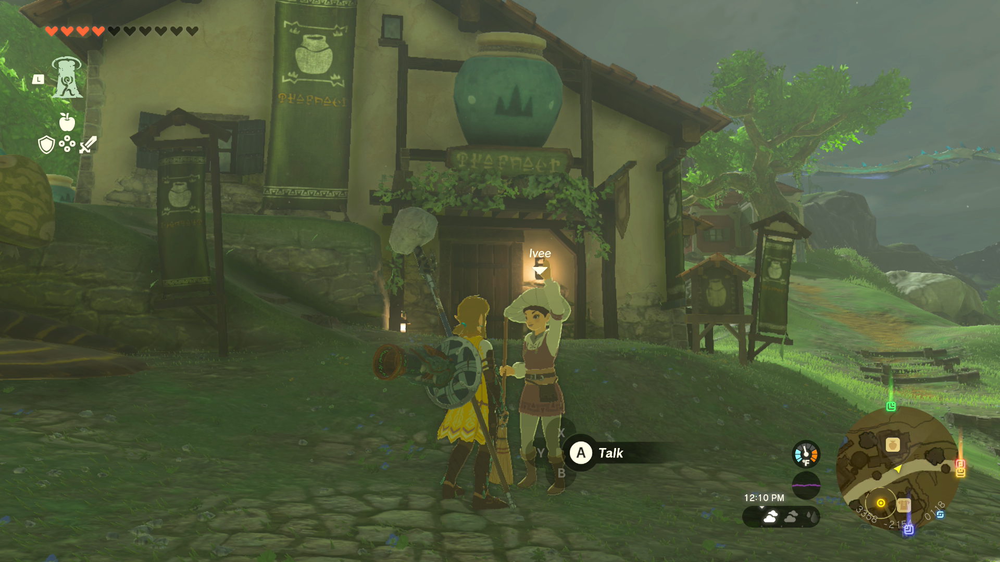
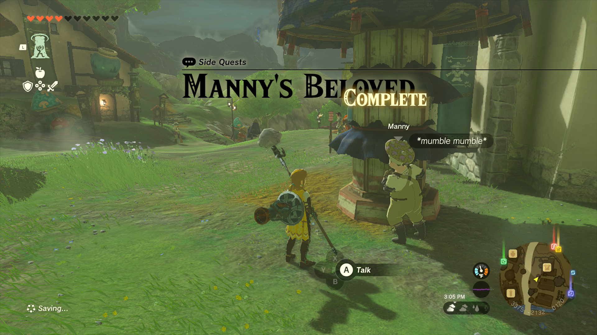

Manny’s Beloved is one of the Side Quests you’ll discover in Hateno Village. Side Quests are quests in The Legend of Zelda: Tears of the Kingdom that are relatively short or simple chores that can earn you small rewards or services. 

## Manny’s Beloved

To start the Side Quest, “Manny’s Beloved”, speak to Manny in Hateno Village. He’s wearing yellow clothes and can usually be found near the general store, keeping an eye on Ivee. 

He wants your help figuring out a gift for Ms. Ivee, the greeter for the general store, which is where you can find her. Ask her what she likes, then report back to Manny, who will be highlighted on the map if this is your active quest. 

Manny will ask you to collect 10 hot-footed frogs to kick things off, which can be found in and around the Hateno Village Wells. When you’ve got 10 of them, turn in the quest with Manny. As a reward for your trouble, you’ll be given 10 Rushrooms in return. 

Manny's Beloved

See the complete List of Side Quests and Side Adventures

### Up Next: Walkthrough

Previous

About IGN's Zelda TotK Guide Writers

Next

Walkthrough

### Top Guide Sections

  * Walkthrough
  * Zelda: Tears of The Kingdom Switch 2 Edition Guide
  * Zelda Notes Voice Memories
  * List of Side Quests and Side Adventures

### Was this guide helpful?

Leave feedback

### In This Guide

The Legend of Zelda: Tears of the KingdomNintendo EPD

Initial Release: May 12, 2023

Learn more

Go to comments