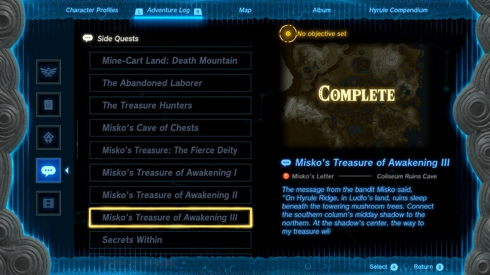
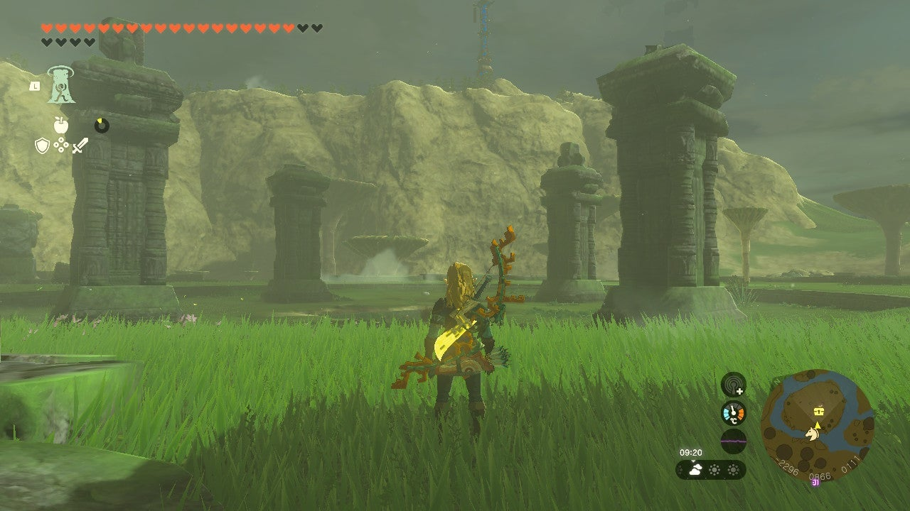
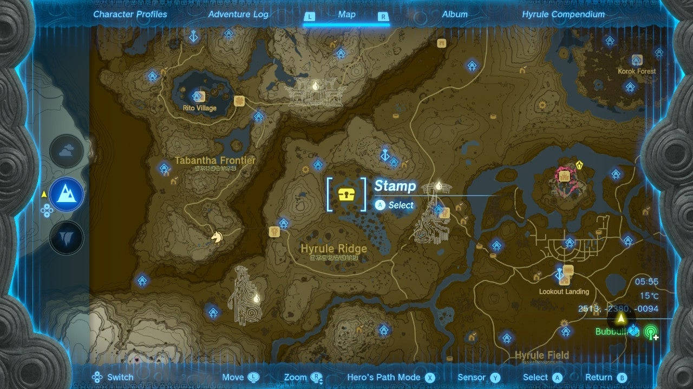
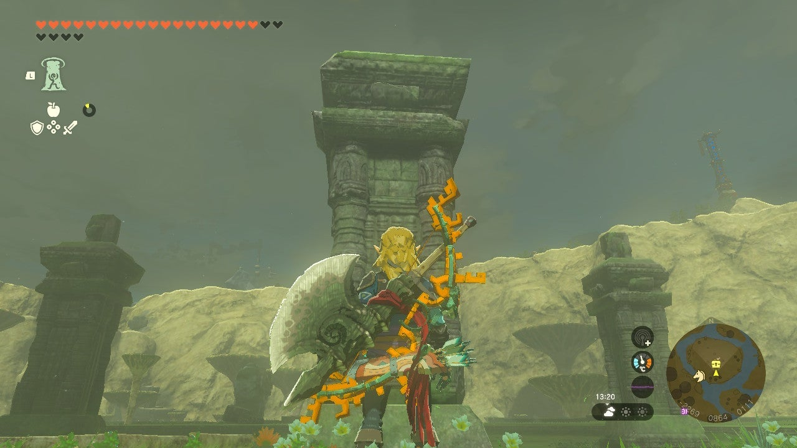
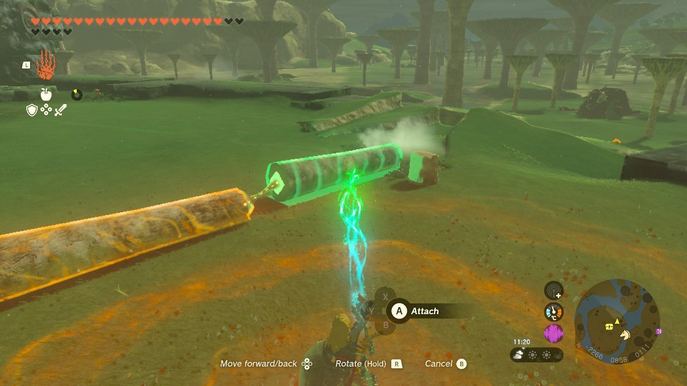
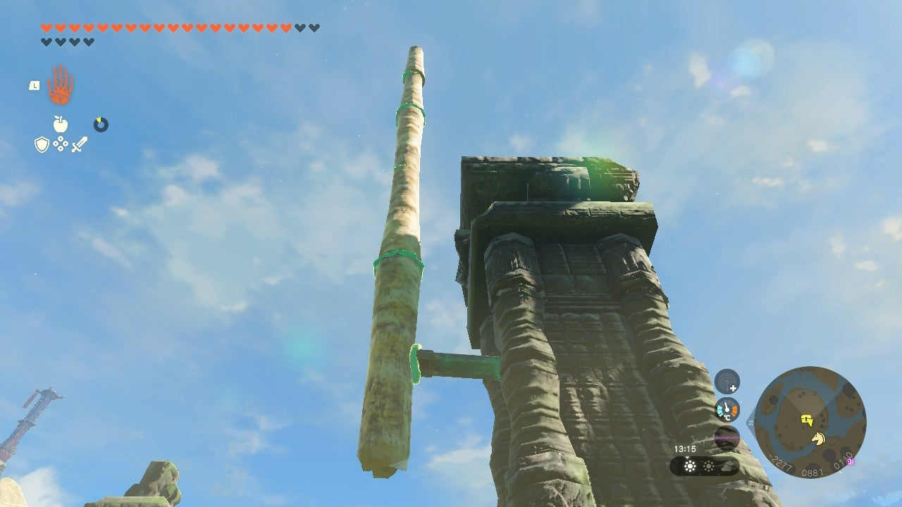
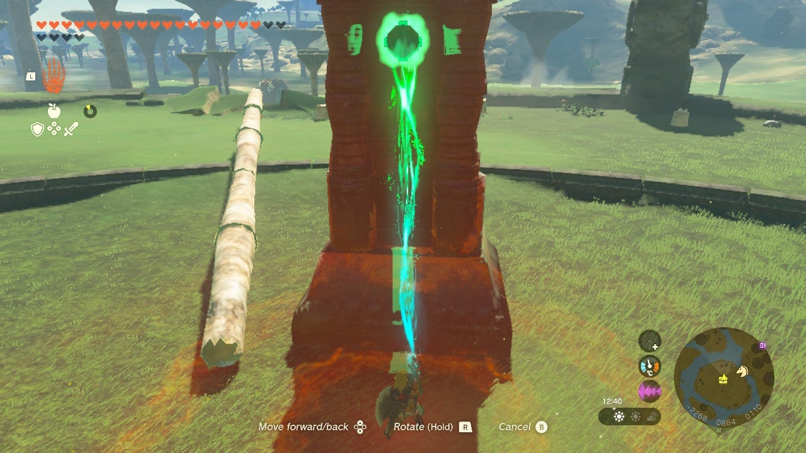
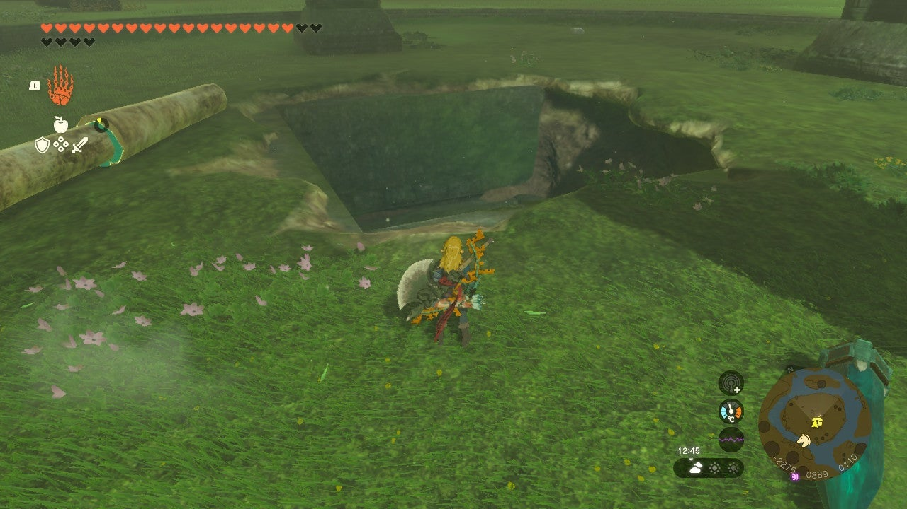
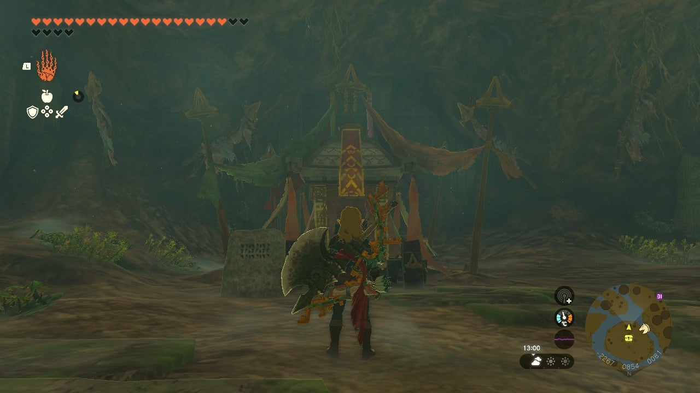

The **Mask of Awakening** is one of the three pieces that make up the Armor of Awakening Set in The Legend of Zelda: Tears of the Kingdom. This piece of armor is received as a reward for completing the Misko’s Treasure of Awakening III quest. 

You can also find the Armor of Awakening without the hassle by scanning the Link (Link’s Awakening) Amiibo!

In this guide, we will teach you everything you need to know about the Mask of Awakening, including how to get it, its stats, and its upgrade requirements. 

## Mask of Awakening

**Official description** : _Legend says this mask resembles a hero who explored a mysterious island that one could visit but not leave. The item makes one want to wear it but also not wear it._

Mask of Awakening Base Stats

Defense  
Effect Bonus  
Cost  
Sale Value

3  
N/A  
N/A  
600

Mask of Awakening

## How to Get the Mask of Awakening

There are two ways to get your hands on the Mask of Awakening in The Legend of Zelda: Tears of the Kingdom. 

### Scan the Link (Link's Awakening) Amiibo

If you own the Link (Link's Awakening) Amiibo, **hold L** to open your abilities wheel, then select the Amiibo icon. Get Link to an open area, then place your Amiibo near the NFC touchpoint on your Switch or controller, and you'll have the chance to unlock the Armor of the Awakening. 

Looking for more thorough instructions on how to use Amiibos or curious about other Amiibo rewards? Check out our comprehensive Amiibo Unlocks guide for more details!

## Where to Find the Mask of Awakening

If you would rather find the Mask of Awakening by completing the side quest required to get it, you will have to complete the Misko’s Treasure of Awakening III side quest. 

If you follow this guide and know what to do, you can complete this quest whenever you want. But if you want to find the glass bottle containing the riddle, you will have to complete Misko’s Treasure of Awakening I and Misko’s Treasure of Awakening II first since you get the clues in order of completion. 

### Misko’s Treasure of Awakening III Walkthrough

Misko’s riddle for the third leg of the Armor of Awakening treasure hunt reads as follows: 

_“On Hyrule Ridge, in Ludfo’s land, ruins sleep beneath the towering mushroom trees. Connect the southern column’s midday shadow to the northern. At the shadows center, the way to my treasure will open.”_

The location the riddle hints to is **Thundra Plateau** in Hyrule Ridge. You can find you way there by gliding southwest from Lindor’s Brow Skyview Tower or by riding to the west of New Serenne Stable. 

**Thundra Plateau coordinates** : -2307, 0854, 0113. 

Once you arrive at your destination, climb up into the arena to begin deciphering the next part of the riddle: _Connect the southern column’s midday shadow to the northern._

Check your compass and find the southernmost column. 

**Southern column coordinates** : -2268, 0877, 0126. 

There should be several logs scattered about the arena. If not, chop down some of the mushroom-shaped trees to create a massive pillar. You will need around five or six logs stacked end-to-end to make this work. 

Once you have your giant stick, you have to somehow attach it to the southern pillar. You can do this by using a stake and placing it as high as you possibly can on the southern column. If you don’t have a stake, you can also just stand on top of the column and hold your giant stick. 

The idea is to extend the southern column's shadow so that it touches the northern column when the sun is behind it at noon. Attaching your stick to the column just makes it easier. That way, you are free to build a fire, wait till noon, and watch the shadow pass over the northern column, opening the way to the treasure. 

If your timing was right and your stick was long enough, a massive hole will open in the middle of Thundra Plateau. Drop down to find the Cap of Awakening. 

**Mask of Awakening coordinates** : -2267, 0847, 0081. 

## Mask of Awakening Upgrade Requirements

The Mask of Awakening cannot be dyed, but it can be upgraded. If you find all three pieces of the Armor of Awakening Set, upgrade them each twice, and wear them together, you will unlock an **Attack Up** Set Bonus.

Mask of Awakening Upgrades

Level  
Materials  
Labor Cost  
Defense Level

Base  
N/A  
N/A  
3

★  
10x Luminous Stone1x Star Fragment  
10 Rupees  
5

★★  
15x Luminous Stone1x Star Fragment  
50 Rupees  
8

★★★  
20x Luminous Stone1x Star Fragment  
200 Rupees  
12

★★★★  
30x Luminous Stone1x Star Fragment  
500 Rupees  
20

### Up Next: Walkthrough

Previous

About IGN's Zelda TotK Guide Writers

Next

Walkthrough

### Top Guide Sections

  * Walkthrough
  * Zelda: Tears of The Kingdom Switch 2 Edition Guide
  * Zelda Notes Voice Memories
  * List of Side Quests and Side Adventures

### Was this guide helpful?

Leave feedback

### In This Guide

The Legend of Zelda: Tears of the KingdomNintendo EPD

Initial Release: May 12, 2023

Learn more

Go to comments