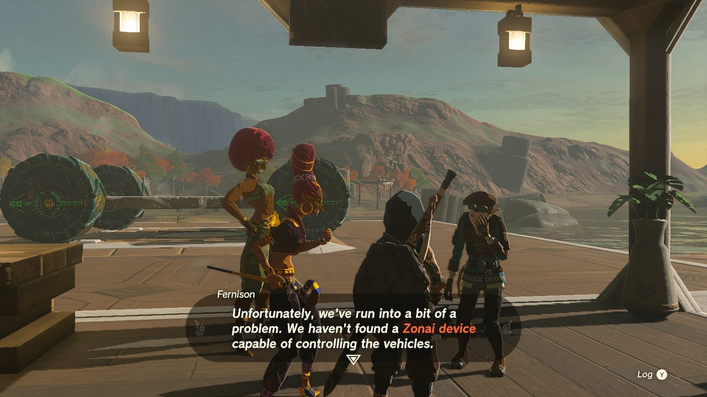
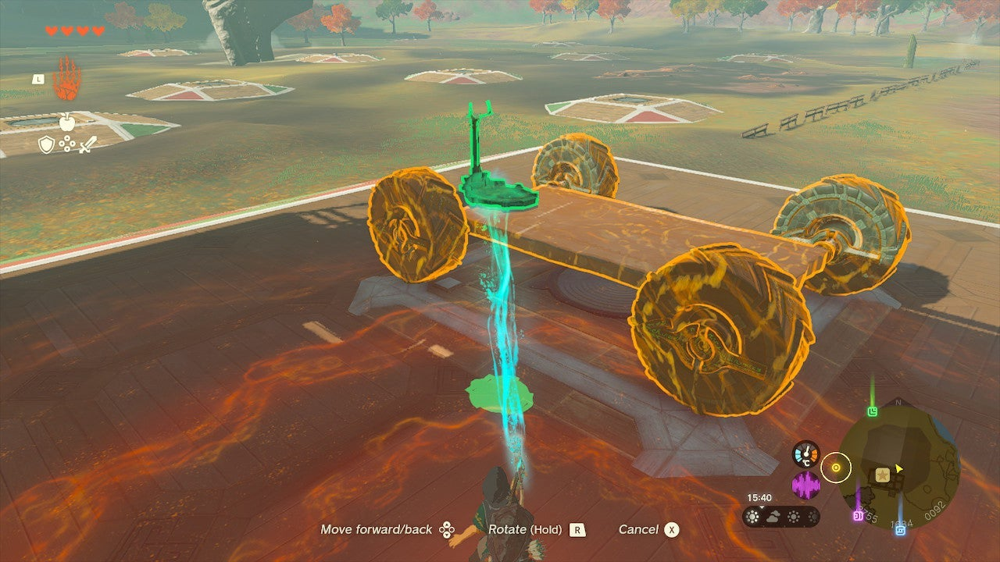
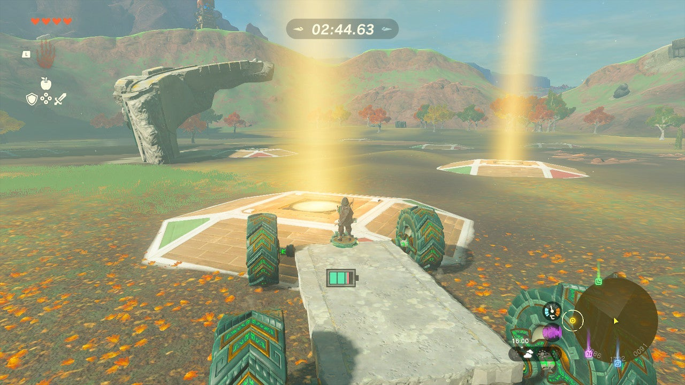

Ready to build another awesome zonai vehicle and take it for a test drive? The Akkala side quest **Master the Vehicle Prototype** requires your car-building expertise. Here's how to find this quest and how to solve it. 

## Master the Vehicle Prototype Walkthrough

To start Master the Vehicle Prototype, go to the area **northwest of Tarrey Town** in the Akkala Highlands (on the mainland), where you'll find two Gerudo arguing with a Hylian called Fernison. Listen in on their conversation to start the quest (coordinates 3753, 1675, 0092). 

To solve this side quest, you need to find a way to **control the nearby vehicle prototype**. More specifically, you need to bring a **steering stick** zonai device and place it on the vehicle, which will trigger the next dialogue scene. 

In case you don't have a steering stick in your inventory, you can**use the nearby device dispenser**. It's just a little further southeast of the quest location. Using this device dispenser will also complete the Secrets Within quest if you haven't done it already. 

Once you've got a steering stick, use Ultrahand to place it on the vehicle prototype. After that, Fernison will call out to you and ask you to **complete a race**. It's fairly straightforward: take control of the vehicle prototype and drive across the illuminated tiles. 

Beware that there's a time limit, although it's very generous. Make sure you ride the vehicle prototype back to the platform afterwards to complete the Master the Vehicle Prototype side quest. 

As a reward, you get a **silver rupee** (worth 100 green rupees) and a **stable sleepover ticket** , which is good for one regular bed in a stable of your choice. Furthermore, if you return to Fernison at a later time, she'll give you a follow-up side quest: The Tarrey Town Race Is On!

Master the Vehicle Prototype

See the complete List of Side Quests and Side Adventures

### Up Next: Walkthrough

Previous

About IGN's Zelda TotK Guide Writers

Next

Walkthrough

### Top Guide Sections

  * Walkthrough
  * Zelda: Tears of The Kingdom Switch 2 Edition Guide
  * Zelda Notes Voice Memories
  * List of Side Quests and Side Adventures

### Was this guide helpful?

Leave feedback

Go to comments