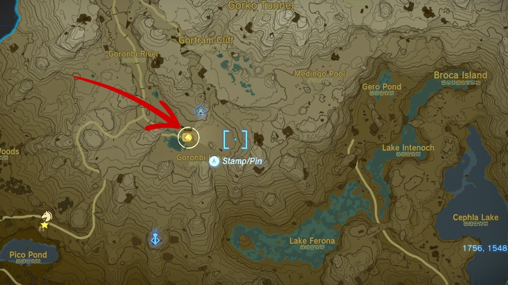
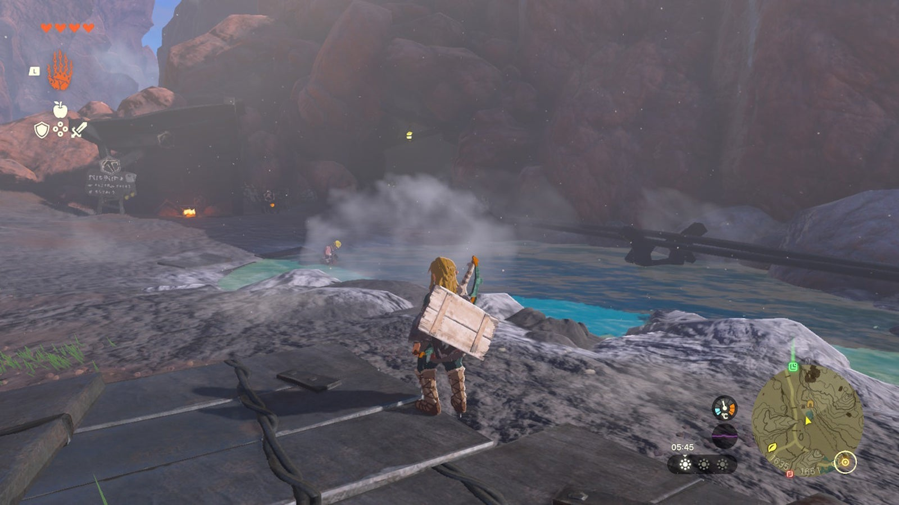
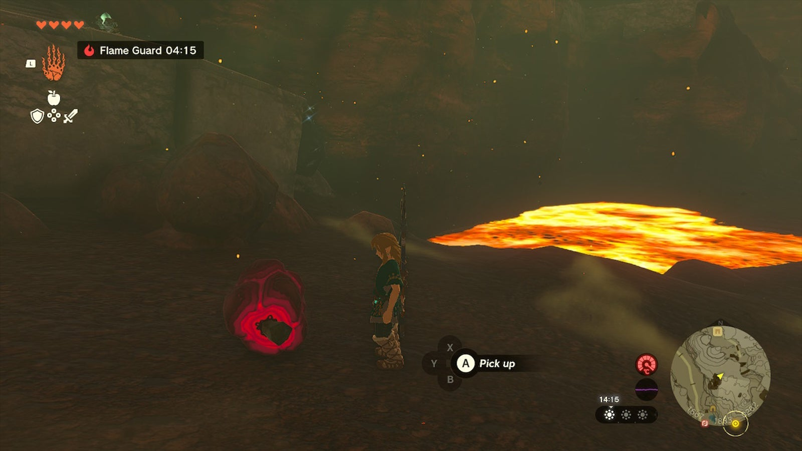
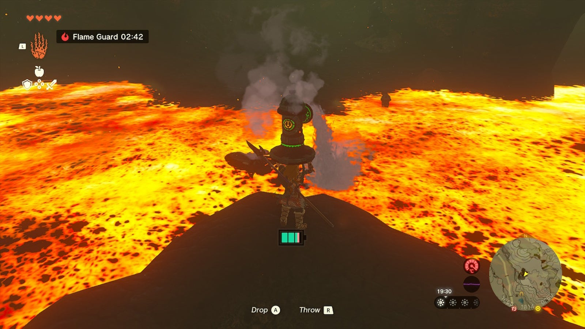

Starting at the Bedrock Bistro, in Hyrule's Eldin region, the **Meat for Meat side quest** will send you on a hunt for marbled rock roast. As this stone-like Goron delicacy is hard to find, here's how to complete the Meat for Meat quest. 

## Meat for Meat Walkthrough

Start this quest by **speaking to Mezer** , who is currently engaged in a discussion about marbled rock roast with the proprietor of the Bedrock Bistro, a Goron named Cooke. The Bedrock Bistro is located next to Goronbi Lake, south of Death Mountain in Eldin (coordinates 1756, 1548, 0278). 

The quest objective is to **find marbled rock roast** for Mezer, but the only hint you get is to "try the caves past the cart tracks". This means that you need to **follow the nearby tracks** towards the northwest until you see a cave entrance, a small lake, and a guy named Fico. 

This cave is where you'll find the marbled rock roast, but beware: it's filled with lava, so **don't go in without a fireproof elixir**! As Fico will tell you, you need a fireproof lizard and monster parts to create this elixir. Note that the more monster parts you add, the stronger the elixir will be. 

In case you don't have any **fireproof lizards** in your inventory, there's one on the path to the north, not far away. Don't worry if you miss it - they're very common in this area, especially around the Southern Mine in the north. Try to shoot the lizards instead of running after them, as they're too fast to catch. 

Once you've taken the fireproof elixir, it's time to explore the West Restaurant Cave. Stick to the right and walk up the higher ledge, which allows you to **glide over the lava**. You'll find several pieces of marbled rock roast further down the cave, but you can't cross the lava while carrying them. 

Here's the solution: climb the wall to your right and **pick up a hydrant** (you can also try to use the rockets, but the hydrants are much easier). Return to the lava, activate the hydrant by hitting it with a weapon, and **spray water on the lava** to create a path. 

Now you may carry the marbled rock roast back to the Bedrock Bistro, where the Meat for Meat side quest is completed. As a quest reward, Mezer will give you a **large Zonai charge**. 

Meat for Meat

See the complete List of Side Quests and Side Adventures

### Up Next: Walkthrough

Previous

About IGN's Zelda TotK Guide Writers

Next

Walkthrough

### Top Guide Sections

  * Walkthrough
  * Zelda: Tears of The Kingdom Switch 2 Edition Guide
  * Zelda Notes Voice Memories
  * List of Side Quests and Side Adventures

### Was this guide helpful?

Leave feedback

### In This Guide

The Legend of Zelda: Tears of the KingdomNintendo EPD

Initial Release: May 12, 2023

Learn more

Go to comments