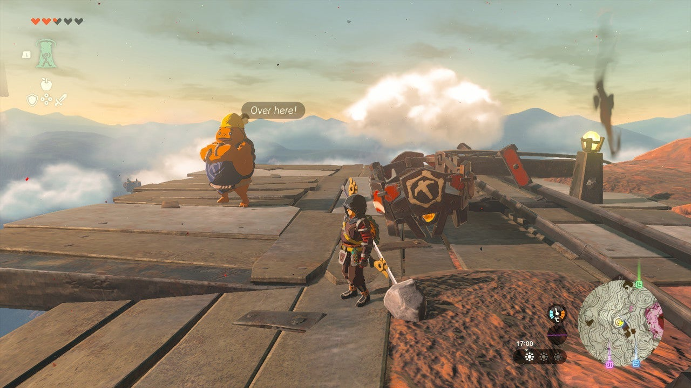

The third and final Mine-Cart Land quest takes us to Death Mountain, in the middle of the Eldin region. Before you climb the mountain, make sure you've completed the previous quest, Mine-Cart Land: Quickshot Course. 

Ready to shoot some balloons? Here's how to complete **Mine-Cart Land: Death Mountain** in The Legend of Zelda: Tears of the Kingdom. 

## Mine-Cart Land: Death Mountain Walkthrough

The final Mine-Cart Land quest starts by speaking to the three Gorons in the southern Mine Cave, directly after completing the previous side quest. The Goron called Kabetta will ask you to try a more difficult course on the west side of **Death Mountain**. If you teleport to the Sitsum Shrine, you'll be there in no time. 

Speak to Kabetta, who will give you ten arrows if you agree to try the challenge. The goal is to hit **eight balloons** within the time limit. Just like before, place the minecart on the track and jump in to start the race. 

When you've completed the challenge, Kabetta will give you a **Goron Fabric** as a reward. This concludes the Mine-Cart Land side quest series. 

Mine-Cart Land: Death Mountain

See the complete List of Side Quests and Side Adventures

### Up Next: Walkthrough

Previous

About IGN's Zelda TotK Guide Writers

Next

Walkthrough

### Top Guide Sections

  * Walkthrough
  * Zelda: Tears of The Kingdom Switch 2 Edition Guide
  * Zelda Notes Voice Memories
  * List of Side Quests and Side Adventures

### Was this guide helpful?

Leave feedback

### In This Guide

The Legend of Zelda: Tears of the KingdomNintendo EPD

Initial Release: May 12, 2023

Learn more

Go to comments