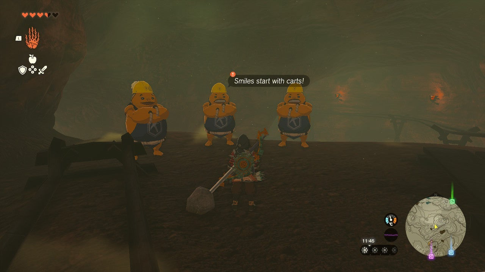
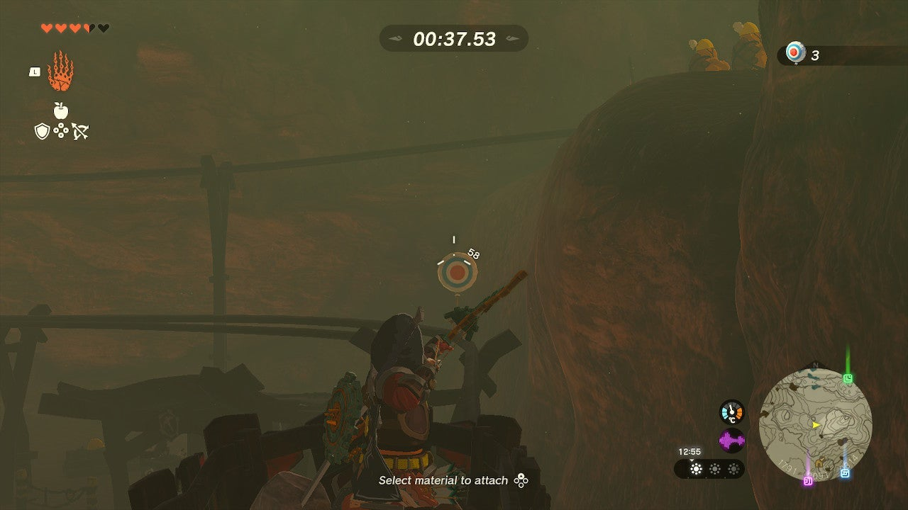

Let's hope you have good aim while driving, because the Mine-Cart Land: Open for Business side quest has you shooting balloons from a minecart. Once you've completed the Yunobo of Goron City quest, explore the **Southern Mine** to start this balloon-shooting challenge. 

Here's how to complete **Mine-Cart Land: Open for Business!** in The Legend of Zelda: Tears of the Kingdom. 

## Mine-Cart Land: Open for Business Walkthrough

Go inside the Southern Mine Cave in the southwestern part of Eldin (northwest of the Timawak Shrine). Speak to the three Gorons inside to start the quest. 

The Gorons will ask you to use the nearby cart to ride the minecart track (the one inside the cave - place it on the track with Ultrahand), and **shoot at least five balloons** while doing so. If you didn't bring any arrows, don't worry; they'll give you a stack of ten. 

If you manage to complete the challenge, you'll be rewarded with a **red rupee** (worth 20 green rupees). If you want, you can immediately continue the next challenge, Mine-Cart Land: Quickshot Course. 

Mine-Cart Land: Open for Business!

See the complete List of Side Quests and Side Adventures

### Up Next: Walkthrough

Previous

About IGN's Zelda TotK Guide Writers

Next

Walkthrough

### Top Guide Sections

  * Walkthrough
  * Zelda: Tears of The Kingdom Switch 2 Edition Guide
  * Zelda Notes Voice Memories
  * List of Side Quests and Side Adventures

### Was this guide helpful?

Leave feedback

### In This Guide

The Legend of Zelda: Tears of the KingdomNintendo EPD

Initial Release: May 12, 2023

Learn more

Go to comments