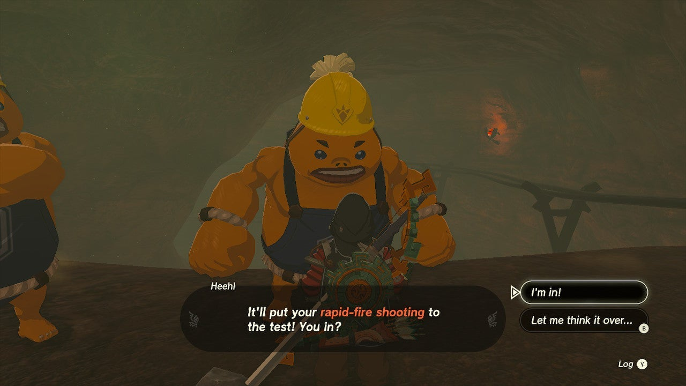

Did you manage to shoot at least five balloons during the Mine-Cart Land: Open for Business! side quest? Then it's time for your next challenge: shoot seven balloons while riding the minecart track in the Southern Mines. 

Here's how to complete the second part of this Tears of the Kingdom quest series: **Mine-Cart Land: Quickshot Course**. 

## Mine-Cart Land: Quickshot Course Walkthrough

Like the previous Mine-Cart Land quest, you need to visit the **Southern Mine Cave** to start this quest. Speak to the Goron on the right, Heehl, who will ask you to complete the minecart course again. This time, however, you need to **shoot seven balloons**. 

Before you start the challenge, Heehl will give you a stack of ten arrows. Place the cart on the tracks again and hop in to start the race. 

Once you've shot seven balloons, you've completed Mine-Cart Land: Quickshot Course. You will receive one **purple rupee** (worth 50 green rupees) and unlock the next side quest: Mine-Cart Land: Death Mountain. 

Mine-Cart Land: Quickshot Course

See the complete List of Side Quests and Side Adventures

### Up Next: Walkthrough

Previous

About IGN's Zelda TotK Guide Writers

Next

Walkthrough

### Top Guide Sections

  * Walkthrough
  * Zelda: Tears of The Kingdom Switch 2 Edition Guide
  * Zelda Notes Voice Memories
  * List of Side Quests and Side Adventures

### Was this guide helpful?

Leave feedback

Go to comments